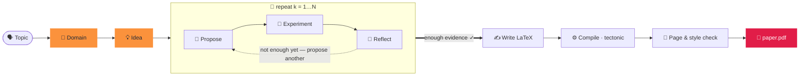

<div align="center">


### Generating a paper in two words.

<p align="center"><code>paperclaw run "diffusion models"</code></p>
<p align="center"><sub>🧭 domain · 💡 idea · 🔬 hypotheses · 🧪 experiments · 📊 analysis<br/>📄 paper.pdf — written, cited &amp; compiled ✓</sub></p>

**PaperClaw** harnesses autonomous agents across the entire research lifecycle —
**🧭 Domain → 💡 Idea → 📄 Paper**. Name a topic and it grounds a field, brainstorms
an idea, runs *real* experiments, and writes a cited, compiled paper.

[](LICENSE)


<sub><b>English</b> · <a href="docs/i18n/README.zh-CN.md">简体中文</a> · <a href="docs/i18n/README.ja.md">日本語</a> · <a href="docs/i18n/README.ko.md">한국어</a> · <a href="docs/i18n/README.es.md">Español</a> · <a href="docs/i18n/README.fr.md">Français</a> · <a href="docs/i18n/README.de.md">Deutsch</a> · <a href="docs/i18n/README.pt.md">Português</a> · <a href="docs/i18n/README.ru.md">Русский</a> · <a href="docs/i18n/README.ar.md">العربية</a> · <a href="docs/i18n/README.hi.md">हिन्दी</a> · <a href="docs/i18n/README.it.md">Italiano</a></sub>

</div>

---

## ✦ What is PaperClaw?

PaperClaw is an open-source autonomous research engine. It collapses the
research lifecycle into one clean path and owns the control flow end-to-end: the hypothesis
map, the experiment jobs, the memory, and the paper. Plug in any model (Anthropic SDK or any
OpenAI-compatible endpoint) or an external headless coding agent.

It ships as **one Python package** with a **FastAPI** backend and a **Vite + React**
frontend that builds for two targets — **web** (served by the backend) and **Windows /
macOS / Linux desktop** (Electron) — plus a **full CLI** that mirrors every feature.

<div align="center">

</div>

## ✦ Example papers

Real papers PaperClaw wrote end-to-end — topic → domain → idea → hypotheses → experiments
→ **compiled PDF** — each typeset with its **target venue's** LaTeX template. Each is a full
idea workspace (spec, hypothesis map, experiments, figures, `ref.bib`, LaTeX source). Browse
them in **[`docs/examples/`](docs/examples/)**.

| Paper | Topic | Output |
|---|---|---|
| 📄 [**RC-Diff: Risk-Controlled Financial Diffusion with Path-Level Audits**](<docs/examples/[Paper 1] rc-diff-risk-controlled-financial-diffusion/paper.pdf>) | Diffusion models for financial time series | Target Venue · 9 pp |

## ✦ A clean Research Model

| | Step | What happens | One command |
|:--:|:--|:--|:--|
| 🧭 | **Domain** — *the ground to dig in* | Describe a field in one sentence. The model writes a `DOMAIN.md` spec — target, crucial papers, datasets, libraries, venues — pulled **live from open scholarly indexes**, not model memory. | `paperclaw domain auto "…"` |
| 💡 | **Idea** — *a concrete, testable direction* | Brainstorming digests one or more domains into full `IDEA.md` drafts — background, research gap, motivation, root hypotheses. Refine one in chat, then pin it as a living idea. | `paperclaw brainstorm generate` |
| 📄 | **Paper** — *written, cited & compiled* | The hypothesis loop proposes, tests and reflects round after round, selects the strongest results, and writes a venue-formatted LaTeX paper with **validated citations** — compiled to PDF and refined until style- and length-compliant. | `paperclaw run --idea <id>` |

<div align="center">

<br/>
<sub><b>Domain in auto mode (web UI)</b> — describe a field in one sentence; PaperClaw surveys open scholarly indexes live and writes the <code>DOMAIN.md</code> spec.</sub>
</div>

## ✦ Inside the autopilot — a hypothesis loop that knows when to stop

Once an idea has a domain, PaperClaw runs an **experiment-driven loop**, growing a
hypothesis map from measured results rather than an up-front guess — then writes the
paper from whatever it actually found. Every phase streams live and is **resumable**.



## ✦ Two ways to run it

PaperClaw runs in two modes — pick one (they share the same backend and `saves/` data, so
you can switch freely).

**Quickest setup (no commands):** copy `settings.example.yaml` → `settings.yaml` in the project directory and fill in your keys — both the backend and the CLI read it on start (it overrides the in-app Settings). It's YAML, so you can `#`-comment the options:

```yaml
LLM:
  provider: anthropic           # anthropic | openai (any OpenAI-compatible endpoint)
  base_url: null                # null = provider default; set for a proxy / self-hosted
  api_key: ""
  model: claude-opus-4-8
image_generation:               # optional — paper figures (empty key = use matplotlib/TikZ)
  base_url: null
  api_key: ""
  model: null                   # e.g. gpt-image-1, dall-e-3
academic_search:
  open_alex:
    api_key: ""                 # optional — avoids OpenAlex anonymous rate-limits
```

`settings.yaml` is git-ignored (it holds your keys), so it never gets committed. (A legacy `settings.json` is still read.)

> ⚙️ **Full configuration** — model & keys, image generation, OpenAlex, experiment mode, SSH remotes, LaTeX, and the `paperclaw doctor` check: see the **[Environment setup guide](docs/environment-guide.md)**.

> [!TIP]
> **Web mode is the recommended experience** — live streaming, the hypothesis graph, the
> experiment monitor, and the in-app PDF viewer, all in one place. **CLI mode** mirrors
> every feature for terminals, servers, and automation.

---

### 🪟 1. Web mode *(recommended)*

> 📘 **New to the UI?** Follow the **[Web UI walkthrough](docs/web-guide.md)** — four annotated steps from domain to paper, each with its CLI equivalent.

**Install** — backend + frontend:

```bash
pip install -e ".[dev]"          # backend (Python)
cd frontend && npm install       # frontend (Node)
```

**Run** — `./dev.sh` from the repo root starts both and kills stale ports:

```bash
./dev.sh                         # backend :8230 + web UI :5173
# → open http://localhost:5173
```

<sub>Manual equivalent (two terminals): `paperclaw serve --reload` &nbsp;·&nbsp; `cd frontend && npm run dev:web`. &nbsp; Desktop app: `npm run dev` (Electron).</sub>

**Configure** — open **⚙️ Settings** (gear, bottom-left):

- **🔌 LLM** — provider, base URL (for proxies / self-hosted), model, and API key.
- **📚 Academic search** — an OpenAlex API key for literature search (the domain survey, SOTA papers, and references). Optional, but without one OpenAlex may rate-limit anonymous requests and surveys return "Found 0 papers".
- **🖼️ Image generation** — optional OpenAI-style image API for paper figures (falls back to matplotlib/TikZ when unset).
- **🩺 Doctor** — one click checks the whole environment is ready (LLM, coding agent, LaTeX toolchain, image gen, OpenAlex).

Keys are stored server-side in `saves/settings.yaml` (mode `600`) and never sent to the
browser. Without a key the app still runs and replies with a configuration hint.

**Use it** — click **⚡ Auto run** (sidebar for a fresh topic, or on an existing idea) to go
from topic → paper; watch it live in the banner and browse the 🌳 Hypotheses and 📄 Paper
tabs. Or chat to build a domain, brainstorm ideas, and pin one.

> 📘 **New to the UI?** Follow the **[Web UI walkthrough](docs/web-guide.md)** — four annotated steps from domain to paper, each with its CLI equivalent.

---

### ⌨️ 2. CLI mode

The CLI mirrors every web feature. **Install only the backend** (no frontend build needed):

```bash
pip install -e ".[dev]"
```

**Configure** — local mode reads config with this precedence (highest first):
**environment variables → `.env` (cwd) → `.env` in `$PAPERCLAW_HOME` → `./settings.yaml` (project
dir) → `$PAPERCLAW_HOME/settings.yaml`**. The simplest path is the grouped `settings.yaml`
above; the env keys below override individual fields:

| Key | Purpose |
|---|---|
| `PAPERCLAW_PROVIDER` | `anthropic` \| `openai` (OpenAI-compatible) |
| `PAPERCLAW_BASE_URL` | proxy / self-hosted endpoint (optional) |
| `PAPERCLAW_MODEL` | e.g. `claude-opus-4-8` |
| `PAPERCLAW_API_KEY` | API key (`ANTHROPIC_API_KEY` / `OPENAI_API_KEY` are provider-matched fallbacks) |
| `OPENALEX_API_KEY` | OpenAlex key for literature search (optional — avoids anonymous rate-limits) |
| `PAPERCLAW_HOME` | workspace root (default: `./saves`) |

```bash
# or persist them once:
paperclaw settings set --provider anthropic --model claude-opus-4-8 --api-key sk-…
paperclaw settings set --openalex-api-key oa-…   # literature search (optional)
paperclaw doctor                 # check the env is ready (LLM, LaTeX, image gen, OpenAlex)
```

**Use it** — local mode (default) works on files under `$PAPERCLAW_HOME`:

```bash
# Fully autonomous: topic → doctor → domain → idea → hypotheses → paper
paperclaw run "diffusion models for time series"       # writes the paper on 2 positives
paperclaw run "…" --positive 3 --max-hypotheses 8      # stop at 3 supported, cap at 8
paperclaw status / stop / resume                       # manage runs from any terminal

# …or drive each step:
paperclaw domain auto "time-series diffusion"
paperclaw domain list                  # [✓] = selected for brainstorming
paperclaw brainstorm generate          # digest selected domains → IDEA.md drafts
paperclaw brainstorm pin <seed-id>     # promote a draft to a living idea
paperclaw hypothesis <idea> generate   # build the hypothesis map
paperclaw references <idea> validate   # validate citations vs Crossref/OpenAlex
paperclaw experiments                  # list detached, monitored experiment jobs
```

**Remote mode** — point the same CLI at a running backend instead of local files with
`--backend` (config then lives on the server, not locally):

```bash
paperclaw --backend domain list                    # → http://127.0.0.1:8230
paperclaw --backend http://host:8230 chat "hello"  # explicit URL
```

<details>
<summary><b>Auto-run config file & parallel runs</b></summary>

```yaml
# run.yaml
topic: generative modeling for time series
positive: 3          # write the paper once 3 hypotheses are SUPPORTED
max_hypotheses: 8    # stop after 8 if not enough positives
page_limit: 8
```
```bash
paperclaw run --config run.yaml   # CLI flags override the file
```

**Ideas run in parallel** — start an auto run on as many ideas as you like; each idea's
panel shows only its own ⚡ banner. Runs are **detached**: they survive closing the tab or
restarting the backend. **Stop** with `paperclaw stop [--idea <id>]` (or Ctrl+C, or
the ⏹ on the web banner); **continue** a stopped run with `paperclaw resume [--idea
<id>]` — the pipeline is resumable, so it skips finished hypotheses/phases.

</details>

## ✦ Development

```bash
./dev.sh          # one-shot: kills stale ports, restarts backend :8230 + web UI :5173
```

Or manually — backend from the repo root, **npm commands inside `frontend/`**:

```bash
pip install -e ".[dev]"
paperclaw serve --reload                  # repo root — API on :8230
cd frontend && npm install
npm run dev:web                           # web     → http://localhost:5173
npm run dev                               # desktop → Electron window
```

> **Restart after every change set** — `--reload` doesn't cover new dependencies,
> startup-loaded settings, or Vite config changes.

## ✦ Production

```bash
# Web (served by the Python backend)
cd frontend && npm run build:web          # → frontend/dist/web, then `paperclaw serve`

# Desktop packages (output in frontend/dist/)
npm run dist:win     # Windows — NSIS installer + portable zip
npm run dist:mac     # macOS   — dmg + zip (must run on a Mac)
npm run dist:linux   # Linux   — AppImage
```

Push a `v*` tag (or run the workflow manually) and `.github/workflows/desktop.yml` builds
win/mac/linux on native runners and uploads the artifacts.

## ✦ Tests

```bash
pytest tests/                             # backend
cd frontend && npm run typecheck          # frontend (tsc --noEmit)
```

## ✦ PaperClaw Capabilities

<table>
<tr>
<td width="33%" valign="top">

**🧭 Domain-driven discovery**
Auto `DOMAIN.md` from one sentence or a guided wizard — papers, datasets, libraries and venues pulled from live scholarly indexes.

</td>
<td width="33%" valign="top">

**💡 Multi-domain brainstorm**
Digest one or more domains into full `IDEA.md` drafts, then distil one into a living idea spec kept current as you talk.

</td>
<td width="33%" valign="top">

**🔁 Iterative hypothesis loop**
Propose → test → reflect, growing a hypothesis map from measured results — the smallest experiment that settles each question.

</td>
</tr>
<tr>
<td valign="top">

**🤝 In-cycle research assistant**
A provider-agnostic scaffold — swap the model or plug an external headless coding agent into any stage.

</td>
<td valign="top">

**🧪 Real, managed experiments**
Jobs that survive restarts. The agent writes `run.py`, runs it as a sandboxed subprocess, and debugs its own tracebacks until it gets metrics and figures.

</td>
<td valign="top">

**🧠 Full-lifecycle memory**
Domain, idea, hypothesis and paper are living documents and resumable checkpoints — stop and continue any run without losing work.

</td>
</tr>
<tr>
<td valign="top">

**♻️ Evolving assistant**
Curated domains, prose-style guides, reference codebases and validated bibliographies accumulate and are reused — sharper over time.

</td>
<td valign="top">

**📚 Validated citations**
Each idea owns a `ref.bib` built deterministically from OpenAlex & Crossref, every entry validated against the source — no fabricated references.

</td>
<td valign="top">

**📄 Venue-formatted papers**
Real LaTeX, compiled with tectonic through an agentic fix loop, refined until style- and length-compliant — reporting only results that genuinely ran.

</td>
</tr>
<tr>
<td valign="top">

**🖥️ Hardware-aware**
Detects CPU / GPU / memory / disk on the local host and any SSH remote, so experiments are planned against the compute you actually have.

</td>
<td valign="top">

**🪟 Web · Desktop · CLI**
One Vite + React codebase ships as a web app, an Electron desktop app, and a full CLI — every capability identical across all three.

</td>
<td valign="top">

**🔌 Bring your own model**
Anthropic via the official SDK, or any OpenAI-compatible endpoint. Default model `claude-opus-4-8`. Keys stay server-side.

</td>
</tr>
</table>

## ✦ FAQ

**How do I run it on a server (for its storage & compute) and use it locally over an SSH tunnel?**
Deploy the backend on the server and reach it over an SSH tunnel — no public port needed. **On the server:** build the UI and start the backend on one port — `cd frontend && npm run build:web` then `paperclaw serve --port 8230`; data lives in `$PAPERCLAW_HOME` and experiments use the server's CPU/GPU. **On your laptop:** forward the port with `ssh -N -L 8230:localhost:8230 user@server`, then open `http://localhost:8230`. The CLI works the same against the tunnel: `paperclaw --backend http://localhost:8230 …`.

**Why does a domain survey say "Found 0 papers"?**
OpenAlex now budget-limits anonymous (per-IP) requests. Add a free OpenAlex API key in
**Settings → 📚 Academic search** (or `OPENALEX_API_KEY`) for a dedicated budget.

**I clicked the top-left ⚡ Auto run but the UI shows no progress — where did it go?**
The sidebar's top-left **⚡ Auto run** launches a run from a **topic** (it mirrors `paperclaw
run "your topic"`) and is still in **beta** — its in-app progress view is under development.
The run is fine (detached, like any auto run); follow it from any terminal with `paperclaw
status` (and `paperclaw stop` / `paperclaw resume`). Auto runs started on an *existing* idea
(the top-bar ⚡ Auto run) do show the live banner. See the [Web UI walkthrough](docs/web-guide.md#4-auto-run--topic--paper-on-autopilot).

**Is my API key safe?**
Keys are stored server-side in `saves/settings.yaml` (mode `600`) and never sent to the
browser or logged.

**Do I need a GPU?**
No — small runs work on CPU. PaperClaw detects CPU/GPU/memory on the local host and any
SSH remote and plans experiments against the compute you actually have.

**Web or CLI?**
Either — they share the same backend and `saves/` data, so you can switch freely; the CLI
mirrors every web feature.

## ✦ License

[MIT](LICENSE) © PaperClaw contributors.

<div align="center">
<br />
<sub>🦞 <b>PaperClaw</b> — Domain → Idea → Paper, autonomously.</sub>
</div>
