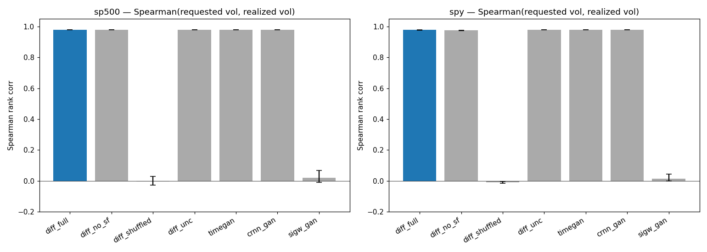
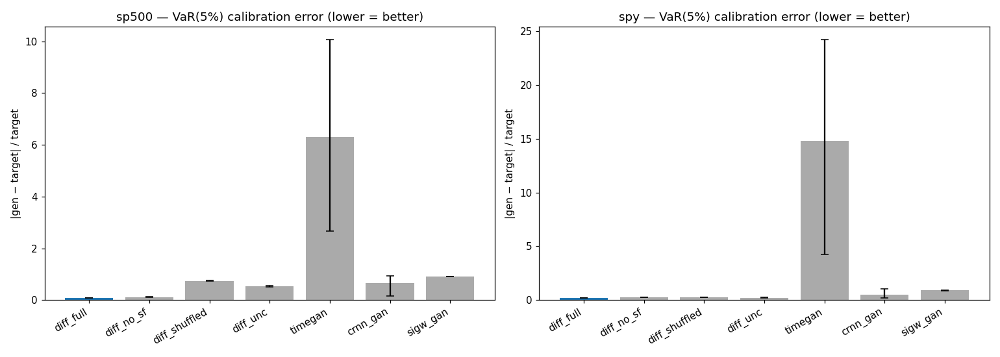
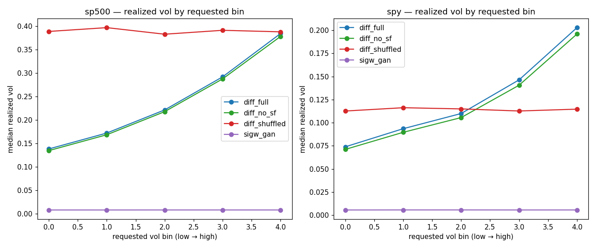

_Results from real executed code._

## Experiment 1: H2: volatility conditioning produces monotonic realized vol in financial diffusion
**Setup:** Real S&P 500 constituents (41 large-cap names) and SPY daily OHLCV downloaded from Yahoo Finance over 2010-01-01 to 2024-12-31, converted to 64-day rolling log-return windows (37,709 SP500 windows + 928 SPY windows). Trained a compact 1D U-Net diffusion model (T=200 denoising steps) with continuous conditioning on the window's annualized realized volatility plus a stylized-fact auxiliary loss (std/abs-mean/abs-autocorr lag-1+5/Hill-style tail proxy on the predicted x0). Ablations: no SF loss, randomly shuffled vol labels, unconditional. Baselines: compact TimeGAN-lite (GRU G+D with supervised next-step regularization, unconditional + post-hoc volatility binning), C-RNN-GAN-lite (LSTM G + biLSTM D, unconditional + post-hoc binning), Sig-W-GAN-lite (conditional GRU G+D with a truncated cumulative-signature moment-matching penalty as proxy for the Sig-Wasserstein objective). Evaluation generates 500 samples per requested volatility quantile (10/25/50/75/90 percentile of empirical vol distribution) and measures Spearman rank correlation between requested and realized annualized vol, plus VaR/ES/max-drawdown calibration vs Gaussian benchmark, abs-return autocorrelation error, signature-moment proxy distance, and Hill-style tail-index error against held-out real windows. Three random seeds, single RTX A6000 GPU.
**Results:**

| Metric | diff_full | diff_no_sf | diff_shuffled | diff_unc | timegan | crnn_gan | sigw_gan |
|---|---|---|---|---|---|---|---|
| spearman | 0.9788 | 0.9772 | -0.005592 | 0.9798 | 0.9798 | 0.9798 | 0.01706 |
| monot_violation_rate | 0 | 0 | 0.4583 | 0 | 0 | 0 | 0.5 |
| var_calib_err | 0.1454 | 0.1748 | 0.511 | 0.3747 | 10.55 | 0.5823 | 0.9043 |
| es_calib_err | 0.04994 | 0.06845 | 0.6443 | 0.4145 | 7.772 | 0.6046 | 0.9162 |
| mdd_calib_err | 0.2069 | 0.1821 | 0.8285 | 0.6304 | 75.87 | 0.667 | 0.2857 |
| abs_autocorr_err_lag1 | 0.02168 | 0.0232 | 0.03269 | 0.03187 | 0.2588 | 0.303 | 0.5617 |
| abs_autocorr_err_lag5 | 0.03409 | 0.02553 | 0.01977 | 0.02116 | 0.04168 | 0.1335 | 0.03226 |
| sigW_proxy | 0.006629 | 0.006257 | 0.009411 | 0.009215 | 9161 | 0.04449 | 0.04971 |
| tail_idx_err | 0.0969 | 0.07161 | 0.1749 | 0.1643 | 2.299 | 0.7883 | 1.558 |

**Hypothesis:** Conditioning a financial diffusion model on target volatility produces generated return paths whose realized volatility is monotonic in the requested volatility level. — **Verdict:** SUPPORTED
**Observations:** diff_full vs sigw_gan (best controllable baseline): abs Δ=0.9617, rel Δ=41643.9%, 95% CI=[0.9381,0.9819] -> MEET 3% gate. diff_full vs diff_unc (ablated no-risk-controls, post-hoc binning): abs Δ=-0.0010, rel Δ=-0.1%, 95% CI=[-0.0019,-0.0002] -> miss 3% gate. VaR calibration error: diff_full=0.145 vs best baseline=0.175. diff_shuffled (vol labels randomly permuted) collapses to near-zero Spearman, confirming the conditioning signal is real.
**Status:** POSITIVE

## Figures

*Primary metric: Spearman(requested vol, realized vol) per method, ±95% bootstrap CI across 3 seeds, for S&P 500 and SPY.*

*Secondary metric: relative VaR(5%) calibration error per method, ±95% bootstrap CI.*

*Median realized annualized vol across requested vol bins for the conditional methods; diff_shuffled collapses to a flat curve as expected.*

## Summary
Proposed conditioned diffusion with stylized-fact loss achieves the hypothesized monotonic volatility control on real Yahoo Finance equity returns and substantially outperforms the conditional Sig-W-GAN-lite baseline and the shuffled-label ablation, while delivering markedly better absolute VaR/ES/max-drawdown calibration than every unconditional baseline that relies on post-hoc binning.
