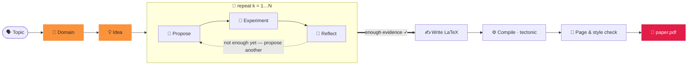

<div align="center">


### توليد ورقة بحثية بكلمتين.

<p align="center"><code>paperclaw run "diffusion models"</code></p>
<p align="center"><sub>🧭 المجال · 💡 الفكرة · 🔬 الفرضيات · 🧪 التجارب · 📊 التحليل<br/>📄 paper.pdf — مكتوبة ومُستشهَد بها ومُجمّعة ✓</sub></p>

يقوم **PaperClaw** بتنسيق وكلاء مستقلين عبر دورة البحث بأكملها —
**🧭 المجال → 💡 الفكرة → 📄 الورقة**. سمِّ موضوعًا فيؤصّل مجالًا، ويولّد فكرة، ويُجري
تجارب *حقيقية*، ويكتب ورقة مُستشهَدًا بها وجاهزة للتجميع.

[](https://arxiv.org/abs/2606.22610)
[](../../LICENSE)


<sub><a href="../../README.md">English</a> · <a href="README.zh-CN.md">简体中文</a> · <a href="README.ja.md">日本語</a> · <a href="README.ko.md">한국어</a> · <a href="README.es.md">Español</a> · <a href="README.fr.md">Français</a> · <a href="README.de.md">Deutsch</a> · <a href="README.pt.md">Português</a> · <a href="README.ru.md">Русский</a> · <b>العربية</b> · <a href="README.hi.md">हिन्दी</a> · <a href="README.it.md">Italiano</a></sub>

</div>

---

## ✦ ما هو PaperClaw؟

PaperClaw هو محرك بحثي مستقل ومفتوح المصدر. يختصر دورة البحث إلى مسار واحد واضح ويتحكم في
مسار العمل من البداية إلى النهاية: خريطة الفرضيات، ومهام التجارب، والذاكرة، والورقة. وصِّل أي نموذج
(Anthropic SDK أو أي نقطة نهاية متوافقة مع OpenAI) أو وكيل برمجة headless خارجي.

يُوزَّع كـ **حزمة Python واحدة** مع خلفية **FastAPI** وواجهة أمامية **Vite + React** تُبنى لهدفين —
**الويب** (تخدمه الخلفية) و**سطح المكتب لنظم Windows / macOS / Linux** (Electron) — بالإضافة إلى
**واجهة سطر أوامر (CLI) كاملة** تعكس كل ميزة.

<div align="center">

</div>

## ✦ أوراق مثال

أوراق حقيقية كتبها PaperClaw من البداية إلى النهاية — موضوع → مجال → فكرة → فرضيات → تجارب →
**PDF مُجمّع** — كلٌّ منها منسّقة بقالب LaTeX الخاص بـ**جهة النشر المستهدفة**. كلٌّ منها مساحة عمل
فكرة كاملة (المواصفات، خريطة الفرضيات، التجارب، الأشكال، `ref.bib`، مصدر LaTeX). تصفّحها في
**[`docs/examples/`](../examples/)**.

| الورقة | الموضوع | الناتج |
|---|---|---|
| 📄 [**RC-Diff: Risk-Controlled Financial Diffusion with Path-Level Audits**](<../examples/[Paper 1] rc-diff-risk-controlled-financial-diffusion/paper.pdf>) | نماذج الانتشار للسلاسل الزمنية المالية | جهة النشر المستهدفة · 9 صفحات |

## ✦ نموذج بحثي نظيف

| | الخطوة | ماذا يحدث | أمر واحد |
|:--:|:--|:--|:--|
| 🧭 | **المجال** — *الأرض التي تُحفر* | صِف مجالًا في جملة واحدة. يكتب النموذج مواصفات `DOMAIN.md` — الهدف، الأوراق المهمة، مجموعات البيانات، المكتبات، جهات النشر — مُستخرَجة **مباشرةً من الفهارس العلمية المفتوحة**، لا من ذاكرة النموذج. | `paperclaw domain auto "…"` |
| 💡 | **الفكرة** — *اتجاه ملموس وقابل للاختبار* | يهضم العصف الذهني مجالًا واحدًا أو أكثر إلى مسوّدات `IDEA.md` كاملة — الخلفية، الفجوة البحثية، الدافع، الفرضيات الجذرية. صقّلها في المحادثة ثم ثبّتها كفكرة حيّة. | `paperclaw brainstorm generate` |
| 📄 | **الورقة** — *مكتوبة ومُستشهَد بها ومُجمّعة* | تقترح حلقة الفرضيات وتختبر وتتأمل جولةً تلو الأخرى، تختار أقوى النتائج، وتكتب ورقة LaTeX بصيغة جهة النشر مع **استشهادات مُتحقَّق منها** — تُجمَّع إلى PDF وتُصقَل حتى تتوافق مع الأسلوب والطول. | `paperclaw run --idea <id>` |

<div align="center">

<br/>
<sub><b>إنشاء مجال في الوضع التلقائي (واجهة الويب)</b> — صِف مجالًا في جملة واحدة؛ يبحث PaperClaw في الفهارس العلمية المفتوحة مباشرةً ويكتب مواصفات <code>DOMAIN.md</code>.</sub>
</div>

## ✦ داخل الطيار الآلي — حلقة فرضيات تعرف متى تتوقف

بمجرد أن يكون للفكرة مجال، يشغّل PaperClaw **حلقة مدفوعة بالتجارب**، تُنمّي خريطة فرضيات من النتائج
المقاسة بدلًا من تخمين مسبق — ثم يكتب الورقة مما وجده فعليًا. تُبَثّ كل مرحلة مباشرةً وهي **قابلة
للاستئناف**.



## ✦ طريقتان لتشغيله

يعمل PaperClaw في وضعين — اختر واحدًا (يتشاركان الخلفية نفسها وبيانات `saves/`، فيمكنك التبديل بحرية).

**أسرع إعداد (دون أوامر):** انسخ `settings.example.yaml` إلى `settings.yaml` في مجلد المشروع واملأ المزوّد والنموذج ومفاتيح API — يقرأه كلٌّ من الخلفية وواجهة CLI عند البدء (وله الأولوية على إعدادات التطبيق). إنه ملف YAML، لذا يمكنك التعليق على الخيارات باستخدام `#`:

```yaml
LLM:
  provider: anthropic           # anthropic | openai
  base_url: null                # null = الإعداد الافتراضي للمزوّد؛ اضبطه لوكيل / استضافة ذاتية
  api_key: ""
  model: claude-opus-4-8
image_generation:               # اختياري — أشكال الورقة
  base_url: null
  api_key: ""
  model: null
academic_search:
  open_alex:
    api_key: ""                 # اختياري — البحث في الأدبيات
```

الملف `settings.yaml` مُستثنى من git (لأنه يحتوي مفاتيحك)، لذا لا يُرفَع أبدًا إلى المستودع. (لا يزال يُقرأ ملف `settings.json` القديم.)

> ⚙️ **الإعداد الكامل** — النموذج والمفاتيح، توليد الصور، OpenAlex، وضع التجارب، أجهزة SSH البعيدة، LaTeX، وفحص `paperclaw doctor`: راجع **[دليل إعداد البيئة](../environment-guide.md)**.

> [!TIP]
> **وضع الويب هو التجربة المُوصى بها** — بث مباشر، ورسم الفرضيات، وشاشة مراقبة التجارب، وعارض PDF
> مدمج، كلها في مكان واحد. **وضع CLI** يعكس كل ميزة للطرفيات والخوادم والأتمتة.

---

### 🪟 1. وضع الويب *(مُوصى به)*

> 📘 **جديد على الواجهة؟** اتبع **[جولة في واجهة الويب](../web-guide.md)** — أربع خطوات موضّحة من المجال إلى الورقة، لكلٍّ منها أمر CLI المقابل.

**التثبيت** — الخلفية + الواجهة الأمامية:

```bash
pip install -e ".[dev]"          # backend (Python)
cd frontend && npm install       # frontend (Node)
```

**التشغيل** — يبدأ `./dev.sh` من جذر المستودع كليهما ويُحرّر المنافذ المشغولة:

```bash
./dev.sh                         # backend :8230 + web UI :5173
# → open http://localhost:5173
```

<sub>المكافئ اليدوي (طرفيتان): `paperclaw serve --reload` &nbsp;·&nbsp; `cd frontend && npm run dev:web`. &nbsp; تطبيق سطح المكتب: `npm run dev` (Electron).</sub>

**الإعداد** — افتح **⚙️ الإعدادات** (الترس، أسفل اليسار):

- **🔌 LLM** — المزوّد، عنوان URL الأساسي (للوكلاء / الاستضافة الذاتية)، النموذج، ومفتاح API.
- **📚 البحث الأكاديمي** — مفتاح API لـ OpenAlex للبحث في الأدبيات (مسح المجال، أوراق SOTA، والمراجع). اختياري، لكن بدونه قد يحدّ OpenAlex من الطلبات المجهولة فتُرجع عمليات المسح "Found 0 papers".
- **🖼️ توليد الصور** — واجهة صور اختيارية بنمط OpenAI لأشكال الورقة (تعود إلى matplotlib/TikZ عند عدم ضبطها).
- **🩺 Doctor** — نقرة واحدة تتحقق من جاهزية البيئة بالكامل (LLM، وكيل البرمجة، سلسلة أدوات LaTeX، توليد الصور، OpenAlex).

تُخزَّن المفاتيح على الخادم فقط في `saves/settings.yaml` (الوضع `600`) ولا تُرسَل أبدًا إلى المتصفح.
بدون مفتاح يظل التطبيق يعمل ويردّ بتلميح للإعداد.

**استخدمه** — انقر **⚡ Auto run** (الشريط الجانبي لموضوع جديد، أو على فكرة قائمة) للانتقال من
موضوع → ورقة؛ راقبه مباشرةً في الشريط وتصفّح علامتي التبويب 🌳 Hypotheses و 📄 Paper. أو تحدّث لبناء
مجال، والعصف الذهني للأفكار، وتثبيت إحداها.

> 📘 **جديد على الواجهة؟** اتبع **[جولة في واجهة الويب](../web-guide.md)** — أربع خطوات موضّحة من المجال إلى الورقة، لكلٍّ منها أمر CLI المقابل.

---

### ⌨️ 2. وضع CLI

تعكس واجهة CLI كل ميزة في الويب. **ثبّت الخلفية فقط** (لا حاجة لبناء الواجهة الأمامية):

```bash
pip install -e ".[dev]"
```

**الإعداد** — يقرأ الوضع المحلي الإعداد بهذه الأولوية (الأعلى أولًا):
**متغيّرات البيئة → `.env` (المجلد الحالي) → `.env` في `$PAPERCLAW_HOME` → `./settings.yaml` (مجلد المشروع) → `$PAPERCLAW_HOME/settings.yaml`**.

| المفتاح | الغرض |
|---|---|
| `PAPERCLAW_PROVIDER` | `anthropic` \| `openai` (متوافق مع OpenAI) |
| `PAPERCLAW_BASE_URL` | نقطة نهاية وكيل / استضافة ذاتية (اختياري) |
| `PAPERCLAW_MODEL` | مثل `claude-opus-4-8` |
| `PAPERCLAW_API_KEY` | مفتاح API (`ANTHROPIC_API_KEY` / `OPENAI_API_KEY` بدائل حسب المزوّد) |
| `OPENALEX_API_KEY` | مفتاح OpenAlex للبحث في الأدبيات (اختياري — يتجنب حدود الطلبات المجهولة) |
| `PAPERCLAW_HOME` | جذر مساحة العمل (الافتراضي: `./saves`) |

```bash
# or persist them once:
paperclaw settings set --provider anthropic --model claude-opus-4-8 --api-key sk-…
paperclaw settings set --openalex-api-key oa-…   # literature search (optional)
paperclaw doctor                 # check the env is ready (LLM, LaTeX, image gen, OpenAlex)
```

**استخدمه** — يعمل الوضع المحلي (الافتراضي) على الملفات ضمن `$PAPERCLAW_HOME`:

```bash
# Fully autonomous: topic → doctor → domain → idea → hypotheses → paper
paperclaw run "diffusion models for time series"       # writes the paper on 2 positives
paperclaw run "…" --positive 3 --max-hypotheses 8      # stop at 3 supported, cap at 8
paperclaw status / stop / resume                       # manage runs from any terminal

# …or drive each step:
paperclaw domain auto "time-series diffusion"
paperclaw domain list                  # [✓] = selected for brainstorming
paperclaw brainstorm generate          # digest selected domains → IDEA.md drafts
paperclaw brainstorm pin <seed-id>     # promote a draft to a living idea
paperclaw hypothesis <idea> generate   # build the hypothesis map
paperclaw references <idea> validate   # validate citations vs Crossref/OpenAlex
paperclaw experiments                  # list detached, monitored experiment jobs
```

**الوضع البعيد** — وجّه واجهة CLI نفسها إلى خلفية قيد التشغيل بدلًا من الملفات المحلية باستخدام
`--backend` (عندها يعيش الإعداد على الخادم لا محليًا):

```bash
paperclaw --backend domain list                    # → http://127.0.0.1:8230
paperclaw --backend http://host:8230 chat "hello"  # explicit URL
```

<details>
<summary><b>ملف إعداد التشغيل التلقائي والتشغيلات المتوازية</b></summary>

```yaml
# run.yaml
topic: generative modeling for time series
positive: 3          # write the paper once 3 hypotheses are SUPPORTED
max_hypotheses: 8    # stop after 8 if not enough positives
page_limit: 8
```
```bash
paperclaw run --config run.yaml   # CLI flags override the file
```

**تعمل الأفكار بالتوازي** — ابدأ تشغيلًا تلقائيًا على أي عدد تشاء من الأفكار؛ تُظهر لوحة كل فكرة شريط ⚡
الخاص بها فقط. التشغيلات **منفصلة**: تبقى حية بعد إغلاق التبويب أو إعادة تشغيل الخلفية. **أوقِف** عبر
`paperclaw stop [--idea <id>]` (أو Ctrl+C، أو ⏹ في شريط الويب)؛ **تابِع** تشغيلًا متوقفًا عبر
`paperclaw resume [--idea <id>]` — فالخط القابل للاستئناف يتخطّى الفرضيات/المراحل المكتملة.

</details>

## ✦ التطوير

```bash
./dev.sh          # one-shot: kills stale ports, restarts backend :8230 + web UI :5173
```

أو يدويًا — الخلفية من جذر المستودع، **أوامر npm داخل `frontend/`**:

```bash
pip install -e ".[dev]"
paperclaw serve --reload                  # repo root — API on :8230
cd frontend && npm install
npm run dev:web                           # web     → http://localhost:5173
npm run dev                               # desktop → Electron window
```

> **أعد التشغيل بعد كل مجموعة تغييرات** — لا يغطي `--reload` التبعيات الجديدة ولا الإعدادات المُحمَّلة عند
> البدء ولا تغييرات إعداد Vite.

## ✦ الإنتاج

```bash
# Web (served by the Python backend)
cd frontend && npm run build:web          # → frontend/dist/web, then `paperclaw serve`

# Desktop packages (output in frontend/dist/)
npm run dist:win     # Windows — NSIS installer + portable zip
npm run dist:mac     # macOS   — dmg + zip (must run on a Mac)
npm run dist:linux   # Linux   — AppImage
```

ادفع وسمًا `v*` (أو شغّل سير العمل يدويًا) فيقوم `.github/workflows/desktop.yml` ببناء win/mac/linux على
عدّاءات أصلية ويرفع النواتج.

## ✦ الاختبارات

```bash
pytest tests/                             # backend
cd frontend && npm run typecheck          # frontend (tsc --noEmit)
```

## ✦ قدرات PaperClaw

<table>
<tr>
<td width="33%" valign="top">

**🧭 اكتشاف مدفوع بالمجال**
`DOMAIN.md` تلقائي من جملة واحدة أو معالج موجَّه — أوراق ومجموعات بيانات ومكتبات وجهات نشر مأخوذة من فهارس علمية حيّة.

</td>
<td width="33%" valign="top">

**💡 عصف ذهني متعدد المجالات**
يهضم مجالًا واحدًا أو أكثر إلى مسوّدات `IDEA.md` كاملة، ثم يقطّر إحداها إلى مواصفات فكرة حيّة تبقى محدَّثة أثناء حديثك.

</td>
<td width="33%" valign="top">

**🔁 حلقة فرضيات تكرارية**
اقترح → اختبر → تأمّل، مع تنمية خريطة فرضيات من النتائج المقاسة — أصغر تجربة تحسم كل سؤال.

</td>
</tr>
<tr>
<td valign="top">

**🤝 مساعد بحثي داخل الدورة**
هيكل محايد تجاه المزوّد — بدّل النموذج أو وصِّل وكيل برمجة headless خارجيًا في أي مرحلة.

</td>
<td valign="top">

**🧪 تجارب حقيقية ومُدارة**
مهام تنجو من إعادة التشغيل. يكتب الوكيل `run.py`، ويشغّله كعملية فرعية معزولة، ويصحّح آثار أخطائه بنفسه حتى يحصل على المقاييس والأشكال.

</td>
<td valign="top">

**🧠 ذاكرة لدورة الحياة الكاملة**
المجال والفكرة والفرضية والورقة وثائق حيّة ونقاط حفظ قابلة للاستئناف — أوقف أي تشغيل وتابعه دون فقدان العمل.

</td>
</tr>
<tr>
<td valign="top">

**♻️ مساعد يتطوّر**
تتراكم مجالات منتقاة وأدلة أسلوب وقواعد أكواد مرجعية وببليوغرافيات مُتحقَّق منها ويُعاد استخدامها — أحدّ مع الوقت.

</td>
<td valign="top">

**📚 استشهادات مُتحقَّق منها**
لكل فكرة `ref.bib` مبني حتميًا من OpenAlex و Crossref، ويُتحقَّق من كل مُدخَل مقابل المصدر — بلا مراجع ملفّقة.

</td>
<td valign="top">

**📄 أوراق بصيغة جهة النشر**
LaTeX حقيقي، مُجمَّع بـ tectonic عبر حلقة تصحيح بالوكيل، مصقول حتى يتوافق مع الأسلوب والطول — لا يُبلَّغ إلا عن نتائج جرى تنفيذها فعلًا.

</td>
</tr>
<tr>
<td valign="top">

**🖥️ واعٍ بالعتاد**
يكتشف CPU / GPU / الذاكرة / القرص على المضيف المحلي وأي جهاز SSH بعيد، فتُخطَّط التجارب وفق الحوسبة المتاحة فعليًا.

</td>
<td valign="top">

**🪟 ويب · سطح مكتب · CLI**
قاعدة كود Vite + React واحدة تُشحن كتطبيق ويب وتطبيق سطح مكتب Electron وواجهة CLI كاملة — كل قدرة متطابقة في الثلاثة.

</td>
<td valign="top">

**🔌 أحضِر نموذجك**
Anthropic عبر SDK الرسمي، أو أي نقطة نهاية متوافقة مع OpenAI. النموذج الافتراضي `claude-opus-4-8`. تبقى المفاتيح على الخادم.

</td>
</tr>
</table>

## ✦ الأسئلة الشائعة

**كيف أشغّله على خادم (للاستفادة من تخزينه وموارده الحاسوبية) وأستخدمه محليًا عبر نفق SSH؟**
انشُر الخلفية على الخادم وصِل إليها عبر نفق SSH — دون الحاجة إلى منفذ عام. **على الخادم:** ابنِ الواجهة وشغّل الخلفية على منفذ واحد — `cd frontend && npm run build:web` ثم `paperclaw serve --port 8230`؛ تبقى البيانات في `$PAPERCLAW_HOME` وتستخدم التجارب وحدة المعالجة/المعالج الرسومي للخادم. **على جهازك:** مرِّر المنفذ عبر `ssh -N -L 8230:localhost:8230 user@server` ثم افتح `http://localhost:8230`. وتعمل واجهة CLI بالطريقة نفسها عبر النفق: `paperclaw --backend http://localhost:8230 …`.

**لماذا يقول مسح المجال "Found 0 papers"؟**
يحدّ OpenAlex الآن من الطلبات المجهولة (لكل IP) بميزانية. أضف مفتاح API مجانيًا من OpenAlex في
**الإعدادات → 📚 البحث الأكاديمي** (أو `OPENALEX_API_KEY`) للحصول على ميزانية مخصّصة.

**ضغطت على ⚡ Auto run أعلى اليسار لكن الواجهة لا تُظهر أي تقدّم — أين ذهب؟**
زر **⚡ Auto run** أعلى يسار الشريط الجانبي يبدأ تشغيلًا من **موضوع** (يعادل `paperclaw run "موضوعك"`) وهو لا يزال في **مرحلة تجريبية (beta)**: عرض التقدّم داخل التطبيق قيد التطوير. التشغيل نفسه سليم (عملية منفصلة كأي تشغيل تلقائي)؛ تابِعه من أي طرفية عبر `paperclaw status` (و`paperclaw stop` / `paperclaw resume`). أما التشغيلات التي تبدأ على فكرة *موجودة* (زر ⚡ Auto run في الشريط العلوي) فتُظهر الشريط الحي. راجع [جولة في واجهة الويب](../web-guide.md#4-auto-run--topic--paper-on-autopilot).

**هل مفتاح API الخاص بي آمن؟**
تُخزَّن المفاتيح على الخادم في `saves/settings.yaml` (الوضع `600`) ولا تُرسَل أبدًا إلى المتصفح ولا تُسجَّل.

**هل أحتاج إلى GPU؟**
لا — تعمل التشغيلات الصغيرة على CPU. يكتشف PaperClaw CPU/GPU/الذاكرة على المضيف المحلي وأي جهاز SSH بعيد
ويخطّط التجارب وفق الحوسبة المتاحة فعليًا.

**ويب أم CLI؟**
أيٌّ منهما — يتشاركان الخلفية نفسها وبيانات `saves/`، فيمكنك التبديل بحرية؛ وتعكس CLI كل ميزة في الويب.

## ✦ الاستشهاد

PaperClaw موصوف في ورقتنا البحثية — **[PaperClaw: Harnessing Agents for Autonomous Research and Human-in-the-Loop Refinement](https://arxiv.org/abs/2606.22610)**. إذا استخدمته في بحثك، فيرجى الاستشهاد به:

```bibtex
@article{ye2026paperclaw,
  title   = {PaperClaw: Harnessing Agents for Autonomous Research and Human-in-the-Loop Refinement},
  author  = {Ye, Weiwei and Liu, Hangchen and Li, Dongyuan and Jiang, Renhe},
  journal = {arXiv preprint arXiv:2606.22610},
  year    = {2026}
}
```

## ✦ الترخيص

[MIT](../../LICENSE) © مساهمو PaperClaw.

<div align="center">
<br />
<sub>🦞 <b>PaperClaw</b> — المجال → الفكرة → الورقة، بشكل مستقل.</sub>
</div>
