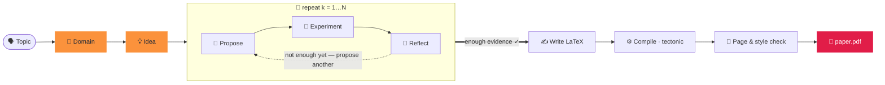

<div align="center">


### Ein Paper in zwei Wörtern erzeugen.

<p align="center"><code>paperclaw run "diffusion models"</code></p>
<p align="center"><sub>🧭 Domäne · 💡 Idee · 🔬 Hypothesen · 🧪 Experimente · 📊 Analyse<br/>📄 paper.pdf — geschrieben, zitiert &amp; kompiliert ✓</sub></p>

**PaperClaw** steuert autonome Agenten über den gesamten Forschungszyklus —
**🧭 Domäne → 💡 Idee → 📄 Paper**. Nenne ein Thema, und es fundiert ein Feld, entwickelt
eine Idee, führt *echte* Experimente aus und schreibt ein zitiertes, kompiliertes Paper.

[](../../LICENSE)


<sub><a href="../../README.md">English</a> · <a href="README.zh-CN.md">简体中文</a> · <a href="README.ja.md">日本語</a> · <a href="README.ko.md">한국어</a> · <a href="README.es.md">Español</a> · <a href="README.fr.md">Français</a> · <b>Deutsch</b> · <a href="README.pt.md">Português</a> · <a href="README.ru.md">Русский</a> · <a href="README.ar.md">العربية</a> · <a href="README.hi.md">हिन्दी</a> · <a href="README.it.md">Italiano</a></sub>

</div>

---

## ✦ Was ist PaperClaw?

PaperClaw ist eine quelloffene, autonome Forschungs-Engine. Sie verdichtet den Forschungszyklus
zu einem einzigen klaren Pfad und besitzt den Kontrollfluss durchgängig: die Hypothesenkarte, die
Experiment-Jobs, das Gedächtnis und das Paper. Binde ein beliebiges Modell ein (Anthropic SDK oder
einen beliebigen OpenAI-kompatiblen Endpunkt) oder einen externen Headless-Coding-Agenten.

Es wird als **ein einziges Python-Paket** ausgeliefert, mit einem **FastAPI**-Backend und einem
**Vite + React**-Frontend, das für zwei Ziele baut — **Web** (vom Backend bereitgestellt) und
**Windows / macOS / Linux Desktop** (Electron) — plus einer **vollständigen CLI**, die jede Funktion
abbildet.

<div align="center">

</div>

## ✦ Beispiel-Paper

Echte Paper, die PaperClaw durchgängig geschrieben hat — Thema → Domäne → Idee → Hypothesen →
Experimente → **kompiliertes PDF** — jedes mit der LaTeX-Vorlage seines **Ziel-Publikationsorts**
gesetzt. Jedes ist ein vollständiger Ideen-Workspace (Spezifikation, Hypothesenkarte, Experimente,
Abbildungen, `ref.bib`, LaTeX-Quelle). Durchstöbere sie in
**[`docs/examples/`](../examples/)**.

| Paper | Thema | Ausgabe |
|---|---|---|
| 📄 [**RC-Diff: Risk-Controlled Financial Diffusion with Path-Level Audits**](<../examples/[Paper 1] rc-diff-risk-controlled-financial-diffusion/paper.pdf>) | Diffusionsmodelle für finanzielle Zeitreihen | Ziel-Publikationsort · 9 S. |

## ✦ Ein sauberes Forschungsmodell

| | Schritt | Was passiert | Ein Befehl |
|:--:|:--|:--|:--|
| 🧭 | **Domäne** — *der Boden zum Graben* | Beschreibe ein Feld in einem Satz. Das Modell schreibt eine `DOMAIN.md`-Spezifikation — Ziel, wichtige Paper, Datensätze, Bibliotheken, Publikationsorte — **live aus offenen wissenschaftlichen Indizes** bezogen, nicht aus dem Modellgedächtnis. | `paperclaw domain auto "…"` |
| 💡 | **Idee** — *eine konkrete, testbare Richtung* | Brainstorming verdichtet eine oder mehrere Domänen zu vollständigen `IDEA.md`-Entwürfen — Hintergrund, Forschungslücke, Motivation, Wurzelhypothesen. Verfeinere sie im Chat und hefte sie als lebendige Idee an. | `paperclaw brainstorm generate` |
| 📄 | **Paper** — *geschrieben, zitiert & kompiliert* | Die Hypothesenschleife schlägt vor, testet und reflektiert Runde um Runde, wählt die stärksten Ergebnisse aus und schreibt ein im Format des Publikationsorts gesetztes LaTeX-Paper mit **validierten Zitaten** — zu PDF kompiliert und verfeinert, bis Stil und Länge passen. | `paperclaw run --idea <id>` |

<div align="center">

<br/>
<sub><b>Domäne im Auto-Modus (Web-Oberfläche)</b> — beschreibe ein Feld in einem Satz; PaperClaw durchsucht offene wissenschaftliche Indizes live und schreibt die <code>DOMAIN.md</code>-Spezifikation.</sub>
</div>

## ✦ Im Autopiloten — eine Hypothesenschleife, die weiß, wann sie aufhört

Sobald eine Idee eine Domäne hat, führt PaperClaw eine **experimentgetriebene Schleife** aus, die
eine Hypothesenkarte aus gemessenen Ergebnissen statt aus einer Vorab-Vermutung wachsen lässt — und
schreibt das Paper aus dem, was es tatsächlich gefunden hat. Jede Phase wird live gestreamt und ist
**fortsetzbar**.



## ✦ Zwei Wege, es auszuführen

PaperClaw läuft in zwei Modi — wähle einen (sie teilen sich dasselbe Backend und die `saves/`-Daten,
du kannst also frei wechseln).

> [!TIP]
> **Der Web-Modus ist die empfohlene Erfahrung** — Live-Streaming, der Hypothesengraph, der
> Experiment-Monitor und der integrierte PDF-Viewer, alles an einem Ort. Der **CLI-Modus** bildet
> jede Funktion für Terminals, Server und Automatisierung ab.

---

### 🪟 1. Web-Modus *(empfohlen)*

**Installieren** — Backend + Frontend:

```bash
pip install -e ".[dev]"          # backend (Python)
cd frontend && npm install       # frontend (Node)
```

**Ausführen** — `./dev.sh` aus dem Repo-Stammverzeichnis startet beides und gibt belegte Ports frei:

```bash
./dev.sh                         # backend :8230 + web UI :5173
# → open http://localhost:5173
```

<sub>Manuelles Äquivalent (zwei Terminals): `paperclaw serve --reload` &nbsp;·&nbsp; `cd frontend && npm run dev:web`. &nbsp; Desktop-App: `npm run dev` (Electron).</sub>

**Konfigurieren** — öffne **⚙️ Einstellungen** (Zahnrad, unten links):

- **🔌 LLM** — Anbieter, Basis-URL (für Proxys / Self-Hosting), Modell und API-Schlüssel.
- **📚 Akademische Suche** — ein OpenAlex-API-Schlüssel für die Literatursuche (Domänen-Recherche, SOTA-Paper und Referenzen). Optional, aber ohne ihn kann OpenAlex anonyme Anfragen drosseln und Recherchen liefern „Found 0 papers".
- **🖼️ Bildgenerierung** — optionale OpenAI-artige Bild-API für Paper-Abbildungen (fällt auf matplotlib/TikZ zurück, wenn nicht gesetzt).
- **🩺 Doctor** — ein Klick prüft, ob die gesamte Umgebung bereit ist (LLM, Coding-Agent, LaTeX-Toolchain, Bildgenerierung, OpenAlex).

Schlüssel werden nur serverseitig in `saves/settings.json` (Modus `600`) gespeichert und nie an den
Browser gesendet. Ohne Schlüssel läuft die App trotzdem und antwortet mit einem Konfigurationshinweis.

**Nutze es** — klicke auf **⚡ Auto run** (Seitenleiste für ein neues Thema oder auf einer bestehenden
Idee), um von Thema → Paper zu gelangen; beobachte es live im Banner und durchstöbere die Tabs
🌳 Hypotheses und 📄 Paper. Oder chatte, um eine Domäne aufzubauen, Ideen zu sammeln und eine anzuheften.

---

### ⌨️ 2. CLI-Modus

Die CLI bildet jede Web-Funktion ab. **Installiere nur das Backend** (kein Frontend-Build nötig):

```bash
pip install -e ".[dev]"
```

**Konfigurieren** — der lokale Modus liest die Konfiguration in dieser Priorität (höchste zuerst):
**Umgebungsvariablen → `.env` (cwd) → `.env` in `$PAPERCLAW_HOME` → `settings.json`**.

| Schlüssel | Zweck |
|---|---|
| `PAPERCLAW_PROVIDER` | `anthropic` \| `openai` (OpenAI-kompatibel) |
| `PAPERCLAW_BASE_URL` | Proxy- / Self-Hosting-Endpunkt (optional) |
| `PAPERCLAW_MODEL` | z. B. `claude-opus-4-8` |
| `PAPERCLAW_API_KEY` | API-Schlüssel (`ANTHROPIC_API_KEY` / `OPENAI_API_KEY` als anbieterabhängige Fallbacks) |
| `OPENALEX_API_KEY` | OpenAlex-Schlüssel für die Literatursuche (optional — vermeidet anonyme Drosselung) |
| `PAPERCLAW_HOME` | Workspace-Wurzel (Standard: `./saves`) |

```bash
# or persist them once:
paperclaw settings set --provider anthropic --model claude-opus-4-8 --api-key sk-…
paperclaw settings set --openalex-api-key oa-…   # literature search (optional)
paperclaw doctor                 # check the env is ready (LLM, LaTeX, image gen, OpenAlex)
```

**Nutze es** — der lokale Modus (Standard) arbeitet mit Dateien unter `$PAPERCLAW_HOME`:

```bash
# Fully autonomous: topic → doctor → domain → idea → hypotheses → paper
paperclaw run "diffusion models for time series"       # writes the paper on 2 positives
paperclaw run "…" --positive 3 --max-hypotheses 8      # stop at 3 supported, cap at 8
paperclaw status / stop / resume                       # manage runs from any terminal

# …or drive each step:
paperclaw domain auto "time-series diffusion"
paperclaw domain list                  # [✓] = selected for brainstorming
paperclaw brainstorm generate          # digest selected domains → IDEA.md drafts
paperclaw brainstorm pin <seed-id>     # promote a draft to a living idea
paperclaw hypothesis <idea> generate   # build the hypothesis map
paperclaw references <idea> validate   # validate citations vs Crossref/OpenAlex
paperclaw experiments                  # list detached, monitored experiment jobs
```

**Remote-Modus** — richte dieselbe CLI mit `--backend` auf ein laufendes Backend statt auf lokale
Dateien (die Konfiguration liegt dann auf dem Server, nicht lokal):

```bash
paperclaw --backend domain list                    # → http://127.0.0.1:8230
paperclaw --backend http://host:8230 chat "hello"  # explicit URL
```

<details>
<summary><b>Auto-Run-Konfigurationsdatei & parallele Läufe</b></summary>

```yaml
# run.yaml
topic: generative modeling for time series
positive: 3          # write the paper once 3 hypotheses are SUPPORTED
max_hypotheses: 8    # stop after 8 if not enough positives
page_limit: 8
```
```bash
paperclaw run --config run.yaml   # CLI flags override the file
```

**Ideen laufen parallel** — starte einen Auto-Run auf so vielen Ideen, wie du möchtest; das Panel
jeder Idee zeigt nur ihr eigenes ⚡-Banner. Läufe sind **abgekoppelt**: Sie überleben das Schließen des
Tabs oder einen Neustart des Backends. **Stoppe** mit `paperclaw stop [--idea <id>]` (oder Ctrl+C oder
dem ⏹ im Web-Banner); **setze** einen gestoppten Lauf mit `paperclaw resume [--idea <id>]` **fort** —
die Pipeline ist fortsetzbar und überspringt bereits abgeschlossene Hypothesen/Phasen.

</details>

## ✦ Entwicklung

```bash
./dev.sh          # one-shot: kills stale ports, restarts backend :8230 + web UI :5173
```

Oder manuell — das Backend aus dem Repo-Stammverzeichnis, **npm-Befehle innerhalb von `frontend/`**:

```bash
pip install -e ".[dev]"
paperclaw serve --reload                  # repo root — API on :8230
cd frontend && npm install
npm run dev:web                           # web     → http://localhost:5173
npm run dev                               # desktop → Electron window
```

> **Nach jedem Änderungssatz neu starten** — `--reload` deckt keine neuen Abhängigkeiten, beim Start
> geladene Einstellungen oder Änderungen an der Vite-Konfiguration ab.

## ✦ Produktion

```bash
# Web (served by the Python backend)
cd frontend && npm run build:web          # → frontend/dist/web, then `paperclaw serve`

# Desktop packages (output in frontend/dist/)
npm run dist:win     # Windows — NSIS installer + portable zip
npm run dist:mac     # macOS   — dmg + zip (must run on a Mac)
npm run dist:linux   # Linux   — AppImage
```

Schiebe ein `v*`-Tag (oder starte den Workflow manuell), und `.github/workflows/desktop.yml` baut
win/mac/linux auf nativen Runnern und lädt die Artefakte hoch.

## ✦ Tests

```bash
pytest tests/                             # backend
cd frontend && npm run typecheck          # frontend (tsc --noEmit)
```

## ✦ PaperClaw-Funktionen

<table>
<tr>
<td width="33%" valign="top">

**🧭 Domänengetriebene Entdeckung**
Automatische `DOMAIN.md` aus einem Satz oder einem geführten Assistenten — Paper, Datensätze, Bibliotheken und Publikationsorte aus Live-Wissenschaftsindizes.

</td>
<td width="33%" valign="top">

**💡 Multi-Domänen-Brainstorming**
Verdichtet eine oder mehrere Domänen zu vollständigen `IDEA.md`-Entwürfen und destilliert daraus eine lebendige Ideen-Spezifikation, die im Gespräch aktuell bleibt.

</td>
<td width="33%" valign="top">

**🔁 Iterative Hypothesenschleife**
Vorschlagen → testen → reflektieren, eine Hypothesenkarte aus gemessenen Ergebnissen wachsen lassen — das kleinste Experiment, das jede Frage klärt.

</td>
</tr>
<tr>
<td valign="top">

**🤝 Forschungsassistent im Zyklus**
Ein anbieterunabhängiges Gerüst — tausche das Modell aus oder binde in jeder Phase einen externen Headless-Coding-Agenten ein.

</td>
<td valign="top">

**🧪 Echte, verwaltete Experimente**
Jobs, die Neustarts überstehen. Der Agent schreibt `run.py`, führt es als isolierten Subprozess aus und debuggt seine eigenen Tracebacks, bis er Metriken und Abbildungen erhält.

</td>
<td valign="top">

**🧠 Gedächtnis über den gesamten Lebenszyklus**
Domäne, Idee, Hypothese und Paper sind lebendige Dokumente und fortsetzbare Checkpoints — jeden Lauf stoppen und fortsetzen, ohne Arbeit zu verlieren.

</td>
</tr>
<tr>
<td valign="top">

**♻️ Sich entwickelnder Assistent**
Kuratierte Domänen, Stil-Leitfäden, Referenz-Codebasen und validierte Bibliografien sammeln sich an und werden wiederverwendet — mit der Zeit schärfer.

</td>
<td valign="top">

**📚 Validierte Zitate**
Jede Idee besitzt eine `ref.bib`, deterministisch aus OpenAlex & Crossref aufgebaut, jeder Eintrag gegen die Quelle validiert — keine erfundenen Referenzen.

</td>
<td valign="top">

**📄 Paper im Publikationsformat**
Echtes LaTeX, mit tectonic über eine Agenten-Korrekturschleife kompiliert, verfeinert bis Stil und Länge passen — es werden nur tatsächlich ausgeführte Ergebnisse berichtet.

</td>
</tr>
<tr>
<td valign="top">

**🖥️ Hardware-bewusst**
Erkennt CPU / GPU / Speicher / Disk auf dem lokalen Host und jedem SSH-Remote, sodass Experimente nach der tatsächlich verfügbaren Rechenleistung geplant werden.

</td>
<td valign="top">

**🪟 Web · Desktop · CLI**
Eine einzige Vite + React-Codebasis wird als Web-App, Electron-Desktop-App und vollständige CLI ausgeliefert — jede Fähigkeit in allen dreien identisch.

</td>
<td valign="top">

**🔌 Eigenes Modell mitbringen**
Anthropic über das offizielle SDK oder ein beliebiger OpenAI-kompatibler Endpunkt. Standardmodell `claude-opus-4-8`. Schlüssel bleiben serverseitig.

</td>
</tr>
</table>

## ✦ FAQ

**Wie betreibe ich es auf einem Server (für dessen Speicher & Rechenleistung) und nutze es lokal über einen SSH-Tunnel?**
Stelle das Backend auf dem Server bereit und erreiche es über einen SSH-Tunnel — kein öffentlicher Port nötig. **Auf dem Server:** baue die UI und starte das Backend auf einem Port — `cd frontend && npm run build:web`, dann `paperclaw serve --port 8230`; die Daten liegen in `$PAPERCLAW_HOME` und Experimente nutzen die CPU/GPU des Servers. **Auf deinem Rechner:** leite den Port mit `ssh -N -L 8230:localhost:8230 user@server` weiter und öffne `http://localhost:8230`. Die CLI funktioniert genauso über den Tunnel: `paperclaw --backend http://localhost:8230 …`.

**Warum zeigt eine Domänen-Recherche „Found 0 papers"?**
OpenAlex drosselt anonyme (pro-IP) Anfragen nun per Budget. Füge unter **Einstellungen → 📚 Akademische
Suche** (oder `OPENALEX_API_KEY`) einen kostenlosen OpenAlex-API-Schlüssel für ein eigenes Budget hinzu.

**Ist mein API-Schlüssel sicher?**
Schlüssel werden serverseitig in `saves/settings.json` (Modus `600`) gespeichert und nie an den Browser
gesendet oder geloggt.

**Brauche ich eine GPU?**
Nein — kleine Läufe funktionieren auf der CPU. PaperClaw erkennt CPU/GPU/Speicher auf dem lokalen Host und
jedem SSH-Remote und plant Experimente nach der tatsächlich verfügbaren Rechenleistung.

**Web oder CLI?**
Beides — sie teilen sich dasselbe Backend und die `saves/`-Daten, du kannst also frei wechseln; die CLI
bildet jede Web-Funktion ab.

## ✦ Lizenz

[MIT](../../LICENSE) © PaperClaw-Mitwirkende.

<div align="center">
<br />
<sub>🦞 <b>PaperClaw</b> — Domäne → Idee → Paper, autonom.</sub>
</div>
