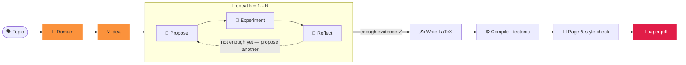

<div align="center">


### Generar un artículo en dos palabras.

<p align="center"><code>paperclaw run "diffusion models"</code></p>
<p align="center"><sub>🧭 dominio · 💡 idea · 🔬 hipótesis · 🧪 experimentos · 📊 análisis<br/>📄 paper.pdf — escrito, citado y compilado ✓</sub></p>

**PaperClaw** orquesta agentes autónomos a lo largo de todo el ciclo de investigación —
**🧭 Dominio → 💡 Idea → 📄 Artículo**. Nombra un tema y fundamenta un campo, genera
una idea, ejecuta experimentos *reales* y escribe un artículo citado y compilado.

[](../../LICENSE)


<sub><a href="../../README.md">English</a> · <a href="README.zh-CN.md">简体中文</a> · <a href="README.ja.md">日本語</a> · <a href="README.ko.md">한국어</a> · <b>Español</b> · <a href="README.fr.md">Français</a> · <a href="README.de.md">Deutsch</a> · <a href="README.pt.md">Português</a> · <a href="README.ru.md">Русский</a> · <a href="README.ar.md">العربية</a> · <a href="README.hi.md">हिन्दी</a> · <a href="README.it.md">Italiano</a></sub>

</div>

---

## ✦ ¿Qué es PaperClaw?

PaperClaw es un motor de investigación autónomo y de código abierto. Reduce el ciclo de
investigación a un único camino limpio y controla el flujo de extremo a extremo: el mapa de
hipótesis, los trabajos de experimentación, la memoria y el artículo. Conecta cualquier modelo
(el SDK de Anthropic o cualquier endpoint compatible con OpenAI) o un agente de codificación
headless externo.

Se distribuye como **un solo paquete de Python** con un backend **FastAPI** y un frontend
**Vite + React** que se compila para dos destinos — **web** (servido por el backend) y
**escritorio para Windows / macOS / Linux** (Electron) — además de una **CLI completa** que
refleja todas las funciones.

<div align="center">

</div>

## ✦ Artículos de ejemplo

Artículos reales que PaperClaw escribió de extremo a extremo — tema → dominio → idea → hipótesis →
experimentos → **PDF compilado** — cada uno maquetado con la plantilla LaTeX de su **lugar de
publicación objetivo**. Cada uno es un espacio de trabajo de idea completo (especificación, mapa de
hipótesis, experimentos, figuras, `ref.bib`, fuente LaTeX). Explóralos en
**[`docs/examples/`](../examples/)**.

| Artículo | Tema | Salida |
|---|---|---|
| 📄 [**RC-Diff: Risk-Controlled Financial Diffusion with Path-Level Audits**](<../examples/[Paper 1] rc-diff-risk-controlled-financial-diffusion/paper.pdf>) | Modelos de difusión para series temporales financieras | Lugar objetivo · 9 pp |

## ✦ Un modelo de investigación limpio

| | Paso | Qué ocurre | Un comando |
|:--:|:--|:--|:--|
| 🧭 | **Dominio** — *el terreno donde cavar* | Describe un campo en una frase. El modelo escribe una especificación `DOMAIN.md` — objetivo, artículos clave, conjuntos de datos, bibliotecas, lugares de publicación — extraída **en vivo de índices académicos abiertos**, no de la memoria del modelo. | `paperclaw domain auto "…"` |
| 💡 | **Idea** — *una dirección concreta y comprobable* | La lluvia de ideas digiere uno o varios dominios en borradores `IDEA.md` completos — contexto, brecha de investigación, motivación, hipótesis raíz. Refínala en el chat y luego fíjala como idea viva. | `paperclaw brainstorm generate` |
| 📄 | **Artículo** — *escrito, citado y compilado* | El bucle de hipótesis propone, prueba y reflexiona ronda tras ronda, selecciona los resultados más sólidos y escribe un artículo LaTeX con formato del lugar y **citas validadas** — compilado a PDF y refinado hasta cumplir estilo y extensión. | `paperclaw run --idea <id>` |

<div align="center">

<br/>
<sub><b>Dominio en modo automático (interfaz web)</b> — describe un campo en una frase; PaperClaw consulta índices académicos abiertos en vivo y escribe la especificación <code>DOMAIN.md</code>.</sub>
</div>

## ✦ Dentro del piloto automático — un bucle de hipótesis que sabe cuándo parar

Una vez que una idea tiene un dominio, PaperClaw ejecuta un **bucle impulsado por experimentos**,
haciendo crecer un mapa de hipótesis a partir de resultados medidos en lugar de una conjetura
inicial — y luego escribe el artículo a partir de lo que realmente encontró. Cada fase se transmite
en vivo y es **reanudable**.



## ✦ Dos formas de ejecutarlo

PaperClaw funciona en dos modos — elige uno (comparten el mismo backend y los datos de `saves/`,
así que puedes cambiar libremente).

**Configuración más rápida (sin comandos):** copia `settings.example.yaml` a `settings.yaml` en el directorio del proyecto y rellena tu proveedor, modelo y claves de API — tanto el backend como la CLI lo leen al iniciar (tiene prioridad sobre los Ajustes de la app). Es YAML, así que puedes comentar las opciones con `#`:

```yaml
LLM:
  provider: anthropic           # anthropic | openai
  base_url: null                # null = predeterminado del proveedor; para proxy / self-hosted
  api_key: ""
  model: claude-opus-4-8
image_generation:               # opcional — figuras del artículo
  base_url: null
  api_key: ""
  model: null
academic_search:
  open_alex:
    api_key: ""                 # opcional — búsqueda bibliográfica
```

`settings.yaml` está en git-ignore (contiene tus claves), por lo que nunca se sube al repositorio. (Todavía se lee un `settings.json` heredado.)

> ⚙️ **Configuración completa** — modelo y claves, generación de imágenes, OpenAlex, modo de experimentos, remotos SSH, LaTeX y la comprobación `paperclaw doctor`: consulta la **[guía de configuración del entorno](../environment-guide.md)**.

> [!TIP]
> **El modo web es la experiencia recomendada** — transmisión en vivo, el grafo de hipótesis, el
> monitor de experimentos y el visor de PDF integrado, todo en un solo lugar. El **modo CLI**
> refleja todas las funciones para terminales, servidores y automatización.

---

### 🪟 1. Modo web *(recomendado)*

> 📘 **¿Nuevo en la interfaz?** Sigue el **[recorrido por la interfaz web](../web-guide.md)** — cuatro pasos anotados de dominio a artículo, cada uno con su equivalente en CLI.

**Instalar** — backend + frontend:

```bash
pip install -e ".[dev]"          # backend (Python)
cd frontend && npm install       # frontend (Node)
```

**Ejecutar** — `./dev.sh` desde la raíz del repositorio inicia ambos y libera puertos ocupados:

```bash
./dev.sh                         # backend :8230 + web UI :5173
# → open http://localhost:5173
```

<sub>Equivalente manual (dos terminales): `paperclaw serve --reload` &nbsp;·&nbsp; `cd frontend && npm run dev:web`. &nbsp; App de escritorio: `npm run dev` (Electron).</sub>

**Configurar** — abre **⚙️ Ajustes** (engranaje, abajo a la izquierda):

- **🔌 LLM** — proveedor, URL base (para proxies / autoalojado), modelo y clave de API.
- **📚 Búsqueda académica** — una clave de API de OpenAlex para la búsqueda de literatura (el estudio del dominio, artículos SOTA y referencias). Opcional, pero sin ella OpenAlex puede limitar las solicitudes anónimas y los estudios devuelven "Found 0 papers".
- **🖼️ Generación de imágenes** — API de imágenes opcional al estilo de OpenAI para las figuras del artículo (recurre a matplotlib/TikZ si no se establece).
- **🩺 Doctor** — un clic comprueba que todo el entorno está listo (LLM, agente de codificación, cadena de herramientas LaTeX, generación de imágenes, OpenAlex).

Las claves se almacenan solo del lado del servidor en `saves/settings.yaml` (modo `600`) y nunca se
envían al navegador. Sin una clave, la aplicación sigue funcionando y responde con una pista de
configuración.

**Úsalo** — haz clic en **⚡ Auto run** (en la barra lateral para un tema nuevo, o sobre una idea
existente) para ir de tema → artículo; obsérvalo en vivo en el banner y explora las pestañas
🌳 Hypotheses y 📄 Paper. O chatea para construir un dominio, generar ideas y fijar una.

> 📘 **¿Nuevo en la interfaz?** Sigue el **[recorrido por la interfaz web](../web-guide.md)** — cuatro pasos anotados de dominio a artículo, cada uno con su equivalente en CLI.

---

### ⌨️ 2. Modo CLI

La CLI refleja todas las funciones web. **Instala solo el backend** (no se necesita compilar el frontend):

```bash
pip install -e ".[dev]"
```

**Configurar** — el modo local lee la configuración con esta prioridad (de mayor a menor):
**variables de entorno → `.env` (cwd) → `.env` en `$PAPERCLAW_HOME` → `./settings.yaml` (directorio del proyecto) → `$PAPERCLAW_HOME/settings.yaml`**.

| Clave | Propósito |
|---|---|
| `PAPERCLAW_PROVIDER` | `anthropic` \| `openai` (compatible con OpenAI) |
| `PAPERCLAW_BASE_URL` | endpoint de proxy / autoalojado (opcional) |
| `PAPERCLAW_MODEL` | p. ej. `claude-opus-4-8` |
| `PAPERCLAW_API_KEY` | clave de API (`ANTHROPIC_API_KEY` / `OPENAI_API_KEY` son respaldos según el proveedor) |
| `OPENALEX_API_KEY` | clave de OpenAlex para la búsqueda de literatura (opcional — evita límites anónimos) |
| `PAPERCLAW_HOME` | raíz del espacio de trabajo (por defecto: `./saves`) |

```bash
# or persist them once:
paperclaw settings set --provider anthropic --model claude-opus-4-8 --api-key sk-…
paperclaw settings set --openalex-api-key oa-…   # literature search (optional)
paperclaw doctor                 # check the env is ready (LLM, LaTeX, image gen, OpenAlex)
```

**Úsalo** — el modo local (por defecto) trabaja sobre archivos bajo `$PAPERCLAW_HOME`:

```bash
# Fully autonomous: topic → doctor → domain → idea → hypotheses → paper
paperclaw run "diffusion models for time series"       # writes the paper on 2 positives
paperclaw run "…" --positive 3 --max-hypotheses 8      # stop at 3 supported, cap at 8
paperclaw status / stop / resume                       # manage runs from any terminal

# …or drive each step:
paperclaw domain auto "time-series diffusion"
paperclaw domain list                  # [✓] = selected for brainstorming
paperclaw brainstorm generate          # digest selected domains → IDEA.md drafts
paperclaw brainstorm pin <seed-id>     # promote a draft to a living idea
paperclaw hypothesis <idea> generate   # build the hypothesis map
paperclaw references <idea> validate   # validate citations vs Crossref/OpenAlex
paperclaw experiments                  # list detached, monitored experiment jobs
```

**Modo remoto** — apunta la misma CLI a un backend en ejecución en lugar de a archivos locales con
`--backend` (la configuración vive entonces en el servidor, no localmente):

```bash
paperclaw --backend domain list                    # → http://127.0.0.1:8230
paperclaw --backend http://host:8230 chat "hello"  # explicit URL
```

<details>
<summary><b>Archivo de configuración de auto-run y ejecuciones en paralelo</b></summary>

```yaml
# run.yaml
topic: generative modeling for time series
positive: 3          # write the paper once 3 hypotheses are SUPPORTED
max_hypotheses: 8    # stop after 8 if not enough positives
page_limit: 8
```
```bash
paperclaw run --config run.yaml   # CLI flags override the file
```

**Las ideas se ejecutan en paralelo** — inicia una ejecución automática en tantas ideas como quieras;
el panel de cada idea muestra solo su propio banner ⚡. Las ejecuciones son **independientes**:
sobreviven al cierre de la pestaña o al reinicio del backend. **Detén** con
`paperclaw stop [--idea <id>]` (o Ctrl+C, o el ⏹ del banner web); **continúa** una ejecución detenida
con `paperclaw resume [--idea <id>]` — la canalización es reanudable, así que omite las hipótesis/fases
ya completadas.

</details>

## ✦ Desarrollo

```bash
./dev.sh          # one-shot: kills stale ports, restarts backend :8230 + web UI :5173
```

O manualmente — el backend desde la raíz del repositorio, **los comandos npm dentro de `frontend/`**:

```bash
pip install -e ".[dev]"
paperclaw serve --reload                  # repo root — API on :8230
cd frontend && npm install
npm run dev:web                           # web     → http://localhost:5173
npm run dev                               # desktop → Electron window
```

> **Reinicia tras cada conjunto de cambios** — `--reload` no cubre nuevas dependencias, ajustes
> cargados al inicio ni cambios en la configuración de Vite.

## ✦ Producción

```bash
# Web (served by the Python backend)
cd frontend && npm run build:web          # → frontend/dist/web, then `paperclaw serve`

# Desktop packages (output in frontend/dist/)
npm run dist:win     # Windows — NSIS installer + portable zip
npm run dist:mac     # macOS   — dmg + zip (must run on a Mac)
npm run dist:linux   # Linux   — AppImage
```

Empuja una etiqueta `v*` (o ejecuta el flujo de trabajo manualmente) y `.github/workflows/desktop.yml`
compila win/mac/linux en runners nativos y sube los artefactos.

## ✦ Pruebas

```bash
pytest tests/                             # backend
cd frontend && npm run typecheck          # frontend (tsc --noEmit)
```

## ✦ Capacidades de PaperClaw

<table>
<tr>
<td width="33%" valign="top">

**🧭 Descubrimiento guiado por dominio**
`DOMAIN.md` automático a partir de una frase o un asistente guiado — artículos, conjuntos de datos, bibliotecas y lugares de publicación extraídos de índices académicos en vivo.

</td>
<td width="33%" valign="top">

**💡 Lluvia de ideas multidominio**
Digiere uno o varios dominios en borradores `IDEA.md` completos y luego destila uno en una especificación de idea viva que se mantiene al día mientras hablas.

</td>
<td width="33%" valign="top">

**🔁 Bucle de hipótesis iterativo**
Proponer → probar → reflexionar, haciendo crecer un mapa de hipótesis a partir de resultados medidos — el experimento más pequeño que resuelve cada pregunta.

</td>
</tr>
<tr>
<td valign="top">

**🤝 Asistente de investigación en el ciclo**
Un andamiaje agnóstico del proveedor — cambia el modelo o conecta un agente de codificación headless externo en cualquier etapa.

</td>
<td valign="top">

**🧪 Experimentos reales y gestionados**
Trabajos que sobreviven a reinicios. El agente escribe `run.py`, lo ejecuta como subproceso aislado y depura sus propios tracebacks hasta obtener métricas y figuras.

</td>
<td valign="top">

**🧠 Memoria de todo el ciclo de vida**
Dominio, idea, hipótesis y artículo son documentos vivos y puntos de control reanudables — detén y continúa cualquier ejecución sin perder trabajo.

</td>
</tr>
<tr>
<td valign="top">

**♻️ Asistente que evoluciona**
Dominios curados, guías de estilo de prosa, bases de código de referencia y bibliografías validadas se acumulan y reutilizan — más afilado con el tiempo.

</td>
<td valign="top">

**📚 Citas validadas**
Cada idea tiene un `ref.bib` construido de forma determinista a partir de OpenAlex y Crossref, con cada entrada validada contra la fuente — sin referencias inventadas.

</td>
<td valign="top">

**📄 Artículos con formato de publicación**
LaTeX real, compilado con tectonic mediante un bucle de corrección del agente, refinado hasta cumplir estilo y extensión — informando solo de resultados que realmente se ejecutaron.

</td>
</tr>
<tr>
<td valign="top">

**🖥️ Consciente del hardware**
Detecta CPU / GPU / memoria / disco en el host local y en cualquier remoto SSH, de modo que los experimentos se planifican según el cómputo que realmente tienes.

</td>
<td valign="top">

**🪟 Web · Escritorio · CLI**
Una sola base de código Vite + React se entrega como app web, app de escritorio Electron y CLI completa — cada capacidad idéntica en las tres.

</td>
<td valign="top">

**🔌 Usa tu propio modelo**
Anthropic mediante el SDK oficial, o cualquier endpoint compatible con OpenAI. Modelo por defecto `claude-opus-4-8`. Las claves permanecen del lado del servidor.

</td>
</tr>
</table>

## ✦ Preguntas frecuentes

**¿Cómo lo ejecuto en un servidor (para su almacenamiento y cómputo) y lo uso localmente mediante un túnel SSH?**
Despliega el backend en el servidor y accede a él por un túnel SSH — sin necesidad de un puerto público. **En el servidor:** compila la interfaz e inicia el backend en un solo puerto — `cd frontend && npm run build:web` y luego `paperclaw serve --port 8230`; los datos viven en `$PAPERCLAW_HOME` y los experimentos usan la CPU/GPU del servidor. **En tu equipo:** reenvía el puerto con `ssh -N -L 8230:localhost:8230 user@server` y abre `http://localhost:8230`. La CLI funciona igual a través del túnel: `paperclaw --backend http://localhost:8230 …`.

**¿Por qué un estudio de dominio dice "Found 0 papers"?**
OpenAlex ahora limita por presupuesto las solicitudes anónimas (por IP). Añade una clave de API gratuita
de OpenAlex en **Ajustes → 📚 Búsqueda académica** (o `OPENALEX_API_KEY`) para un presupuesto dedicado.

**Hice clic en el ⚡ Auto run de arriba a la izquierda pero la interfaz no muestra progreso, ¿adónde fue?**
El **⚡ Auto run** de la esquina superior izquierda de la barra lateral inicia una ejecución desde un **tema** (equivale a `paperclaw run "tu tema"`) y todavía está en **beta**: su vista de progreso en la app está en desarrollo. La ejecución funciona bien (proceso desacoplado, como cualquier auto run); síguela desde cualquier terminal con `paperclaw status` (y `paperclaw stop` / `paperclaw resume`). Las ejecuciones iniciadas sobre una idea *existente* (el ⚡ Auto run de la barra superior) sí muestran el banner en vivo. Consulta el [recorrido por la interfaz web](../web-guide.md#4-auto-run--topic--paper-on-autopilot).

**¿Mi clave de API está segura?**
Las claves se almacenan del lado del servidor en `saves/settings.yaml` (modo `600`) y nunca se envían al
navegador ni se registran.

**¿Necesito una GPU?**
No — las ejecuciones pequeñas funcionan en CPU. PaperClaw detecta CPU/GPU/memoria en el host local y en
cualquier remoto SSH y planifica los experimentos según el cómputo que realmente tienes.

**¿Web o CLI?**
Cualquiera — comparten el mismo backend y los datos de `saves/`, así que puedes cambiar libremente; la CLI
refleja todas las funciones web.

## ✦ Licencia

[MIT](../../LICENSE) © Colaboradores de PaperClaw.

<div align="center">
<br />
<sub>🦞 <b>PaperClaw</b> — Dominio → Idea → Artículo, de forma autónoma.</sub>
</div>
