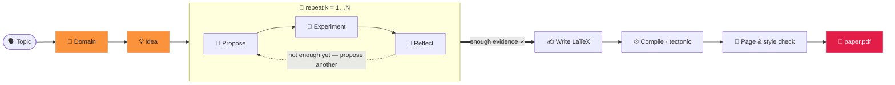

<div align="center">


### Générer un article en deux mots.

<p align="center"><code>paperclaw run "diffusion models"</code></p>
<p align="center"><sub>🧭 domaine · 💡 idée · 🔬 hypothèses · 🧪 expériences · 📊 analyse<br/>📄 paper.pdf — rédigé, cité et compilé ✓</sub></p>

**PaperClaw** orchestre des agents autonomes sur tout le cycle de la recherche —
**🧭 Domaine → 💡 Idée → 📄 Article**. Donnez un sujet : il ancre un domaine, génère
une idée, exécute de *vraies* expériences et rédige un article cité et compilé.

[](https://arxiv.org/abs/2606.22610)
[](../../LICENSE)


<sub><a href="../../README.md">English</a> · <a href="README.zh-CN.md">简体中文</a> · <a href="README.ja.md">日本語</a> · <a href="README.ko.md">한국어</a> · <a href="README.es.md">Español</a> · <b>Français</b> · <a href="README.de.md">Deutsch</a> · <a href="README.pt.md">Português</a> · <a href="README.ru.md">Русский</a> · <a href="README.ar.md">العربية</a> · <a href="README.hi.md">हिन्दी</a> · <a href="README.it.md">Italiano</a></sub>

</div>

---

## ✦ Qu'est-ce que PaperClaw ?

PaperClaw est un moteur de recherche autonome et open source. Il condense le cycle de la
recherche en un seul chemin clair et maîtrise le flux de bout en bout : la carte d'hypothèses,
les tâches d'expérimentation, la mémoire et l'article. Branchez n'importe quel modèle (le SDK
Anthropic ou tout endpoint compatible OpenAI) ou un agent de codage headless externe.

Il est livré sous forme d'**un seul paquet Python** avec un backend **FastAPI** et un frontend
**Vite + React** qui se compile pour deux cibles — le **web** (servi par le backend) et le
**bureau Windows / macOS / Linux** (Electron) — ainsi qu'une **CLI complète** qui reflète chaque
fonctionnalité.

<div align="center">

</div>

## ✦ Articles d'exemple

De vrais articles que PaperClaw a rédigés de bout en bout — sujet → domaine → idée → hypothèses →
expériences → **PDF compilé** — chacun mis en page avec le modèle LaTeX de son **lieu de
publication cible**. Chacun est un espace de travail d'idée complet (spécification, carte
d'hypothèses, expériences, figures, `ref.bib`, source LaTeX). Parcourez-les dans
**[`docs/examples/`](../examples/)**.

| Article | Sujet | Sortie |
|---|---|---|
| 📄 [**RC-Diff: Risk-Controlled Financial Diffusion with Path-Level Audits**](<../examples/[Paper 1] rc-diff-risk-controlled-financial-diffusion/paper.pdf>) | Modèles de diffusion pour séries temporelles financières | Lieu cible · 9 p |

## ✦ Un modèle de recherche épuré

| | Étape | Ce qui se passe | Une commande |
|:--:|:--|:--|:--|
| 🧭 | **Domaine** — *le terrain à creuser* | Décrivez un champ en une phrase. Le modèle écrit une spécification `DOMAIN.md` — objectif, articles clés, jeux de données, bibliothèques, lieux de publication — extraite **en direct d'index scientifiques ouverts**, pas de la mémoire du modèle. | `paperclaw domain auto "…"` |
| 💡 | **Idée** — *une direction concrète et testable* | Le brainstorming digère un ou plusieurs domaines en brouillons `IDEA.md` complets — contexte, lacune de recherche, motivation, hypothèses racines. Affinez-la dans le chat, puis épinglez-la comme idée vivante. | `paperclaw brainstorm generate` |
| 📄 | **Article** — *rédigé, cité et compilé* | La boucle d'hypothèses propose, teste et réfléchit tour après tour, sélectionne les résultats les plus solides et rédige un article LaTeX au format du lieu avec des **citations validées** — compilé en PDF et affiné jusqu'à respecter le style et la longueur. | `paperclaw run --idea <id>` |

<div align="center">

<br/>
<sub><b>Domaine en mode automatique (interface web)</b> — décrivez un champ en une phrase ; PaperClaw interroge des index scientifiques ouverts en direct et écrit la spécification <code>DOMAIN.md</code>.</sub>
</div>

## ✦ Dans le pilote automatique — une boucle d'hypothèses qui sait quand s'arrêter

Une fois qu'une idée a un domaine, PaperClaw exécute une **boucle pilotée par l'expérience**,
faisant croître une carte d'hypothèses à partir de résultats mesurés plutôt que d'une supposition
initiale — puis rédige l'article à partir de ce qu'il a réellement trouvé. Chaque phase est diffusée
en direct et **reprenable**.



## ✦ Deux façons de l'exécuter

PaperClaw fonctionne en deux modes — choisissez-en un (ils partagent le même backend et les données
de `saves/`, vous pouvez donc basculer librement).

**Configuration la plus rapide (sans commandes) :** copiez `settings.example.yaml` vers `settings.yaml` à la racine du projet et renseignez votre fournisseur, modèle et clés API — le backend et la CLI le lisent au démarrage (il prime sur les Paramètres de l'app). C'est du YAML, vous pouvez donc commenter les options avec `#` :

```yaml
LLM:
  provider: anthropic           # anthropic | openai
  base_url: null                # null = valeur par défaut du fournisseur ; pour un proxy / auto-hébergé
  api_key: ""
  model: claude-opus-4-8
image_generation:               # optionnel — figures de l'article
  base_url: null
  api_key: ""
  model: null
academic_search:
  open_alex:
    api_key: ""                 # optionnel — recherche bibliographique
```

`settings.yaml` est ignoré par git (il contient vos clés), il n'est donc jamais commité. (Un ancien `settings.json` est encore lu.)

> ⚙️ **Configuration complète** — modèle et clés, génération d'images, OpenAlex, mode d'exécution, distants SSH, LaTeX et la vérification `paperclaw doctor` : voir le **[guide de configuration de l'environnement](../environment-guide.md)**.

> [!TIP]
> **Le mode web est l'expérience recommandée** — diffusion en direct, le graphe d'hypothèses, le
> moniteur d'expériences et le lecteur PDF intégré, le tout au même endroit. Le **mode CLI** reflète
> chaque fonctionnalité pour les terminaux, serveurs et l'automatisation.

---

### 🪟 1. Mode web *(recommandé)*

> 📘 **Nouveau sur l'interface ?** Suivez la **[visite guidée de l'interface web](../web-guide.md)** — quatre étapes annotées du domaine à l'article, chacune avec son équivalent CLI.

**Installer** — backend + frontend :

```bash
pip install -e ".[dev]"          # backend (Python)
cd frontend && npm install       # frontend (Node)
```

**Lancer** — `./dev.sh` depuis la racine du dépôt démarre les deux et libère les ports occupés :

```bash
./dev.sh                         # backend :8230 + web UI :5173
# → open http://localhost:5173
```

<sub>Équivalent manuel (deux terminaux) : `paperclaw serve --reload` &nbsp;·&nbsp; `cd frontend && npm run dev:web`. &nbsp; Application de bureau : `npm run dev` (Electron).</sub>

**Configurer** — ouvrez **⚙️ Paramètres** (engrenage, en bas à gauche) :

- **🔌 LLM** — fournisseur, URL de base (pour proxys / auto-hébergé), modèle et clé API.
- **📚 Recherche académique** — une clé API OpenAlex pour la recherche de littérature (l'étude du domaine, les articles SOTA et les références). Optionnelle, mais sans elle OpenAlex peut limiter les requêtes anonymes et les études renvoient « Found 0 papers ».
- **🖼️ Génération d'images** — API d'images optionnelle de style OpenAI pour les figures de l'article (repli sur matplotlib/TikZ si non définie).
- **🩺 Doctor** — un clic vérifie que tout l'environnement est prêt (LLM, agent de codage, chaîne d'outils LaTeX, génération d'images, OpenAlex).

Les clés sont stockées uniquement côté serveur dans `saves/settings.yaml` (mode `600`) et ne sont
jamais envoyées au navigateur. Sans clé, l'application fonctionne quand même et répond par une
indication de configuration.

**Utilisez-le** — cliquez sur **⚡ Auto run** (barre latérale pour un nouveau sujet, ou sur une idée
existante) pour aller du sujet → article ; suivez-le en direct dans la bannière et parcourez les
onglets 🌳 Hypotheses et 📄 Paper. Ou discutez pour construire un domaine, générer des idées et en
épingler une.

> 📘 **Nouveau sur l'interface ?** Suivez la **[visite guidée de l'interface web](../web-guide.md)** — quatre étapes annotées du domaine à l'article, chacune avec son équivalent CLI.

---

### ⌨️ 2. Mode CLI

La CLI reflète chaque fonctionnalité web. **N'installez que le backend** (pas besoin de compiler le frontend) :

```bash
pip install -e ".[dev]"
```

**Configurer** — le mode local lit la configuration avec cette priorité (de la plus haute à la plus basse) :
**variables d'environnement → `.env` (cwd) → `.env` dans `$PAPERCLAW_HOME` → `./settings.yaml` (racine du projet) → `$PAPERCLAW_HOME/settings.yaml`**.

| Clé | But |
|---|---|
| `PAPERCLAW_PROVIDER` | `anthropic` \| `openai` (compatible OpenAI) |
| `PAPERCLAW_BASE_URL` | endpoint proxy / auto-hébergé (optionnel) |
| `PAPERCLAW_MODEL` | p. ex. `claude-opus-4-8` |
| `PAPERCLAW_API_KEY` | clé API (`ANTHROPIC_API_KEY` / `OPENAI_API_KEY` sont des replis selon le fournisseur) |
| `OPENALEX_API_KEY` | clé OpenAlex pour la recherche de littérature (optionnelle — évite les limites anonymes) |
| `PAPERCLAW_HOME` | racine de l'espace de travail (par défaut : `./saves`) |

```bash
# or persist them once:
paperclaw settings set --provider anthropic --model claude-opus-4-8 --api-key sk-…
paperclaw settings set --openalex-api-key oa-…   # literature search (optional)
paperclaw doctor                 # check the env is ready (LLM, LaTeX, image gen, OpenAlex)
```

**Utilisez-le** — le mode local (par défaut) travaille sur les fichiers sous `$PAPERCLAW_HOME` :

```bash
# Fully autonomous: topic → doctor → domain → idea → hypotheses → paper
paperclaw run "diffusion models for time series"       # writes the paper on 2 positives
paperclaw run "…" --positive 3 --max-hypotheses 8      # stop at 3 supported, cap at 8
paperclaw status / stop / resume                       # manage runs from any terminal

# …or drive each step:
paperclaw domain auto "time-series diffusion"
paperclaw domain list                  # [✓] = selected for brainstorming
paperclaw brainstorm generate          # digest selected domains → IDEA.md drafts
paperclaw brainstorm pin <seed-id>     # promote a draft to a living idea
paperclaw hypothesis <idea> generate   # build the hypothesis map
paperclaw references <idea> validate   # validate citations vs Crossref/OpenAlex
paperclaw experiments                  # list detached, monitored experiment jobs
```

**Mode distant** — pointez la même CLI vers un backend en cours d'exécution plutôt que vers des
fichiers locaux avec `--backend` (la configuration vit alors sur le serveur, pas localement) :

```bash
paperclaw --backend domain list                    # → http://127.0.0.1:8230
paperclaw --backend http://host:8230 chat "hello"  # explicit URL
```

<details>
<summary><b>Fichier de configuration d'auto-run et exécutions en parallèle</b></summary>

```yaml
# run.yaml
topic: generative modeling for time series
positive: 3          # write the paper once 3 hypotheses are SUPPORTED
max_hypotheses: 8    # stop after 8 if not enough positives
page_limit: 8
```
```bash
paperclaw run --config run.yaml   # CLI flags override the file
```

**Les idées s'exécutent en parallèle** — lancez une exécution automatique sur autant d'idées que vous
le souhaitez ; le panneau de chaque idée n'affiche que sa propre bannière ⚡. Les exécutions sont
**détachées** : elles survivent à la fermeture de l'onglet ou au redémarrage du backend. **Arrêtez**
avec `paperclaw stop [--idea <id>]` (ou Ctrl+C, ou le ⏹ de la bannière web) ; **continuez** une
exécution arrêtée avec `paperclaw resume [--idea <id>]` — le pipeline est reprenable, il saute donc les
hypothèses/phases déjà terminées.

</details>

## ✦ Développement

```bash
./dev.sh          # one-shot: kills stale ports, restarts backend :8230 + web UI :5173
```

Ou manuellement — le backend depuis la racine du dépôt, **les commandes npm dans `frontend/`** :

```bash
pip install -e ".[dev]"
paperclaw serve --reload                  # repo root — API on :8230
cd frontend && npm install
npm run dev:web                           # web     → http://localhost:5173
npm run dev                               # desktop → Electron window
```

> **Redémarrez après chaque lot de changements** — `--reload` ne couvre pas les nouvelles dépendances,
> les paramètres chargés au démarrage ni les changements de configuration de Vite.

## ✦ Production

```bash
# Web (served by the Python backend)
cd frontend && npm run build:web          # → frontend/dist/web, then `paperclaw serve`

# Desktop packages (output in frontend/dist/)
npm run dist:win     # Windows — NSIS installer + portable zip
npm run dist:mac     # macOS   — dmg + zip (must run on a Mac)
npm run dist:linux   # Linux   — AppImage
```

Poussez une étiquette `v*` (ou exécutez le workflow manuellement) et `.github/workflows/desktop.yml`
compile win/mac/linux sur des runners natifs et téléverse les artefacts.

## ✦ Tests

```bash
pytest tests/                             # backend
cd frontend && npm run typecheck          # frontend (tsc --noEmit)
```

## ✦ Capacités de PaperClaw

<table>
<tr>
<td width="33%" valign="top">

**🧭 Découverte pilotée par le domaine**
`DOMAIN.md` automatique à partir d'une phrase ou d'un assistant guidé — articles, jeux de données, bibliothèques et lieux de publication tirés d'index scientifiques en direct.

</td>
<td width="33%" valign="top">

**💡 Brainstorming multidomaine**
Digère un ou plusieurs domaines en brouillons `IDEA.md` complets, puis distille l'un d'eux en une spécification d'idée vivante tenue à jour au fil de la discussion.

</td>
<td width="33%" valign="top">

**🔁 Boucle d'hypothèses itérative**
Proposer → tester → réfléchir, en faisant croître une carte d'hypothèses à partir de résultats mesurés — la plus petite expérience qui tranche chaque question.

</td>
</tr>
<tr>
<td valign="top">

**🤝 Assistant de recherche dans la boucle**
Une ossature agnostique du fournisseur — changez de modèle ou branchez un agent de codage headless externe à n'importe quelle étape.

</td>
<td valign="top">

**🧪 De vraies expériences gérées**
Des tâches qui survivent aux redémarrages. L'agent écrit `run.py`, l'exécute comme sous-processus isolé et débogue ses propres tracebacks jusqu'à obtenir métriques et figures.

</td>
<td valign="top">

**🧠 Mémoire de tout le cycle de vie**
Domaine, idée, hypothèse et article sont des documents vivants et des points de reprise — arrêtez et reprenez n'importe quelle exécution sans perdre de travail.

</td>
</tr>
<tr>
<td valign="top">

**♻️ Un assistant qui évolue**
Domaines sélectionnés, guides de style, bases de code de référence et bibliographies validées s'accumulent et sont réutilisés — plus affûté avec le temps.

</td>
<td valign="top">

**📚 Citations validées**
Chaque idée possède un `ref.bib` construit de façon déterministe à partir d'OpenAlex et Crossref, chaque entrée validée par rapport à la source — aucune référence fabriquée.

</td>
<td valign="top">

**📄 Articles au format de publication**
Du vrai LaTeX, compilé avec tectonic via une boucle de correction de l'agent, affiné jusqu'à respecter le style et la longueur — ne rapportant que les résultats réellement exécutés.

</td>
</tr>
<tr>
<td valign="top">

**🖥️ Conscient du matériel**
Détecte CPU / GPU / mémoire / disque sur l'hôte local et tout distant SSH, afin de planifier les expériences selon le calcul dont vous disposez réellement.

</td>
<td valign="top">

**🪟 Web · Bureau · CLI**
Une seule base de code Vite + React livrée en application web, application de bureau Electron et CLI complète — chaque capacité identique sur les trois.

</td>
<td valign="top">

**🔌 Apportez votre modèle**
Anthropic via le SDK officiel, ou tout endpoint compatible OpenAI. Modèle par défaut `claude-opus-4-8`. Les clés restent côté serveur.

</td>
</tr>
</table>

## ✦ FAQ

**Comment l'exécuter sur un serveur (pour son stockage et son calcul) et l'utiliser localement via un tunnel SSH ?**
Déployez le backend sur le serveur et accédez-y via un tunnel SSH — aucun port public requis. **Sur le serveur :** compilez l'interface et démarrez le backend sur un seul port — `cd frontend && npm run build:web` puis `paperclaw serve --port 8230` ; les données vivent dans `$PAPERCLAW_HOME` et les expériences utilisent le CPU/GPU du serveur. **Sur votre machine :** transférez le port avec `ssh -N -L 8230:localhost:8230 user@server`, puis ouvrez `http://localhost:8230`. La CLI fonctionne de la même façon via le tunnel : `paperclaw --backend http://localhost:8230 …`.

**Pourquoi une étude de domaine affiche-t-elle « Found 0 papers » ?**
OpenAlex limite désormais par budget les requêtes anonymes (par IP). Ajoutez une clé API OpenAlex gratuite
dans **Paramètres → 📚 Recherche académique** (ou `OPENALEX_API_KEY`) pour un budget dédié.

**J'ai cliqué sur ⚡ Auto run en haut à gauche mais l'interface n'affiche aucune progression — où est-elle passée ?**
Le **⚡ Auto run** en haut à gauche de la barre latérale lance une exécution à partir d'un **sujet** (équivaut à `paperclaw run "votre sujet"`) et est encore en **bêta** : sa vue de progression dans l'app est en cours de développement. L'exécution fonctionne (processus détaché, comme tout auto run) ; suivez-la depuis n'importe quel terminal avec `paperclaw status` (et `paperclaw stop` / `paperclaw resume`). Les exécutions lancées sur une idée *existante* (le ⚡ Auto run de la barre supérieure) affichent bien la bannière en direct. Voir la [visite guidée de l'interface web](../web-guide.md#4-auto-run--topic--paper-on-autopilot).

**Ma clé API est-elle en sécurité ?**
Les clés sont stockées côté serveur dans `saves/settings.yaml` (mode `600`) et ne sont jamais envoyées au
navigateur ni journalisées.

**Ai-je besoin d'un GPU ?**
Non — les petites exécutions fonctionnent sur CPU. PaperClaw détecte CPU/GPU/mémoire sur l'hôte local et
tout distant SSH et planifie les expériences selon le calcul dont vous disposez réellement.

**Web ou CLI ?**
L'un ou l'autre — ils partagent le même backend et les données de `saves/`, vous pouvez donc basculer
librement ; la CLI reflète chaque fonctionnalité web.

## ✦ Citation

PaperClaw est décrit dans notre article — **[PaperClaw: Harnessing Agents for Autonomous Research and Human-in-the-Loop Refinement](https://arxiv.org/abs/2606.22610)**. Si vous l'utilisez dans vos recherches, merci de le citer :

```bibtex
@article{ye2026paperclaw,
  title   = {PaperClaw: Harnessing Agents for Autonomous Research and Human-in-the-Loop Refinement},
  author  = {Ye, Weiwei and Liu, Hangchen and Li, Dongyuan and Jiang, Renhe},
  journal = {arXiv preprint arXiv:2606.22610},
  year    = {2026}
}
```

## ✦ Licence

[MIT](../../LICENSE) © Contributeurs de PaperClaw.

<div align="center">
<br />
<sub>🦞 <b>PaperClaw</b> — Domaine → Idée → Article, en autonomie.</sub>
</div>
