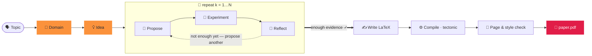

<div align="center">


### दो शब्दों में एक शोध-पत्र तैयार करें।

<p align="center"><code>paperclaw run "diffusion models"</code></p>
<p align="center"><sub>🧭 डोमेन · 💡 आइडिया · 🔬 परिकल्पनाएँ · 🧪 प्रयोग · 📊 विश्लेषण<br/>📄 paper.pdf — लिखित, उद्धृत और संकलित ✓</sub></p>

**PaperClaw** पूरे शोध जीवनचक्र में स्वायत्त एजेंटों का संचालन करता है —
**🧭 डोमेन → 💡 आइडिया → 📄 पेपर**। एक विषय बताइए और यह क्षेत्र को आधार देता है, एक आइडिया गढ़ता है,
*असली* प्रयोग चलाता है, और एक उद्धृत, संकलित शोध-पत्र लिखता है।

[](../../LICENSE)


<sub><a href="../../README.md">English</a> · <a href="README.zh-CN.md">简体中文</a> · <a href="README.ja.md">日本語</a> · <a href="README.ko.md">한국어</a> · <a href="README.es.md">Español</a> · <a href="README.fr.md">Français</a> · <a href="README.de.md">Deutsch</a> · <a href="README.pt.md">Português</a> · <a href="README.ru.md">Русский</a> · <a href="README.ar.md">العربية</a> · <b>हिन्दी</b> · <a href="README.it.md">Italiano</a></sub>

</div>

---

## ✦ PaperClaw क्या है?

PaperClaw एक ओपन-सोर्स स्वायत्त शोध इंजन है। यह शोध जीवनचक्र को एक साफ़ मार्ग में समेट देता है और
नियंत्रण-प्रवाह को आद्योपांत संभालता है: परिकल्पना मानचित्र, प्रयोग कार्य, स्मृति, और शोध-पत्र। कोई भी
मॉडल जोड़िए (Anthropic SDK या कोई भी OpenAI-संगत एंडपॉइंट) या एक बाहरी headless कोडिंग एजेंट।

यह **एक ही Python पैकेज** के रूप में आता है, जिसमें एक **FastAPI** बैकएंड और एक **Vite + React**
फ्रंटएंड है जो दो लक्ष्यों के लिए बनता है — **वेब** (बैकएंड द्वारा परोसा गया) और **Windows / macOS /
Linux डेस्कटॉप** (Electron) — साथ ही एक **पूर्ण CLI** जो हर सुविधा को प्रतिबिंबित करता है।

<div align="center">

</div>

## ✦ उदाहरण शोध-पत्र

असली शोध-पत्र जिन्हें PaperClaw ने आद्योपांत लिखा — विषय → डोमेन → आइडिया → परिकल्पनाएँ → प्रयोग →
**संकलित PDF** — प्रत्येक अपने **लक्षित प्रकाशन-स्थल** के LaTeX टेम्पलेट में टाइपसेट। प्रत्येक एक पूर्ण
आइडिया कार्यक्षेत्र है (विनिर्देश, परिकल्पना मानचित्र, प्रयोग, आकृतियाँ, `ref.bib`, LaTeX स्रोत)। इन्हें
**[`docs/examples/`](../examples/)** में देखें।

| शोध-पत्र | विषय | आउटपुट |
|---|---|---|
| 📄 [**RC-Diff: Risk-Controlled Financial Diffusion with Path-Level Audits**](<../examples/[Paper 1] rc-diff-risk-controlled-financial-diffusion/paper.pdf>) | वित्तीय समय-शृंखला के लिए डिफ्यूज़न मॉडल | लक्षित स्थल · 9 पृष्ठ |

## ✦ एक साफ़ शोध मॉडल

| | चरण | क्या होता है | एक कमांड |
|:--:|:--|:--|:--|
| 🧭 | **डोमेन** — *खोदने की ज़मीन* | किसी क्षेत्र को एक वाक्य में बताइए। मॉडल एक `DOMAIN.md` विनिर्देश लिखता है — लक्ष्य, अहम पेपर, डेटासेट, लाइब्रेरियाँ, प्रकाशन-स्थल — जो **खुले शैक्षणिक सूचकांकों से सीधे लाइव** आते हैं, मॉडल की स्मृति से नहीं। | `paperclaw domain auto "…"` |
| 💡 | **आइडिया** — *एक ठोस, परीक्षण-योग्य दिशा* | विचार-मंथन एक या अधिक डोमेन को पूर्ण `IDEA.md` ड्राफ़्ट में समेटता है — पृष्ठभूमि, शोध-अंतर, प्रेरणा, मूल परिकल्पनाएँ। चैट में इसे निखारिए, फिर इसे एक जीवित आइडिया के रूप में पिन कीजिए। | `paperclaw brainstorm generate` |
| 📄 | **शोध-पत्र** — *लिखित, उद्धृत और संकलित* | परिकल्पना-लूप दौर-दर-दौर प्रस्ताव देता है, परखता है और चिंतन करता है, सबसे मज़बूत परिणाम चुनता है, और **सत्यापित उद्धरणों** के साथ स्थल-स्वरूप का LaTeX शोध-पत्र लिखता है — PDF में संकलित और शैली व लंबाई के अनुरूप होने तक निखारा गया। | `paperclaw run --idea <id>` |

<div align="center">

<br/>
<sub><b>ऑटो मोड में डोमेन (वेब UI)</b> — किसी क्षेत्र को एक वाक्य में बताइए; PaperClaw खुले शैक्षणिक सूचकांकों को लाइव खंगालता है और <code>DOMAIN.md</code> विनिर्देश लिखता है।</sub>
</div>

## ✦ ऑटोपायलट के भीतर — एक परिकल्पना-लूप जो जानता है कि कब रुकना है

जैसे ही किसी आइडिया को डोमेन मिलता है, PaperClaw एक **प्रयोग-चालित लूप** चलाता है, जो शुरुआती अनुमान के
बजाय मापे गए परिणामों से परिकल्पना मानचित्र को बढ़ाता है — और फिर जो वास्तव में मिला उससे शोध-पत्र लिखता
है। हर चरण लाइव स्ट्रीम होता है और **पुनः-आरंभ-योग्य** है।



## ✦ इसे चलाने के दो तरीके

PaperClaw दो मोड में चलता है — एक चुनिए (दोनों एक ही बैकएंड और `saves/` डेटा साझा करते हैं, इसलिए आप
स्वतंत्र रूप से बदल सकते हैं)।

> [!TIP]
> **वेब मोड अनुशंसित अनुभव है** — लाइव स्ट्रीमिंग, परिकल्पना ग्राफ, प्रयोग मॉनिटर, और इन-ऐप PDF व्यूअर,
> सब एक जगह। **CLI मोड** टर्मिनल, सर्वर और स्वचालन के लिए हर सुविधा को प्रतिबिंबित करता है।

---

### 🪟 1. वेब मोड *(अनुशंसित)*

**इंस्टॉल** — बैकएंड + फ्रंटएंड:

```bash
pip install -e ".[dev]"          # backend (Python)
cd frontend && npm install       # frontend (Node)
```

**चलाएँ** — रिपॉज़िटरी रूट से `./dev.sh` दोनों को शुरू करता है और रुके हुए पोर्ट साफ़ करता है:

```bash
./dev.sh                         # backend :8230 + web UI :5173
# → open http://localhost:5173
```

<sub>मैनुअल समतुल्य (दो टर्मिनल): `paperclaw serve --reload` &nbsp;·&nbsp; `cd frontend && npm run dev:web`. &nbsp; डेस्कटॉप ऐप: `npm run dev` (Electron)।</sub>

**कॉन्फ़िगर करें** — **⚙️ सेटिंग्स** (नीचे-बाएँ गियर) खोलें:

- **🔌 LLM** — प्रदाता, बेस URL (प्रॉक्सी / सेल्फ़-होस्टेड के लिए), मॉडल, और API की।
- **📚 अकादमिक खोज** — साहित्य-खोज (डोमेन सर्वेक्षण, SOTA पेपर, और संदर्भ) के लिए एक OpenAlex API की। वैकल्पिक, पर इसके बिना OpenAlex गुमनाम अनुरोधों को सीमित कर सकता है और सर्वेक्षण "Found 0 papers" लौटाते हैं।
- **🖼️ इमेज जनरेशन** — शोध-पत्र की आकृतियों के लिए वैकल्पिक OpenAI-शैली इमेज API (सेट न होने पर matplotlib/TikZ पर वापस आता है)।
- **🩺 Doctor** — एक क्लिक से पूरा वातावरण तैयार है या नहीं जाँचता है (LLM, कोडिंग एजेंट, LaTeX टूलचेन, इमेज जनरेशन, OpenAlex)।

कीज़ केवल सर्वर-साइड `saves/settings.json` (मोड `600`) में संग्रहीत होती हैं और कभी ब्राउज़र को नहीं भेजी
जातीं। की के बिना भी ऐप चलता है और कॉन्फ़िगरेशन संकेत के साथ जवाब देता है।

**उपयोग करें** — **⚡ Auto run** पर क्लिक करें (नए विषय के लिए साइडबार, या किसी मौजूदा आइडिया पर) ताकि
विषय → शोध-पत्र तक पहुँचें; बैनर में इसे लाइव देखें और 🌳 Hypotheses तथा 📄 Paper टैब ब्राउज़ करें। या
चैट करके एक डोमेन बनाएँ, आइडियाज़ का मंथन करें, और एक को पिन करें।

---

### ⌨️ 2. CLI मोड

CLI हर वेब सुविधा को प्रतिबिंबित करता है। **केवल बैकएंड इंस्टॉल करें** (फ्रंटएंड बिल्ड की ज़रूरत नहीं):

```bash
pip install -e ".[dev]"
```

**कॉन्फ़िगर करें** — लोकल मोड इस प्राथमिकता (उच्चतम पहले) से कॉन्फ़िग पढ़ता है:
**पर्यावरण चर → `.env` (cwd) → `$PAPERCLAW_HOME` में `.env` → `settings.json`**।

| की | उद्देश्य |
|---|---|
| `PAPERCLAW_PROVIDER` | `anthropic` \| `openai` (OpenAI-संगत) |
| `PAPERCLAW_BASE_URL` | प्रॉक्सी / सेल्फ़-होस्टेड एंडपॉइंट (वैकल्पिक) |
| `PAPERCLAW_MODEL` | जैसे `claude-opus-4-8` |
| `PAPERCLAW_API_KEY` | API की (`ANTHROPIC_API_KEY` / `OPENAI_API_KEY` प्रदाता-अनुसार फ़ॉलबैक) |
| `OPENALEX_API_KEY` | साहित्य-खोज के लिए OpenAlex की (वैकल्पिक — गुमनाम सीमाओं से बचाता है) |
| `PAPERCLAW_HOME` | कार्यक्षेत्र रूट (डिफ़ॉल्ट: `./saves`) |

```bash
# or persist them once:
paperclaw settings set --provider anthropic --model claude-opus-4-8 --api-key sk-…
paperclaw settings set --openalex-api-key oa-…   # literature search (optional)
paperclaw doctor                 # check the env is ready (LLM, LaTeX, image gen, OpenAlex)
```

**उपयोग करें** — लोकल मोड (डिफ़ॉल्ट) `$PAPERCLAW_HOME` के अंतर्गत फ़ाइलों पर काम करता है:

```bash
# Fully autonomous: topic → doctor → domain → idea → hypotheses → paper
paperclaw run "diffusion models for time series"       # writes the paper on 2 positives
paperclaw run "…" --positive 3 --max-hypotheses 8      # stop at 3 supported, cap at 8
paperclaw status / stop / resume                       # manage runs from any terminal

# …or drive each step:
paperclaw domain auto "time-series diffusion"
paperclaw domain list                  # [✓] = selected for brainstorming
paperclaw brainstorm generate          # digest selected domains → IDEA.md drafts
paperclaw brainstorm pin <seed-id>     # promote a draft to a living idea
paperclaw hypothesis <idea> generate   # build the hypothesis map
paperclaw references <idea> validate   # validate citations vs Crossref/OpenAlex
paperclaw experiments                  # list detached, monitored experiment jobs
```

**रिमोट मोड** — `--backend` के साथ उसी CLI को लोकल फ़ाइलों के बजाय किसी चालू बैकएंड की ओर इंगित करें
(तब कॉन्फ़िग सर्वर पर रहता है, लोकल नहीं):

```bash
paperclaw --backend domain list                    # → http://127.0.0.1:8230
paperclaw --backend http://host:8230 chat "hello"  # explicit URL
```

<details>
<summary><b>ऑटो-रन कॉन्फ़िग फ़ाइल और समानांतर रन</b></summary>

```yaml
# run.yaml
topic: generative modeling for time series
positive: 3          # write the paper once 3 hypotheses are SUPPORTED
max_hypotheses: 8    # stop after 8 if not enough positives
page_limit: 8
```
```bash
paperclaw run --config run.yaml   # CLI flags override the file
```

**आइडियाज़ समानांतर चलते हैं** — जितने चाहें उतने आइडियाज़ पर ऑटो-रन शुरू करें; प्रत्येक आइडिया का पैनल
केवल अपना ⚡ बैनर दिखाता है। रन **डिटैच्ड** होते हैं: टैब बंद करने या बैकएंड पुनः-आरंभ पर भी बचे रहते हैं।
`paperclaw stop [--idea <id>]` (या Ctrl+C, या वेब बैनर का ⏹) से **रोकें**; रुके हुए रन को
`paperclaw resume [--idea <id>]` से **जारी रखें** — पाइपलाइन पुनः-आरंभ-योग्य है, इसलिए पूर्ण
परिकल्पनाओं/चरणों को छोड़ देती है।

</details>

## ✦ विकास

```bash
./dev.sh          # one-shot: kills stale ports, restarts backend :8230 + web UI :5173
```

या मैनुअल रूप से — बैकएंड रिपॉज़िटरी रूट से, **npm कमांड `frontend/` के भीतर**:

```bash
pip install -e ".[dev]"
paperclaw serve --reload                  # repo root — API on :8230
cd frontend && npm install
npm run dev:web                           # web     → http://localhost:5173
npm run dev                               # desktop → Electron window
```

> **हर बदलाव-सेट के बाद पुनः-आरंभ करें** — `--reload` नई निर्भरताओं, स्टार्टअप पर लोड होने वाली सेटिंग्स,
> या Vite कॉन्फ़िग बदलावों को कवर नहीं करता।

## ✦ प्रोडक्शन

```bash
# Web (served by the Python backend)
cd frontend && npm run build:web          # → frontend/dist/web, then `paperclaw serve`

# Desktop packages (output in frontend/dist/)
npm run dist:win     # Windows — NSIS installer + portable zip
npm run dist:mac     # macOS   — dmg + zip (must run on a Mac)
npm run dist:linux   # Linux   — AppImage
```

एक `v*` टैग पुश करें (या वर्कफ़्लो मैनुअल रूप से चलाएँ) और `.github/workflows/desktop.yml` नेटिव रनर पर
win/mac/linux बनाता है और आर्टिफ़ैक्ट अपलोड करता है।

## ✦ परीक्षण

```bash
pytest tests/                             # backend
cd frontend && npm run typecheck          # frontend (tsc --noEmit)
```

## ✦ PaperClaw क्षमताएँ

<table>
<tr>
<td width="33%" valign="top">

**🧭 डोमेन-चालित खोज**
एक वाक्य या निर्देशित विज़ार्ड से स्वतः `DOMAIN.md` — पेपर, डेटासेट, लाइब्रेरियाँ और प्रकाशन-स्थल लाइव शैक्षणिक सूचकांकों से।

</td>
<td width="33%" valign="top">

**💡 बहु-डोमेन विचार-मंथन**
एक या अधिक डोमेन को पूर्ण `IDEA.md` ड्राफ़्ट में समेटता है, फिर एक को जीवित आइडिया विनिर्देश में निखारता है जो बातचीत के साथ अद्यतन रहता है।

</td>
<td width="33%" valign="top">

**🔁 पुनरावृत्तीय परिकल्पना-लूप**
प्रस्ताव → परीक्षण → चिंतन, मापे गए परिणामों से परिकल्पना मानचित्र बढ़ाते हुए — हर प्रश्न को सुलझाने वाला सबसे छोटा प्रयोग।

</td>
</tr>
<tr>
<td valign="top">

**🤝 चक्र-के-भीतर शोध सहायक**
प्रदाता-निरपेक्ष ढाँचा — किसी भी चरण पर मॉडल बदलें या बाहरी headless कोडिंग एजेंट जोड़ें।

</td>
<td valign="top">

**🧪 असली, प्रबंधित प्रयोग**
पुनः-आरंभ झेलने वाले कार्य। एजेंट `run.py` लिखता है, इसे सैंडबॉक्स्ड सबप्रोसेस के रूप में चलाता है, और मेट्रिक्स व आकृतियाँ मिलने तक अपने ट्रेसबैक स्वयं डिबग करता है।

</td>
<td valign="top">

**🧠 पूर्ण-जीवनचक्र स्मृति**
डोमेन, आइडिया, परिकल्पना और शोध-पत्र जीवित दस्तावेज़ और पुनः-आरंभ-योग्य चेकपॉइंट हैं — किसी भी रन को बिना काम खोए रोकें और जारी रखें।

</td>
</tr>
<tr>
<td valign="top">

**♻️ विकसित होता सहायक**
चयनित डोमेन, शैली-गाइड, संदर्भ कोडबेस और सत्यापित ग्रंथसूचियाँ संचित होकर पुनः उपयोग होती हैं — समय के साथ और पैनी।

</td>
<td valign="top">

**📚 सत्यापित उद्धरण**
प्रत्येक आइडिया का `ref.bib` OpenAlex और Crossref से नियतात्मक रूप से बनता है, हर प्रविष्टि स्रोत से सत्यापित — कोई गढ़े हुए संदर्भ नहीं।

</td>
<td valign="top">

**📄 स्थल-स्वरूप शोध-पत्र**
असली LaTeX, एजेंट फ़िक्स-लूप के माध्यम से tectonic से संकलित, शैली व लंबाई के अनुरूप होने तक निखारा — केवल वास्तव में चले परिणाम ही रिपोर्ट होते हैं।

</td>
</tr>
<tr>
<td valign="top">

**🖥️ हार्डवेयर-सजग**
लोकल होस्ट और किसी भी SSH रिमोट पर CPU / GPU / मेमोरी / डिस्क का पता लगाता है, ताकि प्रयोग आपके वास्तव में उपलब्ध कंप्यूट के अनुसार योजनाबद्ध हों।

</td>
<td valign="top">

**🪟 वेब · डेस्कटॉप · CLI**
एक ही Vite + React कोडबेस वेब ऐप, Electron डेस्कटॉप ऐप, और पूर्ण CLI के रूप में आता है — तीनों में हर क्षमता समान।

</td>
<td valign="top">

**🔌 अपना मॉडल लाएँ**
आधिकारिक SDK के माध्यम से Anthropic, या कोई भी OpenAI-संगत एंडपॉइंट। डिफ़ॉल्ट मॉडल `claude-opus-4-8`। कीज़ सर्वर-साइड रहती हैं।

</td>
</tr>
</table>

## ✦ अक्सर पूछे जाने वाले प्रश्न

**इसे सर्वर पर कैसे चलाएँ (उसका स्टोरेज व कंप्यूट उपयोग करने के लिए) और SSH टनल से लोकल में इस्तेमाल करें?**
बैकएंड को सर्वर पर डिप्लॉय करें और उसे SSH टनल से एक्सेस करें — किसी सार्वजनिक पोर्ट की ज़रूरत नहीं। **सर्वर पर:** UI बिल्ड करें और बैकएंड को एक ही पोर्ट पर शुरू करें — `cd frontend && npm run build:web` फिर `paperclaw serve --port 8230`; डेटा `$PAPERCLAW_HOME` में रहता है और प्रयोग सर्वर के CPU/GPU का उपयोग करते हैं। **अपनी मशीन पर:** `ssh -N -L 8230:localhost:8230 user@server` से पोर्ट फ़ॉरवर्ड करें, फिर `http://localhost:8230` खोलें। CLI भी टनल के ज़रिए वैसे ही काम करता है: `paperclaw --backend http://localhost:8230 …`।

**डोमेन सर्वेक्षण "Found 0 papers" क्यों दिखाता है?**
OpenAlex अब गुमनाम (प्रति-IP) अनुरोधों को बजट-सीमित करता है। समर्पित बजट के लिए **सेटिंग्स → 📚 अकादमिक
खोज** (या `OPENALEX_API_KEY`) में एक निःशुल्क OpenAlex API की जोड़ें।

**क्या मेरी API की सुरक्षित है?**
कीज़ सर्वर-साइड `saves/settings.json` (मोड `600`) में संग्रहीत होती हैं और कभी ब्राउज़र को नहीं भेजी जातीं
न लॉग की जाती हैं।

**क्या मुझे GPU चाहिए?**
नहीं — छोटे रन CPU पर चलते हैं। PaperClaw लोकल होस्ट और किसी भी SSH रिमोट पर CPU/GPU/मेमोरी का पता लगाकर
प्रयोग आपके वास्तव में उपलब्ध कंप्यूट के अनुसार योजनाबद्ध करता है।

**वेब या CLI?**
कोई भी — दोनों एक ही बैकएंड और `saves/` डेटा साझा करते हैं, इसलिए आप स्वतंत्र रूप से बदल सकते हैं; CLI हर
वेब सुविधा को प्रतिबिंबित करता है।

## ✦ लाइसेंस

[MIT](../../LICENSE) © PaperClaw योगदानकर्ता।

<div align="center">
<br />
<sub>🦞 <b>PaperClaw</b> — डोमेन → आइडिया → शोध-पत्र, स्वायत्त रूप से।</sub>
</div>
