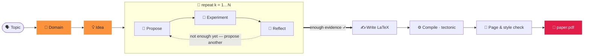

<div align="center">


### Generare un articolo in due parole.

<p align="center"><code>paperclaw run "diffusion models"</code></p>
<p align="center"><sub>🧭 dominio · 💡 idea · 🔬 ipotesi · 🧪 esperimenti · 📊 analisi<br/>📄 paper.pdf — scritto, citato e compilato ✓</sub></p>

**PaperClaw** orchestra agenti autonomi lungo l'intero ciclo della ricerca —
**🧭 Dominio → 💡 Idea → 📄 Articolo**. Indica un argomento e fonda un campo, genera
un'idea, esegue esperimenti *reali* e scrive un articolo citato e compilato.

[](https://arxiv.org/abs/2606.22610)
[](../../LICENSE)


<sub><a href="../../README.md">English</a> · <a href="README.zh-CN.md">简体中文</a> · <a href="README.ja.md">日本語</a> · <a href="README.ko.md">한국어</a> · <a href="README.es.md">Español</a> · <a href="README.fr.md">Français</a> · <a href="README.de.md">Deutsch</a> · <a href="README.pt.md">Português</a> · <a href="README.ru.md">Русский</a> · <a href="README.ar.md">العربية</a> · <a href="README.hi.md">हिन्दी</a> · <b>Italiano</b></sub>

</div>

---

## ✦ Cos'è PaperClaw?

PaperClaw è un motore di ricerca autonomo e open source. Condensa il ciclo della ricerca in un
unico percorso pulito e controlla il flusso da capo a fondo: la mappa delle ipotesi, i job
sperimentali, la memoria e l'articolo. Collega qualsiasi modello (l'SDK di Anthropic o qualsiasi
endpoint compatibile con OpenAI) o un agente di codifica headless esterno.

Viene distribuito come **un unico pacchetto Python** con un backend **FastAPI** e un frontend
**Vite + React** che si compila per due target — **web** (servito dal backend) e **desktop per
Windows / macOS / Linux** (Electron) — più una **CLI completa** che rispecchia ogni funzionalità.

<div align="center">

</div>

## ✦ Articoli di esempio

Articoli reali scritti da PaperClaw da capo a fondo — argomento → dominio → idea → ipotesi →
esperimenti → **PDF compilato** — ciascuno impaginato con il template LaTeX della sua **sede di
pubblicazione obiettivo**. Ognuno è uno spazio di lavoro dell'idea completo (specifica, mappa delle
ipotesi, esperimenti, figure, `ref.bib`, sorgente LaTeX). Sfoglialo in
**[`docs/examples/`](../examples/)**.

| Articolo | Argomento | Output |
|---|---|---|
| 📄 [**RC-Diff: Risk-Controlled Financial Diffusion with Path-Level Audits**](<../examples/[Paper 1] rc-diff-risk-controlled-financial-diffusion/paper.pdf>) | Modelli di diffusione per serie temporali finanziarie | Sede obiettivo · 9 pp |

## ✦ Un modello di ricerca pulito

| | Passo | Cosa accade | Un comando |
|:--:|:--|:--|:--|
| 🧭 | **Dominio** — *il terreno da scavare* | Descrivi un campo in una frase. Il modello scrive una specifica `DOMAIN.md` — obiettivo, articoli cruciali, dataset, librerie, sedi di pubblicazione — estratta **in diretta da indici accademici aperti**, non dalla memoria del modello. | `paperclaw domain auto "…"` |
| 💡 | **Idea** — *una direzione concreta e verificabile* | Il brainstorming digerisce uno o più domini in bozze `IDEA.md` complete — contesto, lacuna di ricerca, motivazione, ipotesi radice. Affinala in chat, poi fissala come idea viva. | `paperclaw brainstorm generate` |
| 📄 | **Articolo** — *scritto, citato e compilato* | Il ciclo delle ipotesi propone, testa e riflette giro dopo giro, seleziona i risultati più solidi e scrive un articolo LaTeX nel formato della sede con **citazioni validate** — compilato in PDF e affinato fino a rispettare stile e lunghezza. | `paperclaw run --idea <id>` |

<div align="center">

<br/>
<sub><b>Dominio in modalità automatica (interfaccia web)</b> — descrivi un campo in una frase; PaperClaw interroga indici accademici aperti in diretta e scrive la specifica <code>DOMAIN.md</code>.</sub>
</div>

## ✦ Dentro il pilota automatico — un ciclo di ipotesi che sa quando fermarsi

Una volta che un'idea ha un dominio, PaperClaw esegue un **ciclo guidato dagli esperimenti**, facendo
crescere una mappa delle ipotesi dai risultati misurati invece che da una congettura iniziale — e poi
scrive l'articolo da ciò che ha effettivamente trovato. Ogni fase è trasmessa in diretta ed è
**riprendibile**.



## ✦ Due modi per eseguirlo

PaperClaw funziona in due modalità — scegline una (condividono lo stesso backend e i dati di
`saves/`, quindi puoi passare liberamente).

**Configurazione più rapida (senza comandi):** copia `settings.example.yaml` in `settings.yaml` nella cartella del progetto e inserisci provider, modello e chiavi API — sia il backend sia la CLI lo leggono all'avvio (ha la precedenza sulle Impostazioni nell'app). È YAML, quindi puoi commentare le opzioni con `#`:

```yaml
LLM:
  provider: anthropic           # anthropic | openai
  base_url: null                # null = predefinito del provider; imposta per proxy / self-hosted
  api_key: ""
  model: claude-opus-4-8
image_generation:               # opzionale — figure dell'articolo
  base_url: null
  api_key: ""
  model: null
academic_search:
  open_alex:
    api_key: ""                 # opzionale — ricerca bibliografica
```

`settings.yaml` è ignorato da git (contiene le tue chiavi), quindi non viene mai committato. (Un `settings.json` legacy viene comunque letto.)

> ⚙️ **Configurazione completa** — modello e chiavi, generazione immagini, OpenAlex, modalità esperimenti, remoti SSH, LaTeX e il controllo `paperclaw doctor`: vedi la **[guida alla configurazione dell'ambiente](../environment-guide.md)**.

> [!TIP]
> **La modalità web è l'esperienza consigliata** — streaming in diretta, il grafo delle ipotesi, il
> monitor degli esperimenti e il visualizzatore PDF integrato, tutto in un unico posto. La **modalità
> CLI** rispecchia ogni funzionalità per terminali, server e automazione.

---

### 🪟 1. Modalità web *(consigliata)*

> 📘 **Nuovo nell'interfaccia?** Segui la **[guida all'interfaccia web](../web-guide.md)** — quattro passaggi annotati dal dominio al paper, ciascuno con il comando CLI corrispondente.

**Installa** — backend + frontend:

```bash
pip install -e ".[dev]"          # backend (Python)
cd frontend && npm install       # frontend (Node)
```

**Esegui** — `./dev.sh` dalla radice del repository avvia entrambi e libera le porte occupate:

```bash
./dev.sh                         # backend :8230 + web UI :5173
# → open http://localhost:5173
```

<sub>Equivalente manuale (due terminali): `paperclaw serve --reload` &nbsp;·&nbsp; `cd frontend && npm run dev:web`. &nbsp; App desktop: `npm run dev` (Electron).</sub>

**Configura** — apri **⚙️ Impostazioni** (ingranaggio, in basso a sinistra):

- **🔌 LLM** — provider, URL di base (per proxy / self-hosting), modello e chiave API.
- **📚 Ricerca accademica** — una chiave API di OpenAlex per la ricerca bibliografica (l'indagine del dominio, gli articoli SOTA e i riferimenti). Opzionale, ma senza di essa OpenAlex può limitare le richieste anonime e le indagini restituiscono "Found 0 papers".
- **🖼️ Generazione immagini** — API immagini opzionale in stile OpenAI per le figure dell'articolo (ripiega su matplotlib/TikZ se non impostata).
- **🩺 Doctor** — un clic verifica che l'intero ambiente sia pronto (LLM, agente di codifica, toolchain LaTeX, generazione immagini, OpenAlex).

Le chiavi sono memorizzate solo lato server in `saves/settings.yaml` (modalità `600`) e non vengono
mai inviate al browser. Senza una chiave l'app funziona comunque e risponde con un suggerimento di
configurazione.

**Usalo** — clicca **⚡ Auto run** (barra laterale per un nuovo argomento, o su un'idea esistente) per
andare da argomento → articolo; seguilo in diretta nel banner e sfoglia le schede 🌳 Hypotheses e
📄 Paper. Oppure chatta per costruire un dominio, generare idee e fissarne una.

> 📘 **Nuovo nell'interfaccia?** Segui la **[guida all'interfaccia web](../web-guide.md)** — quattro passaggi annotati dal dominio al paper, ciascuno con il comando CLI corrispondente.

---

### ⌨️ 2. Modalità CLI

La CLI rispecchia ogni funzionalità web. **Installa solo il backend** (non serve compilare il frontend):

```bash
pip install -e ".[dev]"
```

**Configura** — la modalità locale legge la configurazione con questa priorità (dalla più alta):
**variabili d'ambiente → `.env` (cwd) → `.env` in `$PAPERCLAW_HOME` → `./settings.yaml` (cartella del progetto) → `$PAPERCLAW_HOME/settings.yaml`**.

| Chiave | Scopo |
|---|---|
| `PAPERCLAW_PROVIDER` | `anthropic` \| `openai` (compatibile con OpenAI) |
| `PAPERCLAW_BASE_URL` | endpoint proxy / self-hosted (opzionale) |
| `PAPERCLAW_MODEL` | es. `claude-opus-4-8` |
| `PAPERCLAW_API_KEY` | chiave API (`ANTHROPIC_API_KEY` / `OPENAI_API_KEY` come fallback per provider) |
| `OPENALEX_API_KEY` | chiave OpenAlex per la ricerca bibliografica (opzionale — evita i limiti anonimi) |
| `PAPERCLAW_HOME` | radice dello spazio di lavoro (predefinito: `./saves`) |

```bash
# or persist them once:
paperclaw settings set --provider anthropic --model claude-opus-4-8 --api-key sk-…
paperclaw settings set --openalex-api-key oa-…   # literature search (optional)
paperclaw doctor                 # check the env is ready (LLM, LaTeX, image gen, OpenAlex)
```

**Usalo** — la modalità locale (predefinita) lavora sui file sotto `$PAPERCLAW_HOME`:

```bash
# Fully autonomous: topic → doctor → domain → idea → hypotheses → paper
paperclaw run "diffusion models for time series"       # writes the paper on 2 positives
paperclaw run "…" --positive 3 --max-hypotheses 8      # stop at 3 supported, cap at 8
paperclaw status / stop / resume                       # manage runs from any terminal

# …or drive each step:
paperclaw domain auto "time-series diffusion"
paperclaw domain list                  # [✓] = selected for brainstorming
paperclaw brainstorm generate          # digest selected domains → IDEA.md drafts
paperclaw brainstorm pin <seed-id>     # promote a draft to a living idea
paperclaw hypothesis <idea> generate   # build the hypothesis map
paperclaw references <idea> validate   # validate citations vs Crossref/OpenAlex
paperclaw experiments                  # list detached, monitored experiment jobs
```

**Modalità remota** — punta la stessa CLI a un backend in esecuzione invece che ai file locali con
`--backend` (la configurazione vive allora sul server, non in locale):

```bash
paperclaw --backend domain list                    # → http://127.0.0.1:8230
paperclaw --backend http://host:8230 chat "hello"  # explicit URL
```

<details>
<summary><b>File di configurazione auto-run ed esecuzioni in parallelo</b></summary>

```yaml
# run.yaml
topic: generative modeling for time series
positive: 3          # write the paper once 3 hypotheses are SUPPORTED
max_hypotheses: 8    # stop after 8 if not enough positives
page_limit: 8
```
```bash
paperclaw run --config run.yaml   # CLI flags override the file
```

**Le idee vengono eseguite in parallelo** — avvia un'esecuzione automatica su quante idee vuoi; il
pannello di ogni idea mostra solo il proprio banner ⚡. Le esecuzioni sono **scollegate**: sopravvivono
alla chiusura della scheda o al riavvio del backend. **Ferma** con `paperclaw stop [--idea <id>]` (o
Ctrl+C, o il ⏹ del banner web); **continua** un'esecuzione fermata con `paperclaw resume [--idea <id>]`
— la pipeline è riprendibile, quindi salta ipotesi/fasi già completate.

</details>

## ✦ Sviluppo

```bash
./dev.sh          # one-shot: kills stale ports, restarts backend :8230 + web UI :5173
```

Oppure manualmente — il backend dalla radice del repository, **i comandi npm dentro `frontend/`**:

```bash
pip install -e ".[dev]"
paperclaw serve --reload                  # repo root — API on :8230
cd frontend && npm install
npm run dev:web                           # web     → http://localhost:5173
npm run dev                               # desktop → Electron window
```

> **Riavvia dopo ogni set di modifiche** — `--reload` non copre nuove dipendenze, impostazioni caricate
> all'avvio o modifiche alla configurazione di Vite.

## ✦ Produzione

```bash
# Web (served by the Python backend)
cd frontend && npm run build:web          # → frontend/dist/web, then `paperclaw serve`

# Desktop packages (output in frontend/dist/)
npm run dist:win     # Windows — NSIS installer + portable zip
npm run dist:mac     # macOS   — dmg + zip (must run on a Mac)
npm run dist:linux   # Linux   — AppImage
```

Esegui il push di un tag `v*` (o avvia il workflow manualmente) e `.github/workflows/desktop.yml`
compila win/mac/linux su runner nativi e carica gli artefatti.

## ✦ Test

```bash
pytest tests/                             # backend
cd frontend && npm run typecheck          # frontend (tsc --noEmit)
```

## ✦ Capacità di PaperClaw

<table>
<tr>
<td width="33%" valign="top">

**🧭 Scoperta guidata dal dominio**
`DOMAIN.md` automatico da una frase o da una procedura guidata — articoli, dataset, librerie e sedi di pubblicazione tratti da indici accademici in diretta.

</td>
<td width="33%" valign="top">

**💡 Brainstorming multi-dominio**
Digerisce uno o più domini in bozze `IDEA.md` complete, poi distilla una di esse in una specifica d'idea viva mantenuta aggiornata mentre parli.

</td>
<td width="33%" valign="top">

**🔁 Ciclo di ipotesi iterativo**
Proporre → testare → riflettere, facendo crescere una mappa delle ipotesi dai risultati misurati — il più piccolo esperimento che risolve ogni domanda.

</td>
</tr>
<tr>
<td valign="top">

**🤝 Assistente di ricerca nel ciclo**
Un'impalcatura agnostica rispetto al provider — cambia il modello o collega un agente di codifica headless esterno in qualsiasi fase.

</td>
<td valign="top">

**🧪 Esperimenti reali e gestiti**
Job che sopravvivono ai riavvii. L'agente scrive `run.py`, lo esegue come sottoprocesso isolato e fa il debug dei propri traceback finché non ottiene metriche e figure.

</td>
<td valign="top">

**🧠 Memoria dell'intero ciclo di vita**
Dominio, idea, ipotesi e articolo sono documenti vivi e checkpoint riprendibili — ferma e riprendi qualsiasi esecuzione senza perdere lavoro.

</td>
</tr>
<tr>
<td valign="top">

**♻️ Assistente che evolve**
Domini curati, guide di stile, codebase di riferimento e bibliografie validate si accumulano e vengono riutilizzati — più affilato nel tempo.

</td>
<td valign="top">

**📚 Citazioni validate**
Ogni idea possiede un `ref.bib` costruito in modo deterministico da OpenAlex e Crossref, con ogni voce validata rispetto alla fonte — nessun riferimento inventato.

</td>
<td valign="top">

**📄 Articoli nel formato della sede**
LaTeX reale, compilato con tectonic tramite un ciclo di correzione dell'agente, affinato fino a rispettare stile e lunghezza — riportando solo risultati realmente eseguiti.

</td>
</tr>
<tr>
<td valign="top">

**🖥️ Consapevole dell'hardware**
Rileva CPU / GPU / memoria / disco sull'host locale e su qualsiasi remoto SSH, così gli esperimenti sono pianificati in base al calcolo che hai davvero.

</td>
<td valign="top">

**🪟 Web · Desktop · CLI**
Un'unica base di codice Vite + React viene distribuita come app web, app desktop Electron e CLI completa — ogni capacità identica in tutte e tre.

</td>
<td valign="top">

**🔌 Porta il tuo modello**
Anthropic tramite l'SDK ufficiale, o qualsiasi endpoint compatibile con OpenAI. Modello predefinito `claude-opus-4-8`. Le chiavi restano lato server.

</td>
</tr>
</table>

## ✦ FAQ

**Come lo eseguo su un server (per il suo storage e calcolo) e lo uso localmente tramite un tunnel SSH?**
Distribuisci il backend sul server e raggiungilo tramite un tunnel SSH — nessuna porta pubblica necessaria. **Sul server:** compila l'interfaccia e avvia il backend su un'unica porta — `cd frontend && npm run build:web` poi `paperclaw serve --port 8230`; i dati risiedono in `$PAPERCLAW_HOME` e gli esperimenti usano la CPU/GPU del server. **Sul tuo computer:** inoltra la porta con `ssh -N -L 8230:localhost:8230 user@server`, poi apri `http://localhost:8230`. La CLI funziona allo stesso modo tramite il tunnel: `paperclaw --backend http://localhost:8230 …`.

**Perché un'indagine di dominio dice "Found 0 papers"?**
OpenAlex ora limita per budget le richieste anonime (per IP). Aggiungi una chiave API gratuita di OpenAlex
in **Impostazioni → 📚 Ricerca accademica** (o `OPENALEX_API_KEY`) per un budget dedicato.

**Ho cliccato su ⚡ Auto run in alto a sinistra ma l'interfaccia non mostra progressi — dov'è finito?**
Il **⚡ Auto run** in alto a sinistra nella barra laterale avvia un'esecuzione da un **argomento** (equivale a `paperclaw run "il tuo argomento"`) ed è ancora in **beta**: la visualizzazione del progresso nell'app è in sviluppo. L'esecuzione è regolare (processo scollegato, come ogni auto run); seguila da qualsiasi terminale con `paperclaw status` (e `paperclaw stop` / `paperclaw resume`). Le esecuzioni avviate su un'idea *esistente* (il ⚡ Auto run della barra superiore) mostrano il banner live. Vedi la [guida all'interfaccia web](../web-guide.md#4-auto-run--topic--paper-on-autopilot).

**La mia chiave API è al sicuro?**
Le chiavi sono memorizzate lato server in `saves/settings.yaml` (modalità `600`) e non vengono mai inviate
al browser né registrate nei log.

**Mi serve una GPU?**
No — le esecuzioni piccole funzionano su CPU. PaperClaw rileva CPU/GPU/memoria sull'host locale e su
qualsiasi remoto SSH e pianifica gli esperimenti in base al calcolo che hai davvero.

**Web o CLI?**
Entrambi — condividono lo stesso backend e i dati di `saves/`, quindi puoi passare liberamente; la CLI
rispecchia ogni funzionalità web.

## ✦ Citazione

PaperClaw è descritto nel nostro articolo — **[PaperClaw: Harnessing Agents for Autonomous Research and Human-in-the-Loop Refinement](https://arxiv.org/abs/2606.22610)**. Se lo usi nella tua ricerca, citalo:

```bibtex
@article{ye2026paperclaw,
  title   = {PaperClaw: Harnessing Agents for Autonomous Research and Human-in-the-Loop Refinement},
  author  = {Ye, Weiwei and Liu, Hangchen and Li, Dongyuan and Jiang, Renhe},
  journal = {arXiv preprint arXiv:2606.22610},
  year    = {2026}
}
```

## ✦ Licenza

[MIT](../../LICENSE) © Collaboratori di PaperClaw.

<div align="center">
<br />
<sub>🦞 <b>PaperClaw</b> — Dominio → Idea → Articolo, in autonomia.</sub>
</div>
