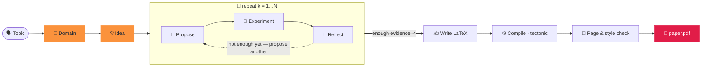

<div align="center">


### 二語で、論文を生成する。

<p align="center"><code>paperclaw run "diffusion models"</code></p>
<p align="center"><sub>🧭 ドメイン · 💡 アイデア · 🔬 仮説 · 🧪 実験 · 📊 分析<br/>📄 paper.pdf — 執筆・引用・コンパイル完了 ✓</sub></p>

**PaperClaw** は研究ライフサイクル全体にわたって自律エージェントを動かします —
**🧭 ドメイン → 💡 アイデア → 📄 論文**。テーマを与えるだけで、分野を地に足の着いた形で定義し、
アイデアを発想し、*本物の*実験を実行し、引用付きでコンパイル済みの論文を書き上げます。

[](../../LICENSE)


<sub><a href="../../README.md">English</a> · <a href="README.zh-CN.md">简体中文</a> · <b>日本語</b> · <a href="README.ko.md">한국어</a> · <a href="README.es.md">Español</a> · <a href="README.fr.md">Français</a> · <a href="README.de.md">Deutsch</a> · <a href="README.pt.md">Português</a> · <a href="README.ru.md">Русский</a> · <a href="README.ar.md">العربية</a> · <a href="README.hi.md">हिन्दी</a> · <a href="README.it.md">Italiano</a></sub>

</div>

---

## ✦ PaperClaw とは？

PaperClaw はオープンソースの自律研究エンジンです。研究ライフサイクルを 1 本の明快な道筋に集約し、
制御フローをエンドツーエンドで掌握します — 仮説マップ、実験ジョブ、メモリ、そして論文。
任意のモデル（Anthropic SDK、または任意の OpenAI 互換エンドポイント）や、
外部のヘッドレスなコーディングエージェントを差し込めます。

**単一の Python パッケージ**として配布され、**FastAPI** バックエンドと **Vite + React**
フロントエンドを含みます。フロントエンドは 2 つのターゲットにビルドされます —
**Web**（バックエンドが配信）と **Windows / macOS / Linux デスクトップ**（Electron）—
さらに、すべての機能を網羅する**フル機能の CLI** も備えています。

<div align="center">

</div>

## ✦ 論文の例

PaperClaw がエンドツーエンドで書き上げた実際の論文 — テーマ → ドメイン → アイデア → 仮説 → 実験 →
**コンパイル済み PDF** — それぞれが**投稿先の会議/誌**の LaTeX テンプレートで組版されています。
各論文は完全なアイデアワークスペース（仕様、仮説マップ、実験、図、`ref.bib`、LaTeX ソース）です。
**[`docs/examples/`](../examples/)** で閲覧できます。

| 論文 | テーマ | 成果物 |
|---|---|---|
| 📄 [**RC-Diff: Risk-Controlled Financial Diffusion with Path-Level Audits**](<../examples/[Paper 1] rc-diff-risk-controlled-financial-diffusion/paper.pdf>) | 金融時系列のための拡散モデル | 投稿先会議 · 9 ページ |

## ✦ クリーンな研究モデル

| | ステップ | 何が起こるか | 1 つのコマンド |
|:--:|:--|:--|:--|
| 🧭 | **ドメイン** — *掘る土壌* | 分野を 1 文で記述します。モデルが `DOMAIN.md` 仕様を書きます — 目標、重要論文、データセット、ライブラリ、投稿先 — これらはモデルの記憶ではなく、**オープンな学術インデックスからライブで**取得されます。 | `paperclaw domain auto "…"` |
| 💡 | **アイデア** — *具体的で検証可能な方向* | ブレインストーミングが 1 つ以上のドメインを完全な `IDEA.md` ドラフトへ — 背景、研究のギャップ、動機、根仮説。チャットで磨き、生きたアイデアとしてピン留めします。 | `paperclaw brainstorm generate` |
| 📄 | **論文** — *執筆・引用・コンパイル* | 仮説ループがラウンドごとに提案・検証・振り返りを行い、最も強い結果を選び、**検証済みの引用**付きで会議書式の LaTeX 論文を書きます — PDF にコンパイルし、書式と分量に適合するまで磨きます。 | `paperclaw run --idea <id>` |

<div align="center">

<br/>
<sub><b>自動モードでのドメイン作成（Web UI）</b> — 分野を 1 文で記述すると、PaperClaw がオープンな学術インデックスをライブで調査し <code>DOMAIN.md</code> 仕様を書きます。</sub>
</div>

## ✦ オートパイロットの中身 — いつ止めるかを知る仮説ループ

アイデアにドメインが付くと、PaperClaw は**実験駆動のループ**を実行し、最初の当て推量ではなく
実測結果から仮説マップを育て — そして実際に見つけたものから論文を書きます。
各フェーズはライブでストリーミングされ、**再開可能**です。



## ✦ 2 つの実行方法

PaperClaw は 2 つのモードで動きます — どちらかを選んでください（同じバックエンドと `saves/` データを
共有するので、自由に切り替えられます）。

**最速セットアップ（コマンド不要）:** `settings.example.yaml` をプロジェクト直下の `settings.yaml` にコピーし、プロバイダー・モデル・API キーを記入します — バックエンドと CLI の両方が起動時に読み込みます（アプリ内設定より優先されます）。 YAML なので、各項目に `#` でコメントを書けます:

```yaml
LLM:
  provider: anthropic           # anthropic | openai
  base_url: null                # null = プロバイダー既定。プロキシ/セルフホスト時に設定
  api_key: ""
  model: claude-opus-4-8
image_generation:               # 任意 — 論文図
  base_url: null
  api_key: ""
  model: null
academic_search:
  open_alex:
    api_key: ""                 # 任意 — 文献検索
```

`settings.yaml` は git 管理対象外です（キーを含むため）。コミットされることはありません。（従来の `settings.json` も読み込まれます。）

> ⚙️ **詳細な設定** — モデルとキー、画像生成、OpenAlex、実験モード、SSH リモート、LaTeX、`paperclaw doctor` チェック: **[環境セットアップガイド](../environment-guide.md)** を参照。

> [!TIP]
> **Web モードが推奨される体験です** — ライブストリーミング、仮説グラフ、実験モニター、
> アプリ内 PDF ビューアがすべて 1 か所に。**CLI モード**は、端末・サーバー・自動化向けに
> すべての機能を同等に提供します。

---

### 🪟 1. Web モード *(推奨)*

> 📘 **UI は初めてですか？** **[Web UI ウォークスルー](../web-guide.md)** をご覧ください — ドメインから論文までの注釈付き 4 ステップ、各ステップに対応する CLI コマンド付き。

**インストール** — バックエンド + フロントエンド：

```bash
pip install -e ".[dev]"          # backend (Python)
cd frontend && npm install       # frontend (Node)
```

**実行** — リポジトリのルートで `./dev.sh` を実行すると、両方を起動し、占有された港を解放します：

```bash
./dev.sh                         # backend :8230 + web UI :5173
# → open http://localhost:5173
```

<sub>手動の等価手順（2 つの端末）：`paperclaw serve --reload` &nbsp;·&nbsp; `cd frontend && npm run dev:web`。 &nbsp; デスクトップアプリ：`npm run dev`（Electron）。</sub>

**設定** — **⚙️ 設定**（左下の歯車）を開きます：

- **🔌 LLM** — プロバイダー、Base URL（プロキシ / セルフホスト用）、モデル、API キー。
- **📚 学術検索** — 文献検索（ドメイン調査、SOTA 論文、参考文献）用の OpenAlex API キー。任意ですが、無い場合 OpenAlex は匿名リクエストをレート制限し、調査が「Found 0 papers」を返すことがあります。
- **🖼️ 画像生成** — 論文の図のための任意の OpenAI 風画像 API（未設定時は matplotlib/TikZ にフォールバック）。
- **🩺 Doctor（環境診断）** — 環境全体が準備できているかをワンクリックで確認（LLM、コーディングエージェント、LaTeX ツールチェーン、画像生成、OpenAlex）。

キーはサーバー側の `saves/settings.yaml`（モード `600`）にのみ保存され、ブラウザには決して送られません。
キーが無くてもアプリは動作し、設定のヒントを返します。

**使ってみる** — **⚡ Auto run**（新規テーマはサイドバー、既存のアイデアにも）をクリックして
テーマ → 論文へ。バナーでライブに観察し、🌳 Hypotheses と 📄 Paper タブを閲覧します。
あるいはチャットでドメインを構築し、アイデアをブレストし、1 つをピン留めします。

> 📘 **UI は初めてですか？** **[Web UI ウォークスルー](../web-guide.md)** をご覧ください — ドメインから論文までの注釈付き 4 ステップ、各ステップに対応する CLI コマンド付き。

---

### ⌨️ 2. CLI モード

CLI は Web のすべての機能に対応します。**バックエンドのみインストール**します（フロントエンドのビルドは不要）：

```bash
pip install -e ".[dev]"
```

**設定** — ローカルモードは次の優先順位（高い順）で設定を読み込みます：
**環境変数 → `.env`（カレント）→ `$PAPERCLAW_HOME` 内の `.env` → `./settings.yaml`（プロジェクト直下）→ `$PAPERCLAW_HOME/settings.yaml`**。

| キー | 用途 |
|---|---|
| `PAPERCLAW_PROVIDER` | `anthropic` \| `openai`（OpenAI 互換） |
| `PAPERCLAW_BASE_URL` | プロキシ / セルフホストのエンドポイント（任意） |
| `PAPERCLAW_MODEL` | 例：`claude-opus-4-8` |
| `PAPERCLAW_API_KEY` | API キー（`ANTHROPIC_API_KEY` / `OPENAI_API_KEY` がプロバイダーに応じたフォールバック） |
| `OPENALEX_API_KEY` | 文献検索用の OpenAlex キー（任意 — 匿名のレート制限を回避） |
| `PAPERCLAW_HOME` | ワークスペースのルート（既定：`./saves`） |

```bash
# or persist them once:
paperclaw settings set --provider anthropic --model claude-opus-4-8 --api-key sk-…
paperclaw settings set --openalex-api-key oa-…   # literature search (optional)
paperclaw doctor                 # check the env is ready (LLM, LaTeX, image gen, OpenAlex)
```

**使ってみる** — ローカルモード（既定）は `$PAPERCLAW_HOME` 配下のファイルで動作します：

```bash
# Fully autonomous: topic → doctor → domain → idea → hypotheses → paper
paperclaw run "diffusion models for time series"       # writes the paper on 2 positives
paperclaw run "…" --positive 3 --max-hypotheses 8      # stop at 3 supported, cap at 8
paperclaw status / stop / resume                       # manage runs from any terminal

# …or drive each step:
paperclaw domain auto "time-series diffusion"
paperclaw domain list                  # [✓] = selected for brainstorming
paperclaw brainstorm generate          # digest selected domains → IDEA.md drafts
paperclaw brainstorm pin <seed-id>     # promote a draft to a living idea
paperclaw hypothesis <idea> generate   # build the hypothesis map
paperclaw references <idea> validate   # validate citations vs Crossref/OpenAlex
paperclaw experiments                  # list detached, monitored experiment jobs
```

**リモートモード** — `--backend` で同じ CLI をローカルファイルではなく実行中のバックエンドに向けます
（この場合、設定はローカルではなくサーバー上に存在します）：

```bash
paperclaw --backend domain list                    # → http://127.0.0.1:8230
paperclaw --backend http://host:8230 chat "hello"  # explicit URL
```

<details>
<summary><b>自動実行の設定ファイルと並列実行</b></summary>

```yaml
# run.yaml
topic: generative modeling for time series
positive: 3          # write the paper once 3 hypotheses are SUPPORTED
max_hypotheses: 8    # stop after 8 if not enough positives
page_limit: 8
```
```bash
paperclaw run --config run.yaml   # CLI flags override the file
```

**アイデアは並列に実行されます** — いくつでも好きなだけアイデアで自動実行を開始できます。
各アイデアのパネルには自分の ⚡ バナーだけが表示されます。実行は**デタッチ**され、
タブを閉じてもバックエンドを再起動しても生き残ります。`paperclaw stop [--idea <id>]`
（または Ctrl+C、Web バナーの ⏹）で**停止**、`paperclaw resume [--idea <id>]` で停止した実行を**継続**します —
パイプラインは再開可能で、完了済みの仮説/フェーズはスキップします。

</details>

## ✦ 開発

```bash
./dev.sh          # one-shot: kills stale ports, restarts backend :8230 + web UI :5173
```

または手動で — バックエンドはリポジトリのルートで、**npm コマンドは `frontend/` 内で**：

```bash
pip install -e ".[dev]"
paperclaw serve --reload                  # repo root — API on :8230
cd frontend && npm install
npm run dev:web                           # web     → http://localhost:5173
npm run dev                               # desktop → Electron window
```

> **変更のたびに再起動を** — `--reload` は新しい依存関係、起動時に読み込まれる設定、Vite 設定の変更をカバーしません。

## ✦ 本番

```bash
# Web (served by the Python backend)
cd frontend && npm run build:web          # → frontend/dist/web, then `paperclaw serve`

# Desktop packages (output in frontend/dist/)
npm run dist:win     # Windows — NSIS installer + portable zip
npm run dist:mac     # macOS   — dmg + zip (must run on a Mac)
npm run dist:linux   # Linux   — AppImage
```

`v*` タグをプッシュ（またはワークフローを手動実行）すると、`.github/workflows/desktop.yml` が
ネイティブランナーで win/mac/linux をビルドし、成果物をアップロードします。

## ✦ テスト

```bash
pytest tests/                             # backend
cd frontend && npm run typecheck          # frontend (tsc --noEmit)
```

## ✦ PaperClaw の機能

<table>
<tr>
<td width="33%" valign="top">

**🧭 ドメイン駆動の発見**
1 文またはガイド付きウィザードから `DOMAIN.md` を自動生成 — 論文、データセット、ライブラリ、投稿先はライブの学術インデックスから取得。

</td>
<td width="33%" valign="top">

**💡 マルチドメインのブレスト**
1 つ以上のドメインを完全な `IDEA.md` ドラフトに集約し、会話に応じて最新に保たれる生きたアイデア仕様へ蒸留。

</td>
<td width="33%" valign="top">

**🔁 反復的な仮説ループ**
提案 → 検証 → 振り返り。実測結果から仮説マップを育て — 各問いを決着させる最小の実験を行います。

</td>
</tr>
<tr>
<td valign="top">

**🤝 サイクル内の研究アシスタント**
プロバイダー非依存の足場 — どの段階でもモデルを差し替えたり、外部のヘッドレスなコーディングエージェントを接続できます。

</td>
<td valign="top">

**🧪 本物の、管理された実験**
再起動を生き延びるジョブ。エージェントが `run.py` を書き、サンドボックス化したサブプロセスで実行し、指標と図が得られるまで自分のトレースバックをデバッグします。

</td>
<td valign="top">

**🧠 ライフサイクル全体のメモリ**
ドメイン、アイデア、仮説、論文は生きた文書であり再開可能なチェックポイント — どの実行も作業を失わずに停止・継続できます。

</td>
</tr>
<tr>
<td valign="top">

**♻️ 進化するアシスタント**
厳選されたドメイン、文体ガイド、参照コードベース、検証済みの参考文献が蓄積・再利用され — 使うほど鋭くなります。

</td>
<td valign="top">

**📚 検証済みの引用**
各アイデアは OpenAlex と Crossref から決定論的に構築される `ref.bib` を持ち、全エントリを出典と照合 — 捏造された参考文献はありません。

</td>
<td valign="top">

**📄 会議書式の論文**
本物の LaTeX を、エージェントの修正ループを通じて tectonic でコンパイルし、書式と分量に適合するまで磨き — 実際に実行された結果のみを報告します。

</td>
</tr>
<tr>
<td valign="top">

**🖥️ ハードウェア対応**
ローカルホストと任意の SSH リモートの CPU / GPU / メモリ / ディスクを検出し、実際に使える計算資源に合わせて実験を計画します。

</td>
<td valign="top">

**🪟 Web · デスクトップ · CLI**
1 つの Vite + React コードベースが Web アプリ、Electron デスクトップアプリ、フル CLI として出荷され — 3 つすべてで機能は同一です。

</td>
<td valign="top">

**🔌 好きなモデルを**
公式 SDK 経由の Anthropic、または任意の OpenAI 互換エンドポイント。既定モデルは `claude-opus-4-8`。キーはサーバー側に留まります。

</td>
</tr>
</table>

## ✦ FAQ

**サーバーで動かし（ストレージと計算資源を活用）、SSH トンネルで手元から使うには？**
バックエンドをサーバーにデプロイし、SSH トンネル経由でアクセスします — 公開ポートは不要です。**サーバー側:** UI をビルドして 1 つのポートでバックエンドを起動 — `cd frontend && npm run build:web` の後に `paperclaw serve --port 8230`。データは `$PAPERCLAW_HOME` にあり、実験はサーバーの CPU/GPU を使います。**手元のマシン側:** `ssh -N -L 8230:localhost:8230 user@server` でポートを転送し、`http://localhost:8230` を開きます。CLI もトンネル越しに同様に動きます: `paperclaw --backend http://localhost:8230 …`。

**ドメイン調査が「Found 0 papers」と出るのはなぜ？**
OpenAlex は現在、匿名（IP 単位）リクエストに予算制限を課します。**設定 → 📚 学術検索**（または `OPENALEX_API_KEY`）で
無料の OpenAlex API キーを追加すると、専用の予算が得られます。

**左上の ⚡ Auto run を押したのに進捗が表示されません — どこへ？**
サイドバー左上の **⚡ Auto run** は**トピック**から実行を開始し（`paperclaw run "トピック"` 相当）、まだ**ベータ**です — アプリ内の進捗表示は開発中です。実行自体は問題ありません（他の自動実行と同様にデタッチされたプロセス）。任意の端末から `paperclaw status`（および `paperclaw stop` / `paperclaw resume`）で追跡できます。**既存のアイデア**で開始した自動実行（上部バーの ⚡ Auto run）はライブバナーを表示します。[Web UI ウォークスルー](../web-guide.md#4-auto-run--topic--paper-on-autopilot) を参照。

**私の API キーは安全ですか？**
キーはサーバー側の `saves/settings.yaml`（モード `600`）にのみ保存され、ブラウザに送られたりログに記録されたりしません。

**GPU は必要ですか？**
いいえ — 小規模な実行は CPU で動きます。PaperClaw はローカルホストと任意の SSH リモートの CPU/GPU/メモリを検出し、
実際に使える計算資源に合わせて実験を計画します。

**Web と CLI のどちらを？**
どちらでも — 同じバックエンドと `saves/` データを共有するので自由に切り替えられます。CLI は Web のすべての機能に対応します。

## ✦ ライセンス

[MIT](../../LICENSE) © PaperClaw コントリビューター。

<div align="center">
<br />
<sub>🦞 <b>PaperClaw</b> — ドメイン → アイデア → 論文、自律的に。</sub>
</div>
