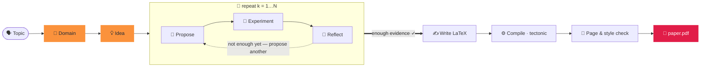

<div align="center">


### 두 단어로 논문을 생성합니다.

<p align="center"><code>paperclaw run "diffusion models"</code></p>
<p align="center"><sub>🧭 도메인 · 💡 아이디어 · 🔬 가설 · 🧪 실험 · 📊 분석<br/>📄 paper.pdf — 작성·인용·컴파일 완료 ✓</sub></p>

**PaperClaw** 는 연구 라이프사이클 전반에 걸쳐 자율 에이전트를 구동합니다 —
**🧭 도메인 → 💡 아이디어 → 📄 논문**. 주제를 입력하면 분야를 탄탄히 정의하고,
아이디어를 발상하며, *실제* 실험을 수행하고, 인용이 포함된 컴파일된 논문을 작성합니다.

[](https://arxiv.org/abs/2606.22610)
[](../../LICENSE)


<sub><a href="../../README.md">English</a> · <a href="README.zh-CN.md">简体中文</a> · <a href="README.ja.md">日本語</a> · <b>한국어</b> · <a href="README.es.md">Español</a> · <a href="README.fr.md">Français</a> · <a href="README.de.md">Deutsch</a> · <a href="README.pt.md">Português</a> · <a href="README.ru.md">Русский</a> · <a href="README.ar.md">العربية</a> · <a href="README.hi.md">हिन्दी</a> · <a href="README.it.md">Italiano</a></sub>

</div>

---

## ✦ PaperClaw 란?

PaperClaw 는 오픈소스 자율 연구 엔진입니다. 연구 라이프사이클을 하나의 깔끔한 경로로 응축하고,
가설 맵, 실험 작업, 메모리, 논문에 이르기까지 제어 흐름을 엔드 투 엔드로 소유합니다.
어떤 모델이든(Anthropic SDK 또는 OpenAI 호환 엔드포인트) 혹은 외부 헤드리스 코딩 에이전트를 연결할 수 있습니다.

**하나의 Python 패키지**로 배포되며, **FastAPI** 백엔드와 **Vite + React** 프론트엔드를 포함합니다.
프론트엔드는 두 가지 타깃으로 빌드됩니다 — **웹**(백엔드가 서빙)과 **Windows / macOS / Linux 데스크톱**
(Electron) — 그리고 모든 기능을 동일하게 제공하는 **완전한 CLI** 도 있습니다.

<div align="center">

</div>

## ✦ 논문 예시

PaperClaw 가 엔드 투 엔드로 작성한 실제 논문 — 주제 → 도메인 → 아이디어 → 가설 → 실험 →
**컴파일된 PDF** — 각각 **목표 학회/저널**의 LaTeX 템플릿으로 조판되었습니다. 각 항목은 완전한
아이디어 작업공간(명세, 가설 맵, 실험, 그림, `ref.bib`, LaTeX 소스)입니다.
**[`docs/examples/`](../examples/)** 에서 살펴보세요.

| 논문 | 주제 | 산출물 |
|---|---|---|
| 📄 [**RC-Diff: Risk-Controlled Financial Diffusion with Path-Level Audits**](<../examples/[Paper 1] rc-diff-risk-controlled-financial-diffusion/paper.pdf>) | 금융 시계열을 위한 확산 모델 | 목표 학회 · 9쪽 |

## ✦ 깔끔한 연구 모델

| | 단계 | 무슨 일이 일어나는가 | 한 줄 명령 |
|:--:|:--|:--|:--|
| 🧭 | **도메인** — *파고들 토양* | 분야를 한 문장으로 기술합니다. 모델이 `DOMAIN.md` 명세를 작성합니다 — 목표, 핵심 논문, 데이터셋, 라이브러리, 투고처 — 모델의 기억이 아니라 **개방형 학술 색인에서 실시간으로** 가져옵니다. | `paperclaw domain auto "…"` |
| 💡 | **아이디어** — *구체적이고 검증 가능한 방향* | 브레인스토밍이 하나 이상의 도메인을 완전한 `IDEA.md` 초안으로 — 배경, 연구 공백, 동기, 근본 가설. 채팅에서 다듬은 뒤 살아있는 아이디어로 고정합니다. | `paperclaw brainstorm generate` |
| 📄 | **논문** — *작성·인용·컴파일* | 가설 루프가 라운드마다 제안·검증·성찰하고, 가장 강력한 결과를 선별해 **검증된 인용**이 포함된 학회 서식의 LaTeX 논문을 작성합니다 — PDF로 컴파일하고 스타일·분량 요건에 맞을 때까지 다듬습니다. | `paperclaw run --idea <id>` |

<div align="center">

<br/>
<sub><b>자동 모드 도메인 생성(웹 UI)</b> — 분야를 한 문장으로 기술하면 PaperClaw 가 개방형 학술 색인을 실시간으로 조사해 <code>DOMAIN.md</code> 명세를 작성합니다.</sub>
</div>

## ✦ 오토파일럿 내부 — 언제 멈출지 아는 가설 루프

아이디어에 도메인이 생기면 PaperClaw 는 **실험 주도 루프**를 실행하여, 사전 추측이 아니라
실측 결과로부터 가설 맵을 키웁니다 — 그리고 실제로 발견한 내용을 바탕으로 논문을 작성합니다.
모든 단계는 실시간으로 스트리밍되며 **재개 가능**합니다.



## ✦ 두 가지 실행 방법

PaperClaw 는 두 가지 모드로 동작합니다 — 하나를 고르세요(같은 백엔드와 `saves/` 데이터를 공유하므로
자유롭게 전환할 수 있습니다).

**가장 빠른 설정(명령 불필요):** `settings.example.yaml`을 프로젝트 디렉터리의 `settings.yaml`으로 복사하고 제공자·모델·API 키를 채우세요 — 백엔드와 CLI 모두 시작 시 읽습니다(앱 내 설정보다 우선합니다). YAML이라 각 항목에 `#` 주석을 달 수 있습니다:

```yaml
LLM:
  provider: anthropic           # anthropic | openai
  base_url: null                # null = 제공자 기본값. 프록시/자체 호스팅 시 설정
  api_key: ""
  model: claude-opus-4-8
image_generation:               # 선택 — 논문 그림
  base_url: null
  api_key: ""
  model: null
academic_search:
  open_alex:
    api_key: ""                 # 선택 — 문헌 검색
```

`settings.yaml`은 git에서 무시됩니다(키를 담고 있음). 따라서 절대 커밋되지 않습니다. (기존 `settings.json`도 읽습니다.)

> ⚙️ **전체 구성** — 모델·키, 이미지 생성, OpenAlex, 실험 모드, SSH 원격, LaTeX, `paperclaw doctor` 점검: **[환경 설정 가이드](../environment-guide.md)** 참고.

> [!TIP]
> **웹 모드가 권장 경험입니다** — 실시간 스트리밍, 가설 그래프, 실험 모니터, 앱 내 PDF 뷰어가 한곳에.
> **CLI 모드**는 터미널·서버·자동화를 위해 모든 기능을 동일하게 제공합니다.

---

### 🪟 1. 웹 모드 *(권장)*

> 📘 **UI가 처음이신가요?** **[웹 UI 둘러보기](../web-guide.md)** 를 따라 해보세요 — 도메인에서 논문까지 주석이 달린 4단계, 각 단계마다 해당 CLI 명령 포함.

**설치** — 백엔드 + 프론트엔드:

```bash
pip install -e ".[dev]"          # backend (Python)
cd frontend && npm install       # frontend (Node)
```

**실행** — 저장소 루트에서 `./dev.sh` 를 실행하면 둘 다 시작하고 점유된 포트를 정리합니다:

```bash
./dev.sh                         # backend :8230 + web UI :5173
# → open http://localhost:5173
```

<sub>수동 동등 방식(두 터미널): `paperclaw serve --reload` &nbsp;·&nbsp; `cd frontend && npm run dev:web`. &nbsp; 데스크톱 앱: `npm run dev`(Electron).</sub>

**구성** — **⚙️ 설정**(왼쪽 아래 톱니바퀴)을 엽니다:

- **🔌 LLM** — 공급자, Base URL(프록시 / 자체 호스팅), 모델, API 키.
- **📚 학술 검색** — 문헌 검색(도메인 조사, SOTA 논문, 참고문헌)용 OpenAlex API 키. 선택 사항이지만, 없으면 OpenAlex 가 익명 요청을 제한하여 조사가 "Found 0 papers" 를 반환할 수 있습니다.
- **🖼️ 이미지 생성** — 논문 그림용 선택적 OpenAI 스타일 이미지 API(미설정 시 matplotlib/TikZ 로 폴백).
- **🩺 닥터(Doctor)** — 전체 환경이 준비됐는지 한 번에 확인(LLM, 코딩 에이전트, LaTeX 툴체인, 이미지 생성, OpenAlex).

키는 서버 측 `saves/settings.yaml`(모드 `600`)에만 저장되며 브라우저로 절대 전송되지 않습니다.
키가 없어도 앱은 동작하며 구성 힌트를 응답합니다.

**사용하기** — **⚡ Auto run**(새 주제는 사이드바, 기존 아이디어에도)을 클릭해 주제 → 논문으로 진행합니다.
배너에서 실시간으로 지켜보고 🌳 Hypotheses 와 📄 Paper 탭을 살펴보세요. 또는 채팅으로 도메인을 만들고
아이디어를 브레인스토밍한 뒤 하나를 고정합니다.

> 📘 **UI가 처음이신가요?** **[웹 UI 둘러보기](../web-guide.md)** 를 따라 해보세요 — 도메인에서 논문까지 주석이 달린 4단계, 각 단계마다 해당 CLI 명령 포함.

---

### ⌨️ 2. CLI 모드

CLI 는 웹의 모든 기능에 대응합니다. **백엔드만 설치**합니다(프론트엔드 빌드 불필요):

```bash
pip install -e ".[dev]"
```

**구성** — 로컬 모드는 다음 우선순위(높은 순)로 설정을 읽습니다:
**환경 변수 → `.env`(현재 디렉터리) → `$PAPERCLAW_HOME` 의 `.env` → `./settings.yaml` (프로젝트 디렉터리) → `$PAPERCLAW_HOME/settings.yaml`**.

| 키 | 용도 |
|---|---|
| `PAPERCLAW_PROVIDER` | `anthropic` \| `openai`(OpenAI 호환) |
| `PAPERCLAW_BASE_URL` | 프록시 / 자체 호스팅 엔드포인트(선택) |
| `PAPERCLAW_MODEL` | 예: `claude-opus-4-8` |
| `PAPERCLAW_API_KEY` | API 키(`ANTHROPIC_API_KEY` / `OPENAI_API_KEY` 는 공급자별 폴백) |
| `OPENALEX_API_KEY` | 문헌 검색용 OpenAlex 키(선택 — 익명 제한 회피) |
| `PAPERCLAW_HOME` | 작업공간 루트(기본값: `./saves`) |

```bash
# or persist them once:
paperclaw settings set --provider anthropic --model claude-opus-4-8 --api-key sk-…
paperclaw settings set --openalex-api-key oa-…   # literature search (optional)
paperclaw doctor                 # check the env is ready (LLM, LaTeX, image gen, OpenAlex)
```

**사용하기** — 로컬 모드(기본)는 `$PAPERCLAW_HOME` 아래 파일에서 동작합니다:

```bash
# Fully autonomous: topic → doctor → domain → idea → hypotheses → paper
paperclaw run "diffusion models for time series"       # writes the paper on 2 positives
paperclaw run "…" --positive 3 --max-hypotheses 8      # stop at 3 supported, cap at 8
paperclaw status / stop / resume                       # manage runs from any terminal

# …or drive each step:
paperclaw domain auto "time-series diffusion"
paperclaw domain list                  # [✓] = selected for brainstorming
paperclaw brainstorm generate          # digest selected domains → IDEA.md drafts
paperclaw brainstorm pin <seed-id>     # promote a draft to a living idea
paperclaw hypothesis <idea> generate   # build the hypothesis map
paperclaw references <idea> validate   # validate citations vs Crossref/OpenAlex
paperclaw experiments                  # list detached, monitored experiment jobs
```

**원격 모드** — `--backend` 로 같은 CLI 를 로컬 파일 대신 실행 중인 백엔드로 향하게 합니다
(이 경우 설정은 로컬이 아니라 서버에 존재합니다):

```bash
paperclaw --backend domain list                    # → http://127.0.0.1:8230
paperclaw --backend http://host:8230 chat "hello"  # explicit URL
```

<details>
<summary><b>자동 실행 구성 파일 및 병렬 실행</b></summary>

```yaml
# run.yaml
topic: generative modeling for time series
positive: 3          # write the paper once 3 hypotheses are SUPPORTED
max_hypotheses: 8    # stop after 8 if not enough positives
page_limit: 8
```
```bash
paperclaw run --config run.yaml   # CLI flags override the file
```

**아이디어는 병렬로 실행됩니다** — 원하는 만큼 많은 아이디어에서 자동 실행을 시작할 수 있습니다.
각 아이디어 패널에는 자신의 ⚡ 배너만 표시됩니다. 실행은 **분리(detached)** 되어 탭을 닫거나
백엔드를 재시작해도 살아남습니다. `paperclaw stop [--idea <id>]`(또는 Ctrl+C, 웹 배너의 ⏹)로 **중지**,
`paperclaw resume [--idea <id>]` 로 중지된 실행을 **계속**합니다 — 파이프라인은 재개 가능하므로 완료된
가설/단계는 건너뜁니다.

</details>

## ✦ 개발

```bash
./dev.sh          # one-shot: kills stale ports, restarts backend :8230 + web UI :5173
```

또는 수동으로 — 백엔드는 저장소 루트에서, **npm 명령은 `frontend/` 안에서**:

```bash
pip install -e ".[dev]"
paperclaw serve --reload                  # repo root — API on :8230
cd frontend && npm install
npm run dev:web                           # web     → http://localhost:5173
npm run dev                               # desktop → Electron window
```

> **변경 세트마다 재시작하세요** — `--reload` 는 새 의존성, 시작 시 로드되는 설정, Vite 구성 변경을 다루지 않습니다.

## ✦ 프로덕션

```bash
# Web (served by the Python backend)
cd frontend && npm run build:web          # → frontend/dist/web, then `paperclaw serve`

# Desktop packages (output in frontend/dist/)
npm run dist:win     # Windows — NSIS installer + portable zip
npm run dist:mac     # macOS   — dmg + zip (must run on a Mac)
npm run dist:linux   # Linux   — AppImage
```

`v*` 태그를 푸시(또는 워크플로를 수동 실행)하면 `.github/workflows/desktop.yml` 가 네이티브 러너에서
win/mac/linux 를 빌드하고 아티팩트를 업로드합니다.

## ✦ 테스트

```bash
pytest tests/                             # backend
cd frontend && npm run typecheck          # frontend (tsc --noEmit)
```

## ✦ PaperClaw 기능

<table>
<tr>
<td width="33%" valign="top">

**🧭 도메인 주도 발견**
한 문장 또는 안내형 마법사로 `DOMAIN.md` 자동 생성 — 논문, 데이터셋, 라이브러리, 투고처를 실시간 학술 색인에서 가져옵니다.

</td>
<td width="33%" valign="top">

**💡 다중 도메인 브레인스토밍**
하나 이상의 도메인을 완전한 `IDEA.md` 초안으로 모은 뒤, 대화에 맞춰 최신으로 유지되는 살아있는 아이디어 명세로 정제합니다.

</td>
<td width="33%" valign="top">

**🔁 반복적 가설 루프**
제안 → 검증 → 성찰. 실측 결과로부터 가설 맵을 키웁니다 — 각 질문을 매듭짓는 최소한의 실험으로.

</td>
</tr>
<tr>
<td valign="top">

**🤝 사이클 내 연구 보조**
공급자 비종속 스캐폴드 — 어느 단계에서든 모델을 교체하거나 외부 헤드리스 코딩 에이전트를 연결할 수 있습니다.

</td>
<td valign="top">

**🧪 실제로 관리되는 실험**
재시작에도 살아남는 작업. 에이전트가 `run.py` 를 작성해 샌드박스 서브프로세스로 실행하고, 지표와 그림을 얻을 때까지 자기 트레이스백을 디버깅합니다.

</td>
<td valign="top">

**🧠 전체 라이프사이클 메모리**
도메인·아이디어·가설·논문은 살아있는 문서이자 재개 가능한 체크포인트 — 어떤 실행이든 작업을 잃지 않고 멈췄다 이어갈 수 있습니다.

</td>
</tr>
<tr>
<td valign="top">

**♻️ 진화하는 보조**
선별된 도메인, 문체 가이드, 참조 코드베이스, 검증된 참고문헌이 축적·재사용되어 — 쓸수록 예리해집니다.

</td>
<td valign="top">

**📚 검증된 인용**
각 아이디어는 OpenAlex 와 Crossref 로부터 결정론적으로 구축된 `ref.bib` 를 가지며, 모든 항목을 출처와 대조합니다 — 날조된 참고문헌은 없습니다.

</td>
<td valign="top">

**📄 학회 서식 논문**
실제 LaTeX 를 에이전트 수정 루프를 통해 tectonic 으로 컴파일하고, 스타일·분량에 맞을 때까지 다듬습니다 — 실제로 실행된 결과만 보고합니다.

</td>
</tr>
<tr>
<td valign="top">

**🖥️ 하드웨어 인식**
로컬 호스트와 모든 SSH 원격의 CPU / GPU / 메모리 / 디스크를 감지하여 실제 보유한 연산 자원에 맞춰 실험을 계획합니다.

</td>
<td valign="top">

**🪟 웹 · 데스크톱 · CLI**
하나의 Vite + React 코드베이스가 웹 앱, Electron 데스크톱 앱, 완전한 CLI 로 출시됩니다 — 셋 모두 기능이 동일합니다.

</td>
<td valign="top">

**🔌 원하는 모델 사용**
공식 SDK 를 통한 Anthropic, 또는 OpenAI 호환 엔드포인트. 기본 모델 `claude-opus-4-8`. 키는 서버 측에 남습니다.

</td>
</tr>
</table>

## ✦ FAQ

**서버에 배포해(스토리지·연산 활용) SSH 터널로 로컬에서 사용하려면?**
백엔드를 서버에 배포하고 SSH 터널로 접속하세요 — 공개 포트가 필요 없습니다. **서버에서:** UI를 빌드하고 한 포트로 백엔드를 시작합니다 — `cd frontend && npm run build:web` 후 `paperclaw serve --port 8230`. 데이터는 `$PAPERCLAW_HOME`에 있고 실험은 서버의 CPU/GPU를 사용합니다. **로컬에서:** `ssh -N -L 8230:localhost:8230 user@server`로 포트를 포워딩한 뒤 `http://localhost:8230`을 엽니다. CLI도 터널을 통해 동일하게 동작합니다: `paperclaw --backend http://localhost:8230 …`.

**도메인 조사가 "Found 0 papers" 라고 나오는 이유는?**
OpenAlex 는 이제 익명(IP 단위) 요청에 예산 제한을 둡니다. **설정 → 📚 학술 검색**(또는 `OPENALEX_API_KEY`)에서
무료 OpenAlex API 키를 추가하면 전용 예산이 생깁니다.

**좌측 상단의 ⚡ Auto run을 눌렀는데 진행 상황이 보이지 않아요 — 어디로 갔나요?**
사이드바 좌측 상단의 **⚡ Auto run**은 **토픽**에서 실행을 시작하며(`paperclaw run "토픽"`과 동일) 아직 **베타**입니다 — 앱 내 진행 표시는 개발 중입니다. 실행 자체는 정상입니다(다른 자동 실행과 마찬가지로 분리된 프로세스). 아무 터미널에서나 `paperclaw status`(및 `paperclaw stop` / `paperclaw resume`)로 추적하세요. **기존 아이디어**에서 시작한 자동 실행(상단 바의 ⚡ Auto run)은 라이브 배너를 표시합니다. [웹 UI 둘러보기](../web-guide.md#4-auto-run--topic--paper-on-autopilot) 참고.

**제 API 키는 안전한가요?**
키는 서버 측 `saves/settings.yaml`(모드 `600`)에만 저장되며 브라우저로 전송되거나 로그에 남지 않습니다.

**GPU 가 필요한가요?**
아니요 — 소규모 실행은 CPU 로 충분합니다. PaperClaw 는 로컬 호스트와 모든 SSH 원격의 CPU/GPU/메모리를 감지해
실제 보유한 연산 자원에 맞춰 실험을 계획합니다.

**웹과 CLI 중 무엇을?**
어느 쪽이든 — 같은 백엔드와 `saves/` 데이터를 공유하므로 자유롭게 전환할 수 있습니다. CLI 는 웹의 모든 기능에 대응합니다.

## ✦ 인용

PaperClaw는 논문 **[PaperClaw: Harnessing Agents for Autonomous Research and Human-in-the-Loop Refinement](https://arxiv.org/abs/2606.22610)** 에서 설명합니다. 연구에 사용하신다면 다음을 인용해 주세요:

```bibtex
@article{ye2026paperclaw,
  title   = {PaperClaw: Harnessing Agents for Autonomous Research and Human-in-the-Loop Refinement},
  author  = {Ye, Weiwei and Liu, Hangchen and Li, Dongyuan and Jiang, Renhe},
  journal = {arXiv preprint arXiv:2606.22610},
  year    = {2026}
}
```

## ✦ 라이선스

[MIT](../../LICENSE) © PaperClaw 기여자.

<div align="center">
<br />
<sub>🦞 <b>PaperClaw</b> — 도메인 → 아이디어 → 논문, 자율적으로.</sub>
</div>
