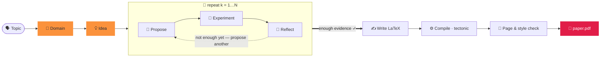

<div align="center">


### Gerar um artigo em duas palavras.

<p align="center"><code>paperclaw run "diffusion models"</code></p>
<p align="center"><sub>🧭 domínio · 💡 ideia · 🔬 hipóteses · 🧪 experimentos · 📊 análise<br/>📄 paper.pdf — escrito, citado e compilado ✓</sub></p>

O **PaperClaw** orquestra agentes autônomos por todo o ciclo de pesquisa —
**🧭 Domínio → 💡 Ideia → 📄 Artigo**. Dê um tema e ele fundamenta um campo, gera uma
ideia, executa experimentos *reais* e escreve um artigo citado e compilado.

[](../../LICENSE)


<sub><a href="../../README.md">English</a> · <a href="README.zh-CN.md">简体中文</a> · <a href="README.ja.md">日本語</a> · <a href="README.ko.md">한국어</a> · <a href="README.es.md">Español</a> · <a href="README.fr.md">Français</a> · <a href="README.de.md">Deutsch</a> · <b>Português</b> · <a href="README.ru.md">Русский</a> · <a href="README.ar.md">العربية</a> · <a href="README.hi.md">हिन्दी</a> · <a href="README.it.md">Italiano</a></sub>

</div>

---

## ✦ O que é o PaperClaw?

O PaperClaw é um motor de pesquisa autônomo e de código aberto. Ele condensa o ciclo de pesquisa
em um único caminho limpo e controla o fluxo de ponta a ponta: o mapa de hipóteses, os trabalhos de
experimentação, a memória e o artigo. Conecte qualquer modelo (o SDK da Anthropic ou qualquer
endpoint compatível com OpenAI) ou um agente de codificação headless externo.

Ele é distribuído como **um único pacote Python** com um backend **FastAPI** e um frontend
**Vite + React** que compila para dois alvos — **web** (servido pelo backend) e **desktop para
Windows / macOS / Linux** (Electron) — além de uma **CLI completa** que reflete cada recurso.

<div align="center">

</div>

## ✦ Artigos de exemplo

Artigos reais que o PaperClaw escreveu de ponta a ponta — tema → domínio → ideia → hipóteses →
experimentos → **PDF compilado** — cada um diagramado com o modelo LaTeX do seu **local de
publicação alvo**. Cada um é um espaço de trabalho de ideia completo (especificação, mapa de
hipóteses, experimentos, figuras, `ref.bib`, fonte LaTeX). Explore-os em
**[`docs/examples/`](../examples/)**.

| Artigo | Tema | Saída |
|---|---|---|
| 📄 [**RC-Diff: Risk-Controlled Financial Diffusion with Path-Level Audits**](<../examples/[Paper 1] rc-diff-risk-controlled-financial-diffusion/paper.pdf>) | Modelos de difusão para séries temporais financeiras | Local alvo · 9 pp |

## ✦ Um modelo de pesquisa limpo

| | Passo | O que acontece | Um comando |
|:--:|:--|:--|:--|
| 🧭 | **Domínio** — *o solo a cavar* | Descreva um campo em uma frase. O modelo escreve uma especificação `DOMAIN.md` — objetivo, artigos cruciais, conjuntos de dados, bibliotecas, locais de publicação — extraída **ao vivo de índices acadêmicos abertos**, não da memória do modelo. | `paperclaw domain auto "…"` |
| 💡 | **Ideia** — *uma direção concreta e testável* | O brainstorming digere um ou mais domínios em rascunhos `IDEA.md` completos — contexto, lacuna de pesquisa, motivação, hipóteses-raiz. Refine-a no chat e então fixe-a como ideia viva. | `paperclaw brainstorm generate` |
| 📄 | **Artigo** — *escrito, citado e compilado* | O laço de hipóteses propõe, testa e reflete rodada após rodada, seleciona os resultados mais fortes e escreve um artigo LaTeX no formato do local com **citações validadas** — compilado em PDF e refinado até cumprir estilo e extensão. | `paperclaw run --idea <id>` |

<div align="center">

<br/>
<sub><b>Domínio em modo automático (interface web)</b> — descreva um campo em uma frase; o PaperClaw consulta índices acadêmicos abertos ao vivo e escreve a especificação <code>DOMAIN.md</code>.</sub>
</div>

## ✦ Dentro do piloto automático — um laço de hipóteses que sabe quando parar

Assim que uma ideia tem um domínio, o PaperClaw executa um **laço guiado por experimentos**,
fazendo crescer um mapa de hipóteses a partir de resultados medidos em vez de um palpite inicial —
e então escreve o artigo a partir do que realmente encontrou. Cada fase é transmitida ao vivo e é
**retomável**.



## ✦ Duas formas de executá-lo

O PaperClaw funciona em dois modos — escolha um (eles compartilham o mesmo backend e os dados de
`saves/`, então você pode alternar livremente).

**Configuração mais rápida (sem comandos):** copie `settings.example.yaml` para `settings.yaml` no diretório do projeto e preencha seu provedor, modelo e chaves de API — tanto o backend quanto a CLI o leem ao iniciar (tem prioridade sobre as Configurações do app). É YAML, então você pode comentar as opções com `#`:

```yaml
LLM:
  provider: anthropic           # anthropic | openai
  base_url: null                # null = padrão do provedor; defina para proxy / self-hosted
  api_key: ""
  model: claude-opus-4-8
image_generation:               # opcional — figuras do artigo
  base_url: null
  api_key: ""
  model: null
academic_search:
  open_alex:
    api_key: ""                 # opcional — busca bibliográfica
```

`settings.yaml` é ignorado pelo git (contém suas chaves), portanto nunca é commitado. (Um `settings.json` legado ainda é lido.)

> ⚙️ **Configuração completa** — modelo e chaves, geração de imagens, OpenAlex, modo de experimentos, remotos SSH, LaTeX e a verificação `paperclaw doctor`: veja o **[guia de configuração do ambiente](../environment-guide.md)**.

> [!TIP]
> **O modo web é a experiência recomendada** — transmissão ao vivo, o grafo de hipóteses, o
> monitor de experimentos e o visualizador de PDF integrado, tudo em um só lugar. O **modo CLI**
> reflete cada recurso para terminais, servidores e automação.

---

### 🪟 1. Modo web *(recomendado)*

> 📘 **Novo na interface?** Siga o **[tour pela interface web](../web-guide.md)** — quatro passos anotados do domínio ao artigo, cada um com seu equivalente em CLI.

**Instalar** — backend + frontend:

```bash
pip install -e ".[dev]"          # backend (Python)
cd frontend && npm install       # frontend (Node)
```

**Executar** — `./dev.sh` a partir da raiz do repositório inicia ambos e libera portas ocupadas:

```bash
./dev.sh                         # backend :8230 + web UI :5173
# → open http://localhost:5173
```

<sub>Equivalente manual (dois terminais): `paperclaw serve --reload` &nbsp;·&nbsp; `cd frontend && npm run dev:web`. &nbsp; App de desktop: `npm run dev` (Electron).</sub>

**Configurar** — abra **⚙️ Configurações** (engrenagem, canto inferior esquerdo):

- **🔌 LLM** — provedor, URL base (para proxies / auto-hospedado), modelo e chave de API.
- **📚 Busca acadêmica** — uma chave de API do OpenAlex para a busca de literatura (o levantamento do domínio, artigos SOTA e referências). Opcional, mas sem ela o OpenAlex pode limitar requisições anônimas e os levantamentos retornam "Found 0 papers".
- **🖼️ Geração de imagens** — API de imagens opcional no estilo da OpenAI para as figuras do artigo (recorre a matplotlib/TikZ quando não definida).
- **🩺 Doctor** — um clique verifica se todo o ambiente está pronto (LLM, agente de codificação, cadeia de ferramentas LaTeX, geração de imagens, OpenAlex).

As chaves são armazenadas apenas no servidor em `saves/settings.yaml` (modo `600`) e nunca enviadas
ao navegador. Sem uma chave, o app ainda funciona e responde com uma dica de configuração.

**Use-o** — clique em **⚡ Auto run** (barra lateral para um tema novo, ou sobre uma ideia existente)
para ir de tema → artigo; acompanhe ao vivo no banner e explore as abas 🌳 Hypotheses e 📄 Paper. Ou
converse para construir um domínio, gerar ideias e fixar uma.

> 📘 **Novo na interface?** Siga o **[tour pela interface web](../web-guide.md)** — quatro passos anotados do domínio ao artigo, cada um com seu equivalente em CLI.

---

### ⌨️ 2. Modo CLI

A CLI reflete cada recurso da web. **Instale apenas o backend** (não é preciso compilar o frontend):

```bash
pip install -e ".[dev]"
```

**Configurar** — o modo local lê a configuração nesta prioridade (da mais alta para a mais baixa):
**variáveis de ambiente → `.env` (cwd) → `.env` em `$PAPERCLAW_HOME` → `./settings.yaml` (diretório do projeto) → `$PAPERCLAW_HOME/settings.yaml`**.

| Chave | Propósito |
|---|---|
| `PAPERCLAW_PROVIDER` | `anthropic` \| `openai` (compatível com OpenAI) |
| `PAPERCLAW_BASE_URL` | endpoint de proxy / auto-hospedado (opcional) |
| `PAPERCLAW_MODEL` | ex.: `claude-opus-4-8` |
| `PAPERCLAW_API_KEY` | chave de API (`ANTHROPIC_API_KEY` / `OPENAI_API_KEY` são fallbacks por provedor) |
| `OPENALEX_API_KEY` | chave do OpenAlex para a busca de literatura (opcional — evita limites anônimos) |
| `PAPERCLAW_HOME` | raiz do espaço de trabalho (padrão: `./saves`) |

```bash
# or persist them once:
paperclaw settings set --provider anthropic --model claude-opus-4-8 --api-key sk-…
paperclaw settings set --openalex-api-key oa-…   # literature search (optional)
paperclaw doctor                 # check the env is ready (LLM, LaTeX, image gen, OpenAlex)
```

**Use-o** — o modo local (padrão) trabalha sobre arquivos em `$PAPERCLAW_HOME`:

```bash
# Fully autonomous: topic → doctor → domain → idea → hypotheses → paper
paperclaw run "diffusion models for time series"       # writes the paper on 2 positives
paperclaw run "…" --positive 3 --max-hypotheses 8      # stop at 3 supported, cap at 8
paperclaw status / stop / resume                       # manage runs from any terminal

# …or drive each step:
paperclaw domain auto "time-series diffusion"
paperclaw domain list                  # [✓] = selected for brainstorming
paperclaw brainstorm generate          # digest selected domains → IDEA.md drafts
paperclaw brainstorm pin <seed-id>     # promote a draft to a living idea
paperclaw hypothesis <idea> generate   # build the hypothesis map
paperclaw references <idea> validate   # validate citations vs Crossref/OpenAlex
paperclaw experiments                  # list detached, monitored experiment jobs
```

**Modo remoto** — aponte a mesma CLI para um backend em execução em vez de arquivos locais com
`--backend` (a configuração passa a viver no servidor, não localmente):

```bash
paperclaw --backend domain list                    # → http://127.0.0.1:8230
paperclaw --backend http://host:8230 chat "hello"  # explicit URL
```

<details>
<summary><b>Arquivo de configuração de auto-run e execuções em paralelo</b></summary>

```yaml
# run.yaml
topic: generative modeling for time series
positive: 3          # write the paper once 3 hypotheses are SUPPORTED
max_hypotheses: 8    # stop after 8 if not enough positives
page_limit: 8
```
```bash
paperclaw run --config run.yaml   # CLI flags override the file
```

**As ideias executam em paralelo** — inicie uma execução automática em quantas ideias quiser; o painel
de cada ideia mostra apenas o seu próprio banner ⚡. As execuções são **destacadas**: sobrevivem ao
fechamento da aba ou à reinicialização do backend. **Pare** com `paperclaw stop [--idea <id>]` (ou
Ctrl+C, ou o ⏹ no banner web); **continue** uma execução parada com `paperclaw resume [--idea <id>]` —
o pipeline é retomável, então pula hipóteses/fases já concluídas.

</details>

## ✦ Desenvolvimento

```bash
./dev.sh          # one-shot: kills stale ports, restarts backend :8230 + web UI :5173
```

Ou manualmente — o backend a partir da raiz do repositório, **comandos npm dentro de `frontend/`**:

```bash
pip install -e ".[dev]"
paperclaw serve --reload                  # repo root — API on :8230
cd frontend && npm install
npm run dev:web                           # web     → http://localhost:5173
npm run dev                               # desktop → Electron window
```

> **Reinicie após cada conjunto de mudanças** — `--reload` não cobre novas dependências, configurações
> carregadas na inicialização nem mudanças na configuração do Vite.

## ✦ Produção

```bash
# Web (served by the Python backend)
cd frontend && npm run build:web          # → frontend/dist/web, then `paperclaw serve`

# Desktop packages (output in frontend/dist/)
npm run dist:win     # Windows — NSIS installer + portable zip
npm run dist:mac     # macOS   — dmg + zip (must run on a Mac)
npm run dist:linux   # Linux   — AppImage
```

Envie uma tag `v*` (ou execute o workflow manualmente) e o `.github/workflows/desktop.yml` compila
win/mac/linux em runners nativos e faz upload dos artefatos.

## ✦ Testes

```bash
pytest tests/                             # backend
cd frontend && npm run typecheck          # frontend (tsc --noEmit)
```

## ✦ Recursos do PaperClaw

<table>
<tr>
<td width="33%" valign="top">

**🧭 Descoberta guiada por domínio**
`DOMAIN.md` automático a partir de uma frase ou de um assistente guiado — artigos, conjuntos de dados, bibliotecas e locais de publicação extraídos de índices acadêmicos ao vivo.

</td>
<td width="33%" valign="top">

**💡 Brainstorming multidomínio**
Digere um ou mais domínios em rascunhos `IDEA.md` completos e então destila um deles numa especificação de ideia viva, mantida atual enquanto você conversa.

</td>
<td width="33%" valign="top">

**🔁 Laço de hipóteses iterativo**
Propor → testar → refletir, fazendo crescer um mapa de hipóteses a partir de resultados medidos — o menor experimento que resolve cada questão.

</td>
</tr>
<tr>
<td valign="top">

**🤝 Assistente de pesquisa no ciclo**
Um arcabouço agnóstico de provedor — troque o modelo ou conecte um agente de codificação headless externo em qualquer etapa.

</td>
<td valign="top">

**🧪 Experimentos reais e gerenciados**
Trabalhos que sobrevivem a reinicializações. O agente escreve `run.py`, o executa como subprocesso isolado e depura seus próprios tracebacks até obter métricas e figuras.

</td>
<td valign="top">

**🧠 Memória de todo o ciclo de vida**
Domínio, ideia, hipótese e artigo são documentos vivos e checkpoints retomáveis — pare e continue qualquer execução sem perder trabalho.

</td>
</tr>
<tr>
<td valign="top">

**♻️ Assistente em evolução**
Domínios curados, guias de estilo de prosa, bases de código de referência e bibliografias validadas se acumulam e são reutilizados — mais afiado com o tempo.

</td>
<td valign="top">

**📚 Citações validadas**
Cada ideia tem um `ref.bib` construído de forma determinística a partir do OpenAlex e do Crossref, com cada entrada validada contra a fonte — sem referências fabricadas.

</td>
<td valign="top">

**📄 Artigos no formato do local**
LaTeX real, compilado com tectonic através de um laço de correção do agente, refinado até cumprir estilo e extensão — relatando apenas resultados que realmente foram executados.

</td>
</tr>
<tr>
<td valign="top">

**🖥️ Ciente do hardware**
Detecta CPU / GPU / memória / disco no host local e em qualquer remoto SSH, de modo que os experimentos são planejados conforme a computação que você realmente tem.

</td>
<td valign="top">

**🪟 Web · Desktop · CLI**
Uma única base de código Vite + React é entregue como app web, app de desktop Electron e CLI completa — cada recurso idêntico nas três.

</td>
<td valign="top">

**🔌 Traga seu próprio modelo**
Anthropic via o SDK oficial, ou qualquer endpoint compatível com OpenAI. Modelo padrão `claude-opus-4-8`. As chaves permanecem no servidor.

</td>
</tr>
</table>

## ✦ Perguntas frequentes

**Como executo em um servidor (para seu armazenamento e computação) e uso localmente por um túnel SSH?**
Implante o backend no servidor e acesse-o por um túnel SSH — sem necessidade de porta pública. **No servidor:** compile a interface e inicie o backend em uma única porta — `cd frontend && npm run build:web` e depois `paperclaw serve --port 8230`; os dados ficam em `$PAPERCLAW_HOME` e os experimentos usam a CPU/GPU do servidor. **No seu computador:** encaminhe a porta com `ssh -N -L 8230:localhost:8230 user@server` e abra `http://localhost:8230`. A CLI funciona da mesma forma pelo túnel: `paperclaw --backend http://localhost:8230 …`.

**Por que um levantamento de domínio diz "Found 0 papers"?**
O OpenAlex agora limita por orçamento as requisições anônimas (por IP). Adicione uma chave de API gratuita
do OpenAlex em **Configurações → 📚 Busca acadêmica** (ou `OPENALEX_API_KEY`) para um orçamento dedicado.

**Cliquei no ⚡ Auto run no canto superior esquerdo, mas a interface não mostra progresso — para onde foi?**
O **⚡ Auto run** no canto superior esquerdo da barra lateral inicia uma execução a partir de um **tema** (equivale a `paperclaw run "seu tema"`) e ainda está em **beta**: sua visualização de progresso no app está em desenvolvimento. A execução está OK (processo desacoplado, como qualquer auto run); acompanhe de qualquer terminal com `paperclaw status` (e `paperclaw stop` / `paperclaw resume`). Execuções iniciadas em uma ideia *existente* (o ⚡ Auto run da barra superior) mostram o banner ao vivo. Veja o [tour pela interface web](../web-guide.md#4-auto-run--topic--paper-on-autopilot).

**Minha chave de API está segura?**
As chaves são armazenadas no servidor em `saves/settings.yaml` (modo `600`) e nunca enviadas ao navegador
ou registradas em log.

**Preciso de uma GPU?**
Não — execuções pequenas funcionam em CPU. O PaperClaw detecta CPU/GPU/memória no host local e em qualquer
remoto SSH e planeja os experimentos conforme a computação que você realmente tem.

**Web ou CLI?**
Qualquer um — compartilham o mesmo backend e os dados de `saves/`, então você pode alternar livremente; a
CLI reflete cada recurso da web.

## ✦ Licença

[MIT](../../LICENSE) © Contribuidores do PaperClaw.

<div align="center">
<br />
<sub>🦞 <b>PaperClaw</b> — Domínio → Ideia → Artigo, de forma autônoma.</sub>
</div>
