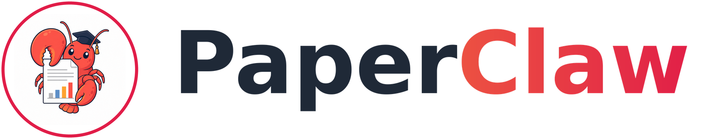
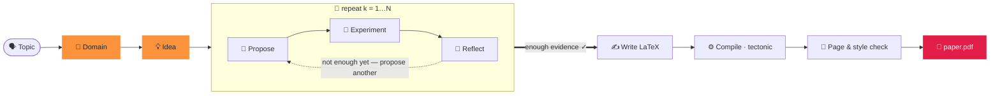

<div align="center">



### Сгенерировать статью в два слова.

<p align="center"><code>paperclaw run "diffusion models"</code></p>
<p align="center"><sub>🧭 область · 💡 идея · 🔬 гипотезы · 🧪 эксперименты · 📊 анализ<br/>📄 paper.pdf — написана, процитирована и скомпилирована ✓</sub></p>

**PaperClaw** управляет автономными агентами на протяжении всего исследовательского цикла —
**🧭 Область → 💡 Идея → 📄 Статья**. Назовите тему — и он обоснует область, придумает идею,
проведёт *реальные* эксперименты и напишет статью со ссылками, готовую к компиляции.

[](https://arxiv.org/abs/2606.22610)
[](../../LICENSE)


<sub><a href="../../README.md">English</a> · <a href="README.zh-CN.md">简体中文</a> · <a href="README.ja.md">日本語</a> · <a href="README.ko.md">한국어</a> · <a href="README.es.md">Español</a> · <a href="README.fr.md">Français</a> · <a href="README.de.md">Deutsch</a> · <a href="README.pt.md">Português</a> · <b>Русский</b> · <a href="README.ar.md">العربية</a> · <a href="README.hi.md">हिन्दी</a> · <a href="README.it.md">Italiano</a></sub>

</div>

---

## ✦ Что такое PaperClaw?

PaperClaw — это автономный исследовательский движок с открытым исходным кодом. Он сводит
исследовательский цикл к одному ясному пути и владеет потоком управления от начала до конца: карта
гипотез, задачи экспериментов, память и статья. Подключите любую модель (Anthropic SDK или любой
OpenAI-совместимый эндпоинт) либо внешнего headless-агента для написания кода.

Он поставляется как **единый пакет Python** с бэкендом на **FastAPI** и фронтендом на
**Vite + React**, который собирается под две цели — **веб** (раздаётся бэкендом) и **десктоп для
Windows / macOS / Linux** (Electron) — плюс **полноценный CLI**, повторяющий все возможности.

<div align="center">

</div>

## ✦ Примеры статей

Настоящие статьи, написанные PaperClaw от начала до конца — тема → область → идея → гипотезы →
эксперименты → **скомпилированный PDF** — каждая свёрстана по шаблону LaTeX её **целевой площадки
публикации**. Каждая — это полное рабочее пространство идеи (спецификация, карта гипотез,
эксперименты, рисунки, `ref.bib`, исходник LaTeX). Просмотрите их в
**[`docs/examples/`](../examples/)**.

| Статья | Тема | Результат |
|---|---|---|
| 📄 [**RC-Diff: Risk-Controlled Financial Diffusion with Path-Level Audits**](<../examples/[Paper 1] rc-diff-risk-controlled-financial-diffusion/paper.pdf>) | Диффузионные модели для финансовых временных рядов | Целевая площадка · 9 стр. |

## ✦ Чистая модель исследования

| | Шаг | Что происходит | Одна команда |
|:--:|:--|:--|:--|
| 🧭 | **Область** — *почва, которую копать* | Опишите область одним предложением. Модель пишет спецификацию `DOMAIN.md` — цель, ключевые статьи, наборы данных, библиотеки, площадки — извлечённую **в реальном времени из открытых научных индексов**, а не из памяти модели. | `paperclaw domain auto "…"` |
| 💡 | **Идея** — *конкретное, проверяемое направление* | Мозговой штурм переваривает одну или несколько областей в полные черновики `IDEA.md` — контекст, исследовательский пробел, мотивация, корневые гипотезы. Доработайте её в чате и закрепите как живую идею. | `paperclaw brainstorm generate` |
| 📄 | **Статья** — *написана, процитирована и скомпилирована* | Цикл гипотез предлагает, проверяет и осмысляет раунд за раундом, отбирает самые сильные результаты и пишет статью LaTeX в формате площадки с **проверенными ссылками** — компилирует в PDF и доводит до соответствия стилю и объёму. | `paperclaw run --idea <id>` |

<div align="center">

<br/>
<sub><b>Область в авто-режиме (веб-интерфейс)</b> — опишите область одним предложением; PaperClaw в реальном времени опрашивает открытые научные индексы и пишет спецификацию <code>DOMAIN.md</code>.</sub>
</div>

## ✦ Внутри автопилота — цикл гипотез, который знает, когда остановиться

Как только у идеи появляется область, PaperClaw запускает **цикл, управляемый экспериментами**,
выращивая карту гипотез из измеренных результатов, а не из изначальной догадки — а затем пишет статью
из того, что действительно нашёл. Каждая фаза транслируется вживую и **возобновляема**.



## ✦ Два способа запуска

PaperClaw работает в двух режимах — выберите один (они используют один и тот же бэкенд и данные
`saves/`, так что можно свободно переключаться).

**Самая быстрая настройка (без команд):** скопируйте `settings.example.yaml` в `settings.yaml` в каталоге проекта и заполните провайдера, модель и API-ключи — и бэкенд, и CLI читают его при запуске (он имеет приоритет над настройками в приложении). Это YAML, поэтому параметры можно комментировать через `#`:

```yaml
LLM:
  provider: anthropic           # anthropic | openai
  base_url: null                # null = по умолчанию у провайдера; задайте для прокси / self-hosted
  api_key: ""
  model: claude-opus-4-8
image_generation:               # необязательно — иллюстрации статьи
  base_url: null
  api_key: ""
  model: null
academic_search:
  open_alex:
    api_key: ""                 # необязательно — поиск литературы
```

`settings.yaml` добавлен в git-ignore (он содержит ваши ключи), поэтому никогда не попадает в коммиты. (Старый `settings.json` по-прежнему читается.)

> ⚙️ **Полная настройка** — модель и ключи, генерация изображений, OpenAlex, режим экспериментов, SSH-удалённые машины, LaTeX и проверка `paperclaw doctor`: см. **[руководство по настройке окружения](../environment-guide.md)**.

> [!TIP]
> **Веб-режим — рекомендуемый опыт**: трансляция вживую, граф гипотез, монитор экспериментов и
> встроенный просмотрщик PDF — всё в одном месте. **Режим CLI** повторяет все возможности для
> терминалов, серверов и автоматизации.

---

### 🪟 1. Веб-режим *(рекомендуется)*

> 📘 **Впервые в интерфейсе?** Пройдите **[обзор веб-интерфейса](../web-guide.md)** — четыре аннотированных шага от домена до статьи, каждый со своей командой CLI.

**Установка** — бэкенд + фронтенд:

```bash
pip install -e ".[dev]"          # backend (Python)
cd frontend && npm install       # frontend (Node)
```

**Запуск** — `./dev.sh` из корня репозитория запускает оба и освобождает занятые порты:

```bash
./dev.sh                         # backend :8230 + web UI :5173
# → open http://localhost:5173
```

<sub>Ручной эквивалент (два терминала): `paperclaw serve --reload` &nbsp;·&nbsp; `cd frontend && npm run dev:web`. &nbsp; Десктоп-приложение: `npm run dev` (Electron).</sub>

**Настройка** — откройте **⚙️ Настройки** (шестерёнка, внизу слева):

- **🔌 LLM** — провайдер, базовый URL (для прокси / самостоятельного хостинга), модель и API-ключ.
- **📚 Академический поиск** — API-ключ OpenAlex для поиска литературы (обзор области, SOTA-статьи и ссылки). Необязателен, но без него OpenAlex может ограничивать анонимные запросы, и обзоры возвращают «Found 0 papers».
- **🖼️ Генерация изображений** — необязательный API изображений в стиле OpenAI для рисунков статьи (откатывается на matplotlib/TikZ, если не задан).
- **🩺 Doctor** — один клик проверяет готовность всего окружения (LLM, агент написания кода, тулчейн LaTeX, генерация изображений, OpenAlex).

Ключи хранятся только на стороне сервера в `saves/settings.yaml` (режим `600`) и никогда не
отправляются в браузер. Без ключа приложение всё равно работает и отвечает подсказкой по настройке.

**Используйте** — нажмите **⚡ Auto run** (боковая панель для новой темы или на существующей идее),
чтобы пройти путь тема → статья; наблюдайте вживую в баннере и просматривайте вкладки 🌳 Hypotheses и
📄 Paper. Или общайтесь в чате, чтобы построить область, провести мозговой штурм идей и закрепить одну.

> 📘 **Впервые в интерфейсе?** Пройдите **[обзор веб-интерфейса](../web-guide.md)** — четыре аннотированных шага от домена до статьи, каждый со своей командой CLI.

---

### ⌨️ 2. Режим CLI

CLI повторяет все возможности веба. **Установите только бэкенд** (сборка фронтенда не нужна):

```bash
pip install -e ".[dev]"
```

**Настройка** — локальный режим читает конфигурацию с таким приоритетом (от высшего к низшему):
**переменные окружения → `.env` (cwd) → `.env` в `$PAPERCLAW_HOME` → `./settings.yaml` (каталог проекта) → `$PAPERCLAW_HOME/settings.yaml`**.

| Ключ | Назначение |
|---|---|
| `PAPERCLAW_PROVIDER` | `anthropic` \| `openai` (OpenAI-совместимый) |
| `PAPERCLAW_BASE_URL` | прокси / самостоятельный эндпоинт (необязательно) |
| `PAPERCLAW_MODEL` | напр. `claude-opus-4-8` |
| `PAPERCLAW_API_KEY` | API-ключ (`ANTHROPIC_API_KEY` / `OPENAI_API_KEY` — запасные в зависимости от провайдера) |
| `OPENALEX_API_KEY` | ключ OpenAlex для поиска литературы (необязательно — избегает анонимных ограничений) |
| `PAPERCLAW_HOME` | корень рабочего пространства (по умолчанию: `./saves`) |

```bash
# or persist them once:
paperclaw settings set --provider anthropic --model claude-opus-4-8 --api-key sk-…
paperclaw settings set --openalex-api-key oa-…   # literature search (optional)
paperclaw doctor                 # check the env is ready (LLM, LaTeX, image gen, OpenAlex)
```

**Используйте** — локальный режим (по умолчанию) работает с файлами в `$PAPERCLAW_HOME`:

```bash
# Fully autonomous: topic → doctor → domain → idea → hypotheses → paper
paperclaw run "diffusion models for time series"       # writes the paper on 2 positives
paperclaw run "…" --positive 3 --max-hypotheses 8      # stop at 3 supported, cap at 8
paperclaw status / stop / resume                       # manage runs from any terminal

# …or drive each step:
paperclaw domain auto "time-series diffusion"
paperclaw domain list                  # [✓] = selected for brainstorming
paperclaw brainstorm generate          # digest selected domains → IDEA.md drafts
paperclaw brainstorm pin <seed-id>     # promote a draft to a living idea
paperclaw hypothesis <idea> generate   # build the hypothesis map
paperclaw references <idea> validate   # validate citations vs Crossref/OpenAlex
paperclaw experiments                  # list detached, monitored experiment jobs
```

**Удалённый режим** — направьте тот же CLI на работающий бэкенд вместо локальных файлов с помощью
`--backend` (конфигурация тогда живёт на сервере, а не локально):

```bash
paperclaw --backend domain list                    # → http://127.0.0.1:8230
paperclaw --backend http://host:8230 chat "hello"  # explicit URL
```

<details>
<summary><b>Файл конфигурации auto-run и параллельные запуски</b></summary>

```yaml
# run.yaml
topic: generative modeling for time series
positive: 3          # write the paper once 3 hypotheses are SUPPORTED
max_hypotheses: 8    # stop after 8 if not enough positives
page_limit: 8
```
```bash
paperclaw run --config run.yaml   # CLI flags override the file
```

**Идеи запускаются параллельно** — запустите авто-прогон на любом числе идей; панель каждой идеи
показывает только её собственный баннер ⚡. Запуски **отсоединены**: они переживают закрытие вкладки
или перезапуск бэкенда. **Остановите** через `paperclaw stop [--idea <id>]` (или Ctrl+C, или ⏹ в
веб-баннере); **продолжите** остановленный запуск через `paperclaw resume [--idea <id>]` — конвейер
возобновляем, поэтому пропускает уже завершённые гипотезы/фазы.

</details>

## ✦ Разработка

```bash
./dev.sh          # one-shot: kills stale ports, restarts backend :8230 + web UI :5173
```

Или вручную — бэкенд из корня репозитория, **команды npm внутри `frontend/`**:

```bash
pip install -e ".[dev]"
paperclaw serve --reload                  # repo root — API on :8230
cd frontend && npm install
npm run dev:web                           # web     → http://localhost:5173
npm run dev                               # desktop → Electron window
```

> **Перезапускайте после каждого набора изменений** — `--reload` не покрывает новые зависимости,
> загружаемые при старте настройки или изменения конфигурации Vite.

## ✦ Продакшен

```bash
# Web (served by the Python backend)
cd frontend && npm run build:web          # → frontend/dist/web, then `paperclaw serve`

# Desktop packages (output in frontend/dist/)
npm run dist:win     # Windows — NSIS installer + portable zip
npm run dist:mac     # macOS   — dmg + zip (must run on a Mac)
npm run dist:linux   # Linux   — AppImage
```

Отправьте тег `v*` (или запустите workflow вручную), и `.github/workflows/desktop.yml` соберёт
win/mac/linux на нативных раннерах и загрузит артефакты.

## ✦ Тесты

```bash
pytest tests/                             # backend
cd frontend && npm run typecheck          # frontend (tsc --noEmit)
```

## ✦ Возможности PaperClaw

<table>
<tr>
<td width="33%" valign="top">

**🧭 Обнаружение, управляемое областью**
Автоматический `DOMAIN.md` из одного предложения или пошагового мастера — статьи, наборы данных, библиотеки и площадки берутся из живых научных индексов.

</td>
<td width="33%" valign="top">

**💡 Мультиобластной мозговой штурм**
Переваривает одну или несколько областей в полные черновики `IDEA.md`, затем дистиллирует один в живую спецификацию идеи, поддерживаемую в актуальности по ходу разговора.

</td>
<td width="33%" valign="top">

**🔁 Итеративный цикл гипотез**
Предложить → проверить → осмыслить, выращивая карту гипотез из измеренных результатов — наименьший эксперимент, который решает каждый вопрос.

</td>
</tr>
<tr>
<td valign="top">

**🤝 Исследовательский ассистент в цикле**
Каркас, независимый от провайдера — меняйте модель или подключайте внешнего headless-агента написания кода на любом этапе.

</td>
<td valign="top">

**🧪 Настоящие, управляемые эксперименты**
Задачи, переживающие перезапуски. Агент пишет `run.py`, запускает его как изолированный подпроцесс и отлаживает собственные трейсбэки, пока не получит метрики и рисунки.

</td>
<td valign="top">

**🧠 Память на весь жизненный цикл**
Область, идея, гипотеза и статья — живые документы и возобновляемые контрольные точки — останавливайте и продолжайте любой запуск без потери работы.

</td>
</tr>
<tr>
<td valign="top">

**♻️ Развивающийся ассистент**
Отобранные области, руководства по стилю, эталонные кодовые базы и проверенные библиографии накапливаются и переиспользуются — со временем острее.

</td>
<td valign="top">

**📚 Проверенные ссылки**
У каждой идеи есть `ref.bib`, детерминированно построенный из OpenAlex и Crossref, каждая запись сверена с источником — без выдуманных ссылок.

</td>
<td valign="top">

**📄 Статьи в формате площадки**
Настоящий LaTeX, скомпилированный через tectonic с агентным циклом исправлений, доведённый до соответствия стилю и объёму — сообщаются только реально выполненные результаты.

</td>
</tr>
<tr>
<td valign="top">

**🖥️ Учёт оборудования**
Обнаруживает CPU / GPU / память / диск на локальном хосте и любом SSH-удалённом, чтобы эксперименты планировались под реально доступные вычисления.

</td>
<td valign="top">

**🪟 Веб · Десктоп · CLI**
Единая кодовая база Vite + React поставляется как веб-приложение, десктоп-приложение Electron и полноценный CLI — каждая возможность одинакова во всех трёх.

</td>
<td valign="top">

**🔌 Своя модель**
Anthropic через официальный SDK или любой OpenAI-совместимый эндпоинт. Модель по умолчанию `claude-opus-4-8`. Ключи остаются на стороне сервера.

</td>
</tr>
</table>

## ✦ Частые вопросы

**Как запустить на сервере (чтобы задействовать его хранилище и вычисления) и работать локально через SSH-туннель?**
Разверните бэкенд на сервере и обращайтесь к нему через SSH-туннель — публичный порт не нужен. **На сервере:** соберите интерфейс и запустите бэкенд на одном порту — `cd frontend && npm run build:web`, затем `paperclaw serve --port 8230`; данные хранятся в `$PAPERCLAW_HOME`, а эксперименты используют CPU/GPU сервера. **На вашем компьютере:** пробросьте порт командой `ssh -N -L 8230:localhost:8230 user@server` и откройте `http://localhost:8230`. CLI работает так же через туннель: `paperclaw --backend http://localhost:8230 …`.

**Почему обзор области показывает «Found 0 papers»?**
OpenAlex теперь ограничивает по бюджету анонимные (по IP) запросы. Добавьте бесплатный API-ключ OpenAlex
в **Настройки → 📚 Академический поиск** (или `OPENALEX_API_KEY`) для выделенного бюджета.

**Я нажал ⚡ Auto run в левом верхнем углу, но интерфейс не показывает прогресс — куда он делся?**
Кнопка **⚡ Auto run** в левом верхнем углу боковой панели запускает прогон из **темы** (эквивалент `paperclaw run "ваша тема"`) и пока находится в **бете**: внутренняя визуализация прогресса в разработке. Сам прогон в порядке (отсоединённый процесс, как любой auto run); следите за ним из любого терминала через `paperclaw status` (а также `paperclaw stop` / `paperclaw resume`). Прогоны, запущенные на *существующей* идее (⚡ Auto run на верхней панели), показывают живой баннер. См. [обзор веб-интерфейса](../web-guide.md#4-auto-run--topic--paper-on-autopilot).

**Безопасен ли мой API-ключ?**
Ключи хранятся на стороне сервера в `saves/settings.yaml` (режим `600`) и никогда не отправляются в
браузер и не пишутся в логи.

**Нужен ли GPU?**
Нет — небольшие запуски работают на CPU. PaperClaw обнаруживает CPU/GPU/память на локальном хосте и любом
SSH-удалённом и планирует эксперименты под реально доступные вычисления.

**Веб или CLI?**
Любой — они используют один и тот же бэкенд и данные `saves/`, так что можно свободно переключаться; CLI
повторяет все возможности веба.

## ✦ Цитирование

PaperClaw описан в нашей статье — **[PaperClaw: Harnessing Agents for Autonomous Research and Human-in-the-Loop Refinement](https://arxiv.org/abs/2606.22610)**. Если вы используете его в своих исследованиях, пожалуйста, процитируйте:

```bibtex
@article{ye2026paperclaw,
  title   = {PaperClaw: Harnessing Agents for Autonomous Research and Human-in-the-Loop Refinement},
  author  = {Ye, Weiwei and Liu, Hangchen and Li, Dongyuan and Jiang, Renhe},
  journal = {arXiv preprint arXiv:2606.22610},
  year    = {2026}
}
```

## ✦ Лицензия

[MIT](../../LICENSE) © Контрибьюторы PaperClaw.

<div align="center">
<br />
<sub>🦞 <b>PaperClaw</b> — Область → Идея → Статья, автономно.</sub>
</div>
