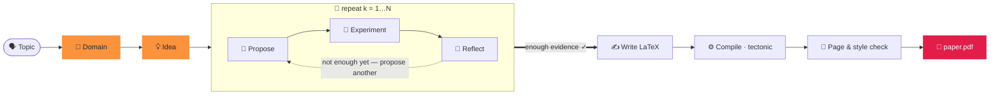

<div align="center">


### 两个词，生成一篇论文。

<p align="center"><code>paperclaw run "diffusion models"</code></p>
<p align="center"><sub>🧭 领域 · 💡 想法 · 🔬 假设 · 🧪 实验 · 📊 分析<br/>📄 paper.pdf — 撰写、引用并编译完成 ✓</sub></p>

**PaperClaw** 在整个科研生命周期中调度自主智能体 —
**🧭 领域 → 💡 想法 → 📄 论文**。给出一个主题，它便会界定领域、构思想法、
运行*真实*实验，并写出一篇带引用、可编译的论文。

[](../../LICENSE)


<sub><a href="../../README.md">English</a> · <b>简体中文</b> · <a href="README.ja.md">日本語</a> · <a href="README.ko.md">한국어</a> · <a href="README.es.md">Español</a> · <a href="README.fr.md">Français</a> · <a href="README.de.md">Deutsch</a> · <a href="README.pt.md">Português</a> · <a href="README.ru.md">Русский</a> · <a href="README.ar.md">العربية</a> · <a href="README.hi.md">हिन्दी</a> · <a href="README.it.md">Italiano</a></sub>

</div>

---

## ✦ PaperClaw 是什么？

PaperClaw 是一个开源的自主科研引擎。它将科研生命周期收敛为一条清晰的路径，
并端到端地掌控整个流程：假设图、实验作业、记忆与论文。可接入任意模型
（Anthropic SDK 或任何兼容 OpenAI 的端点），或外部的无头编码智能体。

它以**单一 Python 包**的形式发布，包含一个 **FastAPI** 后端和一个 **Vite + React**
前端；前端可构建为两种目标 —— **Web**（由后端托管）与 **Windows / macOS / Linux 桌面端**
（Electron）—— 另外还有一个**功能完整的 CLI**，与图形界面一一对应。

<div align="center">

</div>

## ✦ 论文示例

PaperClaw 端到端写出的真实论文 —— 主题 → 领域 → 想法 → 假设 → 实验 →
**编译后的 PDF** —— 每篇都用其**目标会议/期刊**的 LaTeX 模板排版。每篇都是一个完整的
想法工作区（规范、假设图、实验、图表、`ref.bib`、LaTeX 源码）。可在
**[`docs/examples/`](../examples/)** 中浏览。

| 论文 | 主题 | 产出 |
|---|---|---|
| 📄 [**RC-Diff: Risk-Controlled Financial Diffusion with Path-Level Audits**](<../examples/[Paper 1] rc-diff-risk-controlled-financial-diffusion/paper.pdf>) | 面向金融时间序列的扩散模型 | 目标会议 · 9 页 |

## ✦ 简洁的科研模型

| | 步骤 | 发生了什么 | 一条命令 |
|:--:|:--|:--|:--|
| 🧭 | **领域** —— *可深耕的土壤* | 用一句话描述一个领域。模型据此写出 `DOMAIN.md` 规范 —— 目标、关键论文、数据集、代码库、会议 —— 这些都是**从开放学术索引实时获取**的，而非模型记忆。 | `paperclaw domain auto "…"` |
| 💡 | **想法** —— *具体、可检验的方向* | 头脑风暴将一个或多个领域提炼为完整的 `IDEA.md` 草稿 —— 背景、研究空白、动机、根假设。在对话中打磨，然后将其固定为一个活跃的想法。 | `paperclaw brainstorm generate` |
| 📄 | **论文** —— *撰写、引用并编译* | 假设循环逐轮提出、检验并反思，挑选最强的结果，写出按会议格式排版、带**已验证引用**的 LaTeX 论文 —— 编译为 PDF，并不断打磨直至符合格式与篇幅要求。 | `paperclaw run --idea <id>` |

<div align="center">

<br/>
<sub><b>自动模式创建领域（Web 界面）</b> —— 用一句话描述领域；PaperClaw 实时检索开放学术索引并写出 <code>DOMAIN.md</code> 规范。</sub>
</div>

## ✦ 自动驾驶内部 —— 一个知道何时停止的假设循环

一旦想法有了领域，PaperClaw 便运行一个**由实验驱动的循环**，从实测结果中生长出假设图，
而不是一开始就猜测 —— 然后根据它真正发现的内容来撰写论文。每个阶段都实时流式输出，并且**可恢复**。



## ✦ 两种运行方式

PaperClaw 提供两种模式 —— 任选其一（它们共享同一个后端与 `saves/` 数据，可自由切换）。

**最快的配置（无需命令）：** 将 `settings.example.yaml` 复制为项目目录下的 `settings.yaml`，填入你的提供商、模型与 API 密钥 —— 后端与 CLI 启动时都会读取它（其优先级高于应用内设置）。 它是 YAML，可用 `#` 为各项写注释：

```yaml
LLM:
  provider: anthropic           # anthropic | openai
  base_url: null                # null = 提供商默认；代理/自托管时设置
  api_key: ""
  model: claude-opus-4-8
image_generation:               # 可选 —— 论文配图
  base_url: null
  api_key: ""
  model: null
academic_search:
  open_alex:
    api_key: ""                 # 可选 —— 文献检索
```

`settings.yaml` 已被 git 忽略（它包含你的密钥），因此绝不会被提交。（仍会读取旧的 `settings.json`。）

> ⚙️ **完整配置** —— 模型与密钥、图像生成、OpenAlex、实验模式、SSH 远程、LaTeX 以及 `paperclaw doctor` 检查：参见 **[环境配置指南](../environment-guide.md)**。

> [!TIP]
> **推荐使用 Web 模式** —— 实时流式输出、假设图、实验监视器以及内置 PDF 阅读器，集于一处。
> **CLI 模式**为终端、服务器与自动化场景提供了与之完全对应的功能。

---

### 🪟 1. Web 模式 *(推荐)*

> 📘 **第一次使用界面？** 跟随 **[Web 界面图解](../web-guide.md)** —— 从领域到论文的四个带注释步骤，每步都附对应的 CLI 命令。

**安装** —— 后端 + 前端：

```bash
pip install -e ".[dev]"          # backend (Python)
cd frontend && npm install       # frontend (Node)
```

**运行** —— 在仓库根目录执行 `./dev.sh`，会同时启动两者并清理被占用的端口：

```bash
./dev.sh                         # backend :8230 + web UI :5173
# → open http://localhost:5173
```

<sub>手动等价方式（两个终端）：`paperclaw serve --reload` &nbsp;·&nbsp; `cd frontend && npm run dev:web`。 &nbsp; 桌面应用：`npm run dev`（Electron）。</sub>

**配置** —— 打开 **⚙️ 设置**（左下角齿轮）：

- **🔌 LLM** —— 提供商、Base URL（用于代理 / 自托管）、模型与 API Key。
- **📚 学术检索** —— 用于文献检索（领域调研、SOTA 论文与参考文献）的 OpenAlex API Key。可选，但若不配置，OpenAlex 可能会对匿名请求限流，导致调研显示“Found 0 papers”。
- **🖼️ 图像生成** —— 可选的 OpenAI 风格图像 API，用于论文配图（未配置时回退到 matplotlib/TikZ）。
- **🩺 体检（Doctor）** —— 一键检查整个环境是否就绪（LLM、编码智能体、LaTeX 工具链、图像生成、OpenAlex）。

密钥仅存储在服务端的 `saves/settings.yaml`（权限 `600`），绝不会回传到浏览器。
即使没有密钥，应用仍可运行，并会返回一条配置提示。

**开始使用** —— 点击 **⚡ Auto run**（侧边栏用于全新主题，或针对已有想法）即可从主题 → 论文；
在横幅中实时观看，并浏览 🌳 Hypotheses 与 📄 Paper 标签页。也可以通过对话构建领域、
头脑风暴想法并固定其一。

> 📘 **第一次使用界面？** 跟随 **[Web 界面图解](../web-guide.md)** —— 从领域到论文的四个带注释步骤，每步都附对应的 CLI 命令。

---

### ⌨️ 2. CLI 模式

CLI 与 Web 的每项功能一一对应。**只需安装后端**（无需构建前端）：

```bash
pip install -e ".[dev]"
```

**配置** —— 本地模式按以下优先级读取配置（从高到低）：
**环境变量 → `.env`（当前目录）→ `$PAPERCLAW_HOME` 下的 `.env` → `./settings.yaml`（项目目录）→ `$PAPERCLAW_HOME/settings.yaml`**。

| 键 | 用途 |
|---|---|
| `PAPERCLAW_PROVIDER` | `anthropic` \| `openai`（兼容 OpenAI） |
| `PAPERCLAW_BASE_URL` | 代理 / 自托管端点（可选） |
| `PAPERCLAW_MODEL` | 例如 `claude-opus-4-8` |
| `PAPERCLAW_API_KEY` | API Key（`ANTHROPIC_API_KEY` / `OPENAI_API_KEY` 会按提供商作为后备） |
| `OPENALEX_API_KEY` | 用于文献检索的 OpenAlex Key（可选 —— 避免匿名限流） |
| `PAPERCLAW_HOME` | 工作区根目录（默认：`./saves`） |

```bash
# or persist them once:
paperclaw settings set --provider anthropic --model claude-opus-4-8 --api-key sk-…
paperclaw settings set --openalex-api-key oa-…   # literature search (optional)
paperclaw doctor                 # check the env is ready (LLM, LaTeX, image gen, OpenAlex)
```

**开始使用** —— 本地模式（默认）作用于 `$PAPERCLAW_HOME` 下的文件：

```bash
# Fully autonomous: topic → doctor → domain → idea → hypotheses → paper
paperclaw run "diffusion models for time series"       # writes the paper on 2 positives
paperclaw run "…" --positive 3 --max-hypotheses 8      # stop at 3 supported, cap at 8
paperclaw status / stop / resume                       # manage runs from any terminal

# …or drive each step:
paperclaw domain auto "time-series diffusion"
paperclaw domain list                  # [✓] = selected for brainstorming
paperclaw brainstorm generate          # digest selected domains → IDEA.md drafts
paperclaw brainstorm pin <seed-id>     # promote a draft to a living idea
paperclaw hypothesis <idea> generate   # build the hypothesis map
paperclaw references <idea> validate   # validate citations vs Crossref/OpenAlex
paperclaw experiments                  # list detached, monitored experiment jobs
```

**远程模式** —— 用 `--backend` 让同一个 CLI 指向一个正在运行的后端，而非本地文件
（此时配置存放在服务器上，而非本地）：

```bash
paperclaw --backend domain list                    # → http://127.0.0.1:8230
paperclaw --backend http://host:8230 chat "hello"  # explicit URL
```

<details>
<summary><b>自动运行配置文件与并行运行</b></summary>

```yaml
# run.yaml
topic: generative modeling for time series
positive: 3          # write the paper once 3 hypotheses are SUPPORTED
max_hypotheses: 8    # stop after 8 if not enough positives
page_limit: 8
```
```bash
paperclaw run --config run.yaml   # CLI flags override the file
```

**想法可并行运行** —— 你可以在任意多个想法上启动自动运行；每个想法的面板只显示它自己的 ⚡ 横幅。
运行是**分离式**的：关闭标签页或重启后端都不会中断它们。用 `paperclaw stop [--idea <id>]`
（或 Ctrl+C，或 Web 横幅上的 ⏹）**停止**；用 `paperclaw resume [--idea <id>]`**继续**已停止的运行 ——
该流程可恢复，会跳过已完成的假设/阶段。

</details>

## ✦ 开发

```bash
./dev.sh          # one-shot: kills stale ports, restarts backend :8230 + web UI :5173
```

或手动操作 —— 后端在仓库根目录运行，**npm 命令在 `frontend/` 内执行**：

```bash
pip install -e ".[dev]"
paperclaw serve --reload                  # repo root — API on :8230
cd frontend && npm install
npm run dev:web                           # web     → http://localhost:5173
npm run dev                               # desktop → Electron window
```

> **每次改动后都要重启** —— `--reload` 不会覆盖新依赖、启动时加载的设置或 Vite 配置的变更。

## ✦ 生产部署

```bash
# Web (served by the Python backend)
cd frontend && npm run build:web          # → frontend/dist/web, then `paperclaw serve`

# Desktop packages (output in frontend/dist/)
npm run dist:win     # Windows — NSIS installer + portable zip
npm run dist:mac     # macOS   — dmg + zip (must run on a Mac)
npm run dist:linux   # Linux   — AppImage
```

推送一个 `v*` 标签（或手动运行工作流），`.github/workflows/desktop.yml` 会在原生 runner 上
构建 win/mac/linux 并上传产物。

## ✦ 测试

```bash
pytest tests/                             # backend
cd frontend && npm run typecheck          # frontend (tsc --noEmit)
```

## ✦ PaperClaw 能力一览

<table>
<tr>
<td width="33%" valign="top">

**🧭 领域驱动的发现**
用一句话或引导式向导自动生成 `DOMAIN.md` —— 论文、数据集、代码库与会议均取自实时学术索引。

</td>
<td width="33%" valign="top">

**💡 多领域头脑风暴**
将一个或多个领域提炼为完整的 `IDEA.md` 草稿，再凝练出一个随对话持续更新的活跃想法规范。

</td>
<td width="33%" valign="top">

**🔁 迭代式假设循环**
提出 → 检验 → 反思，从实测结果中生长出假设图 —— 用最小的实验定夺每个问题。

</td>
</tr>
<tr>
<td valign="top">

**🤝 全程参与的科研助手**
一个与提供商无关的脚手架 —— 可在任意阶段更换模型，或接入外部无头编码智能体。

</td>
<td valign="top">

**🧪 真实、受管的实验**
作业可在重启后存活。智能体编写 `run.py`，将其作为沙箱化子进程运行，并自行调试报错，直到拿到指标与图表。

</td>
<td valign="top">

**🧠 全生命周期记忆**
领域、想法、假设与论文都是活文档和可恢复的检查点 —— 任何运行都能停止再继续而不丢失工作。

</td>
</tr>
<tr>
<td valign="top">

**♻️ 不断进化的助手**
精选领域、文风指南、参考代码库与已验证的参考文献会不断积累并复用 —— 越用越敏锐。

</td>
<td valign="top">

**📚 已验证的引用**
每个想法都拥有一个 `ref.bib`，由 OpenAlex 与 Crossref 确定性地构建，每条都与来源核对 —— 杜绝伪造引用。

</td>
<td valign="top">

**📄 按会议格式排版的论文**
真正的 LaTeX，用 tectonic 经由智能体修复循环编译，不断打磨直至符合格式与篇幅 —— 只报告真正运行过的结果。

</td>
</tr>
<tr>
<td valign="top">

**🖥️ 硬件感知**
检测本机及任意 SSH 远程主机的 CPU / GPU / 内存 / 磁盘，从而按你真正拥有的算力规划实验。

</td>
<td valign="top">

**🪟 Web · 桌面 · CLI**
同一套 Vite + React 代码可发布为 Web 应用、Electron 桌面应用和功能完整的 CLI —— 三者能力完全一致。

</td>
<td valign="top">

**🔌 自带模型**
通过官方 SDK 接入 Anthropic，或任何兼容 OpenAI 的端点。默认模型 `claude-opus-4-8`。密钥仅留在服务端。

</td>
</tr>
</table>

## ✦ 常见问题

**如何部署到服务器（利用其存储与算力）并通过 SSH 隧道在本地使用？**
在服务器上部署后端，并通过 SSH 隧道访问 —— 无需公开任何端口。**在服务器上：** 构建界面并在单一端口启动后端 —— `cd frontend && npm run build:web`，然后 `paperclaw serve --port 8230`；数据存放在 `$PAPERCLAW_HOME`，实验使用服务器的 CPU/GPU。**在本地机器上：** 用 `ssh -N -L 8230:localhost:8230 user@server` 转发端口，然后打开 `http://localhost:8230`。CLI 也可通过隧道同样使用：`paperclaw --backend http://localhost:8230 …`。

**为什么领域调研显示“Found 0 papers”？**
OpenAlex 现在会对匿名（按 IP）请求做预算限流。在 **设置 → 📚 学术检索**（或 `OPENALEX_API_KEY`）
中添加一个免费的 OpenAlex API Key，以获得独立预算。

**我点击了左上角的 ⚡ Auto run，但界面没有显示进度 —— 它去哪了？**
侧边栏左上角的 **⚡ Auto run** 会从一个**主题**启动运行（等价于 `paperclaw run "你的主题"`），目前仍处于**测试版（beta）**—— 其应用内进度可视化仍在开发中。运行本身没有问题（与任何自动运行一样是分离的后台进程）；可在任意终端用 `paperclaw status`（以及 `paperclaw stop` / `paperclaw resume`）跟踪。在**已有想法**上启动的自动运行（顶部栏的 ⚡ Auto run）会显示实时横幅。参见 [Web 界面图解](../web-guide.md#4-auto-run--topic--paper-on-autopilot)。

**我的 API Key 安全吗？**
密钥仅存储在服务端的 `saves/settings.yaml`（权限 `600`），绝不会回传到浏览器或写入日志。

**需要 GPU 吗？**
不需要 —— 小规模运行在 CPU 上即可。PaperClaw 会检测本机及任意 SSH 远程主机的 CPU/GPU/内存，
并按你真正拥有的算力规划实验。

**用 Web 还是 CLI？**
都行 —— 它们共享同一个后端与 `saves/` 数据，可自由切换；CLI 与 Web 的每项功能一一对应。

## ✦ 许可证

[MIT](../../LICENSE) © PaperClaw 贡献者。

<div align="center">
<br />
<sub>🦞 <b>PaperClaw</b> — 领域 → 想法 → 论文，自主完成。</sub>
</div>
