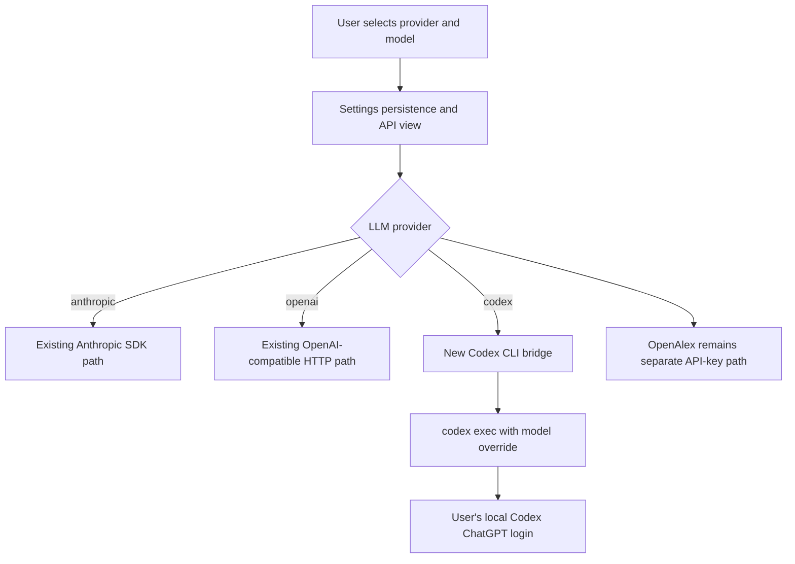
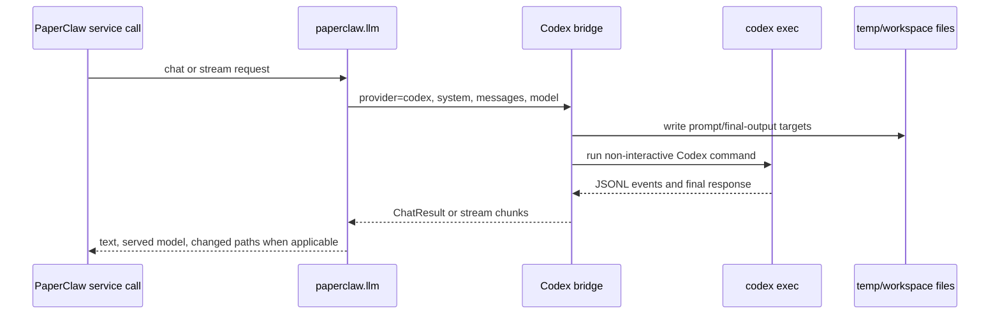

# Codex Subscription Provider - Plan

## Goal Capsule

| Field | Value |
|---|---|
| Objective | Add Codex subscription-backed text model execution as a first-class PaperClaw LLM provider. |
| Target repo | PaperClaw |
| Primary users | Local CLI users and self-hosted web or desktop users who are already signed into Codex with ChatGPT. |
| Authority hierarchy | Preserve existing Anthropic/OpenAI-compatible API behavior; preserve OpenAlex API configuration; route Codex through local CLI auth; do not extract tokens or store ChatGPT credentials in PaperClaw. |
| Execution profile | Cross-surface provider integration touching Python backend, CLI, React settings, doctor diagnostics, docs, and tests. |
| Stop conditions | Stop if current Codex CLI cannot produce a deterministic final message for non-interactive prompts, or if the workspace bridge would require token extraction or undocumented auth files. |

---

## Product Contract

### Summary

PaperClaw will gain `codex` as an LLM provider that runs local Codex CLI commands against the user's ChatGPT-authenticated Codex session, with model selection controlled through the existing model setting.
This is an additional run mode, not a replacement for existing API-key providers or OpenAlex.

### Problem Frame

PaperClaw currently routes text model calls through Anthropic SDK calls or OpenAI-compatible HTTP chat completions, both of which require API keys in `LLMSettings.api_key`.
The project already supports external headless coding agents for experiments through `RunConfig.agent_command`, but that only covers experiment execution.
Users with a Codex subscription need a way to run PaperClaw's LLM-backed research and chat flows through their local Codex login without configuring an OpenAI API key.

### Requirements

**Provider Selection**

- R1. PaperClaw supports `codex` as a persisted `LLM.provider` value alongside `anthropic` and `openai`.
- R2. When `provider=codex`, PaperClaw uses the local Codex CLI and the user's existing Codex login instead of requiring `LLM.api_key`.
- R3. The configured `LLM.model` is passed to Codex so users can choose the model from the same setting they already use for API-backed providers.

**Compatibility and Boundaries**

- R4. Existing Anthropic and OpenAI-compatible flows continue to use their current API-key behavior.
- R5. OpenAlex literature search remains configured through `academic_search.open_alex.api_key` or `OPENALEX_API_KEY`; Codex support does not remove or fake that requirement.
- R6. Image generation remains on the existing OpenAI-style image API path and is not rerouted through Codex in this plan.
- R7. PaperClaw never reads, copies, stores, or displays ChatGPT/Codex tokens; it only invokes the installed Codex executable.

**User-Facing Setup**

- R8. CLI settings, API settings, and the React settings modal expose Codex as a selectable provider without showing an API-key requirement for that provider.
- R9. Doctor diagnostics report whether Codex is installed, logged in through ChatGPT, and healthy enough to use for provider calls.
- R10. Idea resource views and settings displays distinguish "Codex login configured" from "API key configured" with explicit auth/readiness fields instead of overloading `llmKeyConfigured`.

**Runtime Behavior**

- R11. Plain text model calls route through Codex and return a `ChatResult` with the served or requested model recorded.
- R12. Streaming text paths either stream Codex JSONL/final output when available or degrade to a single final chunk with clear status.
- R13. Idea/domain workspace chat uses a Codex workspace bridge rooted at the selected workspace and reports changed paths by snapshotting before and after the Codex run.
- R14. Low-level Anthropic/OpenAI-style tool-call APIs that require structured tool-call exchange return a clear unsupported message for `provider=codex` instead of silently falling back to an API provider.
- R15. Codex process failures surface actionable errors, including missing binary, logged-out state, failed doctor/reachability, non-zero exit, timeout, and empty final response.

### Acceptance Examples

- AE1. Given `LLM.provider: codex`, no `LLM.api_key`, a valid Codex login, and a user-selected `LLM.model`, when the user runs a text-only PaperClaw action, then PaperClaw invokes Codex with that model and returns the assistant response.
- AE2. Given `provider=codex` and no Codex binary on `PATH`, when the user opens Doctor, then the LLM check fails with a Codex-specific install hint and does not mention `OPENAI_API_KEY`.
- AE3. Given `provider=openai`, when the user omits `api_key`, then the existing OpenAI-compatible API-key error still appears.
- AE4. Given `provider=codex`, when the user adds an OpenAlex key in Settings, then OpenAlex masking and live `literature.configure` behavior remain unchanged.
- AE5. Given the user selects Codex in the web settings modal, when they save, then the API key field is not required and the settings view shows Codex as configured based on CLI/login readiness rather than stored secret state.
- AE6. Given `provider=codex` and an idea/domain workspace chat, when Codex changes workspace files, then PaperClaw returns the final assistant text and changed relative paths without requiring Anthropic/OpenAI tool-call JSON.

### Scope Boundaries

- In scope: text LLM provider support, model selection, settings persistence, setup UX, doctor diagnostics, documentation, and tests for Codex provider behavior.
- In scope: using the local Codex CLI as the integration boundary, including `codex exec`, `--model`, JSONL or final-message output, and login-status diagnostics.
- Out of scope: replacing OpenAlex, replacing image generation, extracting ChatGPT tokens, implementing a private Codex HTTP client, or requiring users to log into Codex through PaperClaw.

#### Deferred to Follow-Up Work

- Full native PaperClaw tool-dispatch parity for Codex remains follow-up work; this plan supports workspace chat through a Codex-run workspace bridge, not through Anthropic/OpenAI-style structured tool-call exchange.
- Internationalized README updates can follow the English docs once the provider surface lands.

---

## Planning Contract

### Key Technical Decisions

- KTD1. Add `codex` to the existing provider contract rather than creating a separate "subscription mode" setting.
  Provider selection already drives model, base URL, key fallback, API validation, settings UI, and doctor output, so extending it keeps setup coherent.
- KTD2. Implement Codex through a small backend adapter that shells out to `codex exec`, not through OpenAI HTTP APIs.
  The installed Codex CLI documents ChatGPT sign-in as the subscription path, while API-key sign-in is a separate usage-billed path.
- KTD3. Treat Codex readiness as an executable/auth/health check, not a secret check.
  `codex login status` and `codex doctor` are the right diagnostics; `LLM.api_key` should be ignored for `provider=codex`.
- KTD4. Start with deterministic text-call support plus a workspace bridge, while keeping structured tool-call APIs explicitly unsupported for Codex.
  PaperClaw has both plain LLM calls and tool-use loops; pretending Codex is an OpenAI-compatible tool-calling API would hide real capability differences.
- KTD5. Keep Codex execution bounded by command construction and workspace choice.
  Text-only calls should run in a controlled temporary work directory with read-only sandboxing; workspace chat should run only in the intended idea/domain directory with workspace-write sandboxing and changed-path snapshotting.
- KTD6. Keep the existing experiment CLI-agent mode separate.
  `RunConfig.agent_command` already lets experiments delegate to external agents, including Codex, but this feature is about the global LLM provider path.

### High-Level Technical Design

### Implementation Notes

- The current local CLI is `codex-cli 0.142.2`; `codex --help` exposes `exec`, `login status`, `doctor`, `--model`, `--json`, and `--output-last-message`.
- `codex login status` can report "Logged in using ChatGPT"; `codex doctor` can also expose broken local state and network reachability failures that PaperClaw should surface.
- The adapter should use argument lists rather than shell-string concatenation for provider calls; this avoids quoting bugs around large prompts and model names.
- If the first implementation cannot stream token-level Codex output reliably, returning a single final chunk from `--output-last-message` is acceptable for `stream_chat`.
- Programmatic Codex calls should use secure defaults: argument-list subprocess execution, `--cd` pointing at a temp or selected workspace directory, `--ephemeral`, no `--add-dir`, no dangerous bypass flags, and the narrowest sandbox mode that satisfies the flow (`read-only` for text-only calls; `workspace-write` for workspace chat).

### System-Wide Impact

- Configuration: `provider` becomes a three-value contract in settings files, env vars, API validation, CLI choices, UI options, docs, and tests.
- Runtime: `llm.chat`, `stream_chat`, and `stream_chat_thinking` become provider-dispatched beyond API clients.
- Workspace chat: service/deep-chat routing gains a Codex workspace bridge while low-level structured tool-call APIs stay API-provider-only.
- Agent parity: CLI, local service, web backend, and desktop/web settings must all expose the same Codex provider state.
- Security: PaperClaw becomes responsible for subprocess boundaries when Codex is used as an LLM provider, even though it does not own Codex auth.

### Risks & Dependencies

| Risk | Mitigation |
|---|---|
| Codex CLI output format changes | Keep parsing isolated in one adapter and cover it with fake-process tests. |
| Codex login or network is broken locally | Add explicit doctor checks and provider errors that point to `codex login` / `codex doctor`. |
| Codex behaves like an agent instead of a pure completion API | Use controlled working directories, sandbox flags, explicit workspace snapshotting, and unsupported errors for structured tool-call APIs. |
| Users expect OpenAlex to work without a key | Keep OpenAlex in its own settings section and doctor row. |
| Existing API providers regress | Keep provider-specific tests for Anthropic/OpenAI validation and key fallback. |

### Sources & Research

- `paperclaw/config.py` owns `LLMSettings`, settings file parsing, env precedence, and API-key fallback.
- `paperclaw/llm.py` owns plain chat, streaming chat, thinking streams, and tool-call loops.
- `paperclaw/server/routes/settings.py`, `paperclaw/server/models.py`, `frontend/src/types/index.ts`, and `frontend/src/components/SettingsModal/index.tsx` define the settings contract across API and UI.
- `paperclaw/service.py` owns doctor readiness, idea resource views, and streaming chat routing.
- `paperclaw/agents/cli_agent.py` shows the existing external-agent subprocess pattern for experiment execution.
- Installed Codex CLI help and README show ChatGPT login, `codex exec`, `--model`, `--json`, `--output-last-message`, `login status`, and `doctor` as the relevant integration surfaces.

---

## Implementation Units

### U1. Extend the Settings Contract

- **Goal:** Add `codex` as a valid text LLM provider and make API-key requirements provider-aware.
- **Requirements:** R1, R2, R3, R4, R5, R7, R8, R10.
- **Dependencies:** None.
- **Files:** `paperclaw/config.py`, `paperclaw/server/models.py`, `paperclaw/server/routes/settings.py`, `paperclaw/client.py`, `paperclaw/cli.py`, `tests/test_cli.py`, `tests/test_server.py`.
- **Approach:** Widen provider parsing and validation to include `codex`; keep legacy settings readable; add provider capability helpers so API-key fallback and "configured" checks are not duplicated across routes.
- **Patterns to follow:** Existing nested YAML parsing in `_settings_from_config`, env override logic in `load_settings`, and route validation in `put_settings`.
- **Test scenarios:**
  - Given `LLM.provider: codex` and no `api_key`, `load_settings` returns `provider == "codex"` without filling `OPENAI_API_KEY`.
  - Given `PAPERCLAW_PROVIDER=codex` and `PAPERCLAW_MODEL=codex-test-model`, env overrides select Codex and pass the model through unchanged.
  - Given `provider=codex` through `/api/settings`, the route accepts it and does not require `apiKey`.
  - Given `provider=bogus`, the route still rejects the value with validation.
  - Given `provider=openai` with no saved key but `OPENAI_API_KEY` set, existing key fallback still works.
  - Covers AE4. Given an OpenAlex key update while provider is Codex, masking and `literature.configure` still apply.
- **Verification:** Settings load, save, API, and CLI behavior are provider-aware without changing persisted OpenAlex or image-generation shape.

### U2. Add a Codex CLI Bridge

- **Goal:** Provide a testable adapter that invokes local Codex non-interactively and converts results into PaperClaw LLM results.
- **Requirements:** R2, R3, R7, R11, R12, R15.
- **Dependencies:** U1.
- **Files:** `paperclaw/codex_cli.py`, `paperclaw/llm.py`, `tests/test_codex_cli.py`, `tests/test_server.py`.
- **Approach:** Create a focused adapter around executable discovery, login-status checks, command construction, prompt assembly, final-message capture, optional JSONL event parsing, timeout handling, workspace snapshotting, and error normalization.
- **Execution note:** Implement adapter tests with fake subprocess runners before wiring live `llm.py` dispatch.
- **Patterns to follow:** Subprocess and stream rendering isolation in `paperclaw/agents/cli_agent.py`; `LLMError` and `LLMNotConfigured` semantics in `paperclaw/llm.py`.
- **Test scenarios:**
  - Given a fake successful Codex process and final-message file, the adapter returns response text and model metadata.
  - Given a configured model, the adapter includes a Codex model override in the command arguments.
  - Given a text-only call, the adapter runs Codex in a temporary directory with read-only sandboxing and no extra writable directories.
  - Given a workspace call, the adapter runs Codex in the provided workspace with workspace-write sandboxing and returns changed relative paths from snapshot comparison.
  - Given missing Codex executable, the adapter raises `LLMNotConfigured` with an install/login-oriented message.
  - Given `codex login status` reports no ChatGPT login, the readiness check fails without reading auth files.
  - Given non-zero process exit with stderr/stdout, the adapter raises `LLMError` with a bounded diagnostic.
  - Given JSONL events with assistant deltas, the streaming adapter emits readable chunks and still records the final response.
  - Given malformed JSONL lines, the adapter ignores bad event lines and uses final-message fallback.
- **Verification:** Codex process interaction is isolated behind fakeable process boundaries and never requires live network in tests.

### U3. Route LLM Calls Through Codex Provider Behavior

- **Goal:** Wire `provider=codex` into PaperClaw's LLM APIs without weakening existing Anthropic/OpenAI behavior.
- **Requirements:** R4, R11, R12, R13, R14, R15.
- **Dependencies:** U1, U2.
- **Files:** `paperclaw/llm.py`, `paperclaw/agents/deep_chat.py`, `paperclaw/service.py`, `tests/test_server.py`, `tests/test_deep_chat.py`, `tests/test_hypothesis.py`, `tests/test_iterative_pipeline.py`.
- **Approach:** Dispatch `chat`, `stream_chat`, and `stream_chat_thinking` to the Codex bridge when selected; route idea/domain workspace chat through the Codex workspace bridge; make `chat_with_tools` and `stream_chat_with_tools` raise an explicit unsupported error for Codex.
- **Technical design:** Directional guidance, not implementation specification: `provider=codex` should follow a separate branch early in each public LLM entry point, so existing Anthropic/OpenAI code paths remain unchanged and easy to diff.
- **Patterns to follow:** Provider branching already present in `chat`, `stream_chat`, `stream_chat_thinking`, `chat_with_tools`, and `stream_chat_with_tools`.
- **Test scenarios:**
  - Covers AE1. Given Codex provider and a fake bridge response, `llm.chat` returns `ChatResult.text` and preserves the requested/served model.
  - Given Codex provider and a fake streaming bridge, `llm.stream_chat` yields chunks in order.
  - Given Codex provider and a thinking stream request, the implementation yields text-only events without inventing thinking metadata.
  - Given a scratch chat through `service.send_chat`, Codex provider produces an assistant message without requiring `api_key`.
  - Given an idea/domain workspace chat, the Codex workspace bridge captures modified paths by snapshot and returns them in the final event.
  - Given a direct `chat_with_tools` or `stream_chat_with_tools` call under Codex, the function returns a clear unsupported error with no silent API fallback.
  - Given Anthropic/OpenAI providers, existing tests around mocked `llm.chat`, tool loops, and OpenAI-compatible fallback still pass.
- **Verification:** PaperClaw's public LLM functions have explicit Codex behavior, and existing provider tests remain unchanged except for widened provider values.

### U4. Update Settings, Doctor, and Resource Surfaces

- **Goal:** Make Codex visible and understandable in CLI, REST, React settings, Doctor, and idea resource views.
- **Requirements:** R8, R9, R10, R15.
- **Dependencies:** U1, U2.
- **Files:** `paperclaw/service.py`, `paperclaw/server/routes/settings.py`, `paperclaw/server/models.py`, `paperclaw/cli.py`, `frontend/src/types/index.ts`, `frontend/src/components/SettingsModal/index.tsx`, `frontend/src/components/SettingsModal/styles.module.css`, `frontend/src/components/ResourcesPanel/ResourcesEditor.tsx`, `tests/test_cli.py`, `tests/test_server.py`.
- **Approach:** Add Codex to provider choices and copy; hide or relabel the API key field when Codex is selected; add doctor checks for Codex binary, login status, and health; add explicit provider-auth fields such as `llmAuthConfigured` and `llmAuthKind` so UI copy does not infer Codex readiness from raw key presence.
- **Patterns to follow:** Existing doctor row construction in `environment_report`, CLI `settings` output, and React `PROVIDER_DEFAULTS` handling.
- **Test scenarios:**
  - Covers AE2. Given Codex provider and no executable, doctor returns a failing Codex-specific LLM check with an install hint.
  - Given Codex provider and fake successful status checks, doctor returns LLM ok without any API key.
  - Given Codex provider with fake doctor reachability failure, doctor includes an actionable failure detail.
  - Given API provider with no key, doctor still fails with the existing API-key hint.
  - Given idea resources under Codex provider, `llmAuthConfigured` is based on Codex readiness, `llmAuthKind` indicates Codex login, and the resources panel does not render "API key MISSING".
  - Given the settings modal is loaded with provider Codex, the provider dropdown selects Codex and the key field is not presented as mandatory.
  - Covers AE5. Saving Codex from the settings modal sends provider/model without an API key.
- **Verification:** Every user-facing setup surface communicates the difference between Codex login readiness and API-key readiness.

### U5. Document Codex Setup and Boundaries

- **Goal:** Update English setup documentation and sample config so users know how to use a Codex subscription and what still needs API keys.
- **Requirements:** R2, R3, R5, R6, R7, R8, R9.
- **Dependencies:** U1, U4.
- **Files:** `settings.example.yaml`, `README.md`, `docs/environment-guide.md`.
- **Approach:** Add `codex` to provider examples, show `LLM.model` use, explain that users must install and sign into Codex separately, and keep OpenAlex/image-generation sections separate.
- **Patterns to follow:** Existing README and environment-guide structure for "LLM provider/model/key", "Academic search", "Image generation", and "Experiment execution".
- **Test scenarios:**
  - Documentation mentions `codex` in provider choices without implying `OPENAI_API_KEY`.
  - Documentation says Codex uses local ChatGPT/Codex login and does not store credentials in PaperClaw.
  - Documentation keeps OpenAlex key instructions visible and separate.
  - Documentation keeps image generation API instructions visible and separate.
- **Verification:** A new user can configure `provider: codex`, choose a model, run Doctor, and understand why OpenAlex may still need a key.

### U6. Add Integration Coverage Across CLI, API, and Frontend Contracts

- **Goal:** Protect the cross-surface behavior with targeted backend and frontend checks.
- **Requirements:** R1 through R15.
- **Dependencies:** U1, U2, U3, U4, U5.
- **Files:** `tests/test_cli.py`, `tests/test_server.py`, `tests/test_codex_cli.py`, `tests/test_deep_chat.py`, `frontend/src/types/index.ts`, `frontend/src/components/SettingsModal/index.tsx`, `frontend/src/components/ResourcesPanel/ResourcesEditor.tsx`.
- **Approach:** Keep tests fake-process and hermetic; avoid live Codex calls except for optional manual verification documented outside automated tests.
- **Patterns to follow:** Existing monkeypatch-heavy backend tests and TypeScript typecheck script.
- **Test scenarios:**
  - CLI local mode can save/show Codex provider and model.
  - REST settings roundtrip accepts Codex and returns masked-key fields without leaking stale API keys.
  - Idea resources expose Codex auth readiness through the new auth fields while keeping any legacy `llmKeyConfigured` meaning tied to API keys.
  - Doctor can be tested with fake Codex status functions for missing binary, logged-in, logged-out, and unhealthy states.
  - LLM bridge tests do not require network and assert command arguments rather than running real Codex.
  - Frontend typecheck passes after widening provider-related types.
  - A regression test proves OpenAlex settings roundtrip remains unchanged under Codex provider.
- **Verification:** Backend provider contract, Codex bridge, web types, and docs all agree on the same user-visible behavior.

---

## Verification Contract

| Gate | Applies to | Expected outcome |
|---|---|---|
| `pytest tests/test_cli.py tests/test_server.py tests/test_codex_cli.py` | U1, U2, U4, U6 | Config, settings, doctor, Codex fake-process behavior, and OpenAlex preservation pass. |
| `pytest tests/test_deep_chat.py tests/test_hypothesis.py tests/test_iterative_pipeline.py` | U3 | Provider dispatch does not regress existing chat, hypothesis, or paper-generation flows. |
| `pytest tests/test_cli_agent.py` | U6 | Existing external agent experiment mode remains separate and unaffected. |
| `cd frontend && npm run typecheck` | U4, U6 | React settings/types compile with the widened provider contract. |
| Manual Codex smoke test | U2, U3, U4 | With a local ChatGPT-authenticated Codex CLI, `provider=codex` and a selected model can complete a text-only PaperClaw action and a workspace chat reports changed paths. |

---

## Definition of Done

- `provider=codex` is accepted through settings YAML, environment variables, CLI, REST, and React settings.
- Codex provider calls use the local Codex CLI and selected model without requiring `LLM.api_key`.
- Existing Anthropic/OpenAI-compatible provider behavior and OpenAlex/image-generation settings are preserved.
- Doctor reports Codex readiness through executable, login, and health diagnostics.
- Codex workspace bridge behavior and unsupported structured tool-call behavior are explicit, tested, and documented.
- Documentation explains Codex subscription setup and the remaining OpenAlex API-key requirement.
- Automated tests and frontend typecheck pass for the touched surfaces.
- Dead experimental adapter code or unused fallback branches are removed before landing.
