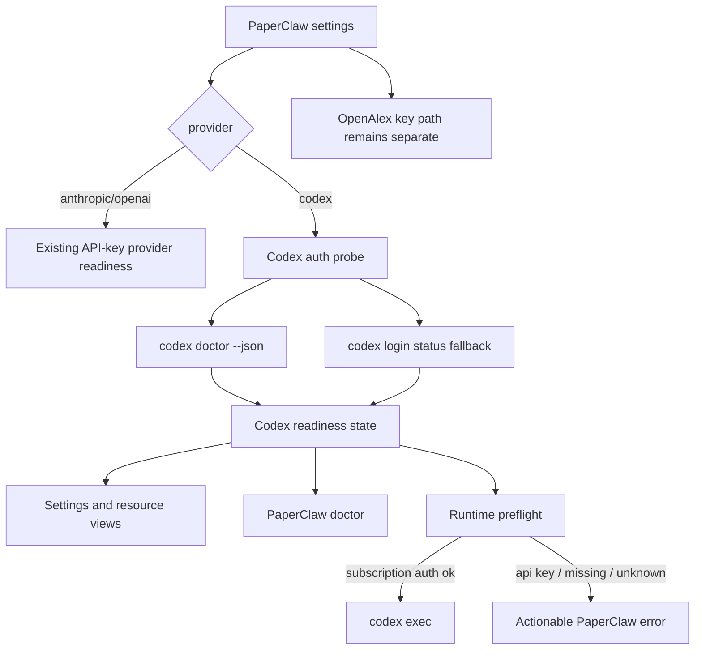
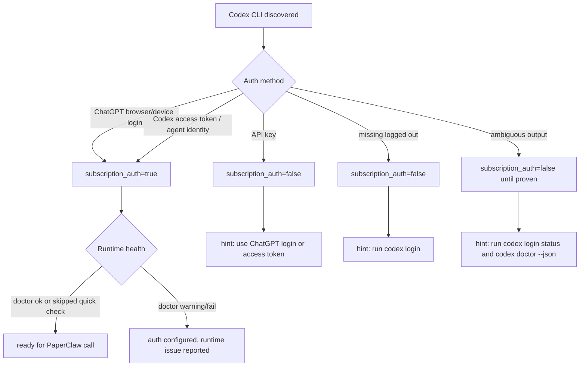

# Codex Subscription Auth Hardening - Plan

## Goal Capsule

| Field | Value |
|---|---|
| Objective | Make PaperClaw's `provider=codex` path reliably use ChatGPT-managed Codex subscription auth, not Codex API-key auth, while preserving model selection and the separate OpenAlex key path. |
| Target repo | PaperClaw |
| Primary users | Local CLI, web, and desktop users who want PaperClaw text-model calls routed through their local Codex subscription session. |
| Authority hierarchy | Follow official Codex auth docs; keep the local Codex CLI as the auth boundary; never read or copy Codex tokens; preserve existing Anthropic/OpenAI-compatible API behavior; keep OpenAlex configuration separate. |
| Execution profile | Auth-sensitive provider hardening across Python backend, CLI/settings API, React settings/resource surfaces, docs, and regression tests. |
| Stop conditions | Stop if the installed Codex CLI exposes no documented or redacted way to distinguish ChatGPT-managed auth from API-key auth; in that case fail closed for subscription mode and surface an explicit limitation rather than guessing from token files. |

---

## Product Contract

### Summary

PaperClaw already has a first-cut `codex` provider that shells out to `codex exec`, passes the configured model, and ignores `LLM.api_key` for that provider.
This plan hardens that path so "Codex subscription mode" means ChatGPT-managed Codex auth, not a Platform API key login inside Codex.
It also makes model defaults and setup messages harder to misconfigure, and keeps OpenAlex as its own academic-search API configuration.

### Problem Frame

Official Codex docs define two OpenAI auth modes for Codex: ChatGPT sign-in for subscription access and API-key sign-in for usage-based access.
The current PaperClaw check treats `codex login status` output containing "ChatGPT" as configured and uses plain `codex doctor` as a broad health check.
That is directionally right, but it misses important states: API-key Codex login, ChatGPT access-token automation, unrelated doctor failures, stale inherited API keys in settings, and accidental use of PaperClaw's Anthropic default model with the Codex CLI.

### Requirements

**Codex Auth Contract**

- R1. `provider=codex` represents ChatGPT-managed Codex subscription/workspace auth, not Platform API-key usage through `codex login --with-api-key`.
- R2. ChatGPT browser login, device-code login, and persisted Codex access-token login count as ChatGPT-managed auth when PaperClaw can verify them without exposing token values; inherited `CODEX_ACCESS_TOKEN` is shown as an unverified ChatGPT-managed candidate until Codex confirms it during execution or diagnostics.
- R3. API-key Codex auth must be reported as the wrong auth method for subscription mode, with a hint to run `codex logout` and `codex login` using ChatGPT or a valid Codex access token.
- R4. PaperClaw must not read, parse, copy, persist, or display `auth.json`, OS keychain contents, access tokens, API keys, or ChatGPT tokens.
- R5. Auth readiness must be derived from Codex CLI commands and redacted CLI output, preferring structured `codex doctor --json` when available and falling back to `codex login status` only when needed.

**Runtime Behavior**

- R6. `codex exec` calls must preflight that subscription auth is configured before starting a PaperClaw model request.
- R7. Runtime failures from Codex auth, entitlement, model access, network reachability, timeout, and empty final output must surface as bounded PaperClaw errors with actionable next steps.
- R8. Doctor and settings must separate "subscription auth is configured" from "Codex runtime is currently healthy" so unrelated doctor failures do not look like a missing login.

**Model Configuration**

- R9. Users can specify a Codex model through `settings.yaml`, `paperclaw settings set --model`, `PAPERCLAW_MODEL`, and the settings UI.
- R10. PaperClaw must not pass an Anthropic default model to `codex exec` by accident when the user switches to `provider=codex`.
- R11. If no Codex model is intentionally configured, PaperClaw omits `--model` and lets Codex choose its documented default.

**OpenAlex and Existing Provider Boundaries**

- R12. OpenAlex remains configured through `academic_search.open_alex.api_key` or `OPENALEX_API_KEY`; Codex subscription auth does not replace or satisfy this.
- R13. Anthropic and OpenAI-compatible provider behavior, API-key fallback, and image-generation settings remain unchanged.
- R14. The UI, CLI, settings API, resource panel, doctor, README, environment guide, and sample settings must use consistent terminology for API-key providers, Codex subscription auth, and OpenAlex.

### Acceptance Examples

- AE1. Given `LLM.provider: codex`, no `LLM.api_key`, a Codex CLI that reports ChatGPT auth, and `LLM.model: gpt-5.5`, when a text PaperClaw action runs, then PaperClaw invokes `codex exec` with that model and returns the assistant response.
- AE2. Given `provider=codex` and a Codex CLI logged in with an API key, when the user opens Settings or runs Doctor, then PaperClaw reports Codex auth as not subscription-backed and does not mark the provider configured.
- AE3. Given `provider=codex` and a Codex CLI using a documented ChatGPT workspace access token, including inherited `CODEX_ACCESS_TOKEN`, when PaperClaw probes readiness or starts a Codex run, then it treats auth as ChatGPT-managed without storing or logging the token.
- AE4. Given `provider=codex` and `OPENAI_API_KEY` set in the environment, when settings load, then PaperClaw does not copy that key into `LLM.api_key` and does not treat it as Codex subscription auth.
- AE5. Given `provider=codex` and no explicit Codex model, when the user saves settings from the UI, then PaperClaw avoids sending `claude-opus-4-8` to Codex by default.
- AE6. Given a saved OpenAlex key and `provider=codex`, when settings are displayed or saved, then OpenAlex masking and live literature configuration remain unchanged.
- AE7. Given a valid ChatGPT login but `codex doctor --json` reports unrelated install or state warnings, when settings are displayed, then auth shows configured while Doctor still surfaces the runtime issue separately.

### Scope Boundaries

- In scope: Codex auth detection, subscription-vs-API-key classification, runtime preflight, auth-specific error messages, model default handling, settings/doctor/resource/UI copy, and docs/tests.
- In scope: documented Codex CLI auth surfaces: `codex login`, `codex login status`, `codex doctor --json`, `codex exec`, `--model`, persisted access-token login, and inherited `CODEX_ACCESS_TOKEN` behavior.
- Out of scope: building a PaperClaw-hosted Codex login flow, reading Codex credential files, replacing OpenAlex, replacing image generation, changing Codex cloud behavior, or making Codex emulate Anthropic/OpenAI structured tool calls.

#### Deferred to Follow-Up Work

- Internationalized README files can be updated after the English setup contract is proven.
- A richer UI model picker can follow once the repo has a stable source for current Codex model availability.

---

## Planning Contract

### Key Technical Decisions

- KTD1. Keep the Codex CLI as the only auth boundary.
  PaperClaw should ask Codex what auth it has through documented commands and redacted diagnostics, not inspect credential storage.
- KTD2. Model Codex readiness as structured state, not a single boolean.
  The state needs installed status, auth method, subscription-auth status, runtime health, detail, and hint fields so settings and doctor can tell different truths.
- KTD3. Prefer `codex doctor --json` for auth classification, with `codex login status` as fallback.
  The installed CLI exposes redacted JSON diagnostics including auth mode, while older or failing CLIs may only expose human status text.
- KTD4. Treat API-key Codex login as unsupported for `provider=codex`.
  Users who want API billing already have the OpenAI-compatible provider path; the Codex provider exists to use subscription/workspace auth.
- KTD5. Separate auth-configured from runtime-healthy.
  A ChatGPT login can be real while network reachability, installation provenance, or local state checks fail; settings should not collapse those into "login missing."
- KTD6. Preserve explicit model selection but omit accidental inherited defaults.
  Passing a stale Anthropic model into `codex exec` is worse than letting Codex choose its documented default; explicit user-provided Codex models still pass through.

### High-Level Technical Design

Directional guidance, not implementation specification:

### Implementation Constraints

- Sanitizers must remove absolute credential/storage paths and any secret-looking values before returning diagnostics through API, CLI, logs, or UI.
- Environment-token detection may use only presence or absence of `CODEX_ACCESS_TOKEN`; PaperClaw must not copy, print, persist, or compare the token value.
- Tests should use fake Codex command runners and fake doctor JSON; no test should require a real Codex login or network.
- Runtime preflight should be cheap enough for ordinary PaperClaw calls; full doctor diagnostics can stay in `paperclaw doctor` and settings refresh paths.
- Keep current dirty frontend dependency files unrelated to this plan unless implementation must adjust UI types or components.

### System-Wide Impact

- Configuration: provider-specific auth semantics become explicit, especially around Codex versus API-key providers.
- Runtime: Codex calls fail earlier and clearer when the local CLI is using the wrong auth mode.
- UX: settings, resource panels, and doctor can present subscription auth, API-key auth, and runtime health without overloading `hasKey`.
- Documentation: setup guidance must distinguish `codex login` ChatGPT sign-in from `codex login --with-api-key`, and must keep OpenAlex as a separate key.

### Risks & Dependencies

| Risk | Mitigation |
|---|---|
| Codex CLI JSON diagnostics change shape | Keep parsing isolated in `paperclaw/codex_cli.py`, tolerate missing fields, and keep human-output fallback tests. |
| `codex doctor --json` returns overall failure for non-auth issues | Parse auth checks independently from overall status and expose runtime health separately. |
| Access-token auth is enterprise/workspace-specific | Treat persisted token auth as ChatGPT-managed only when Codex's redacted diagnostics indicate agent identity or access-token auth; treat inherited `CODEX_ACCESS_TOKEN` as unverified until execution/diagnostics confirm it, and document its limited availability. |
| Current model names change | Do not validate against a hardcoded allowlist; either pass an explicit user model through or omit `--model` to use Codex defaults. |
| UI copy implies OpenAlex is covered by Codex | Keep OpenAlex in its own settings section, doctor detail, and docs examples. |

### Sources & Research

- Official Codex manual fetched fresh from <https://developers.openai.com/codex/codex-manual.md> on 2026-06-28.
- Official Codex overview/pricing docs state that ChatGPT plans include Codex and API-key usage is a distinct option: <https://developers.openai.com/codex/overview> and <https://developers.openai.com/codex/pricing>.
- Official Codex authentication docs define ChatGPT sign-in, API-key sign-in, credential caching, device auth, access tokens, and auth restrictions: <https://developers.openai.com/codex/auth>.
- Official Codex model docs describe `--model`/`-m`, Codex defaults, and recommended models: <https://developers.openai.com/codex/models>.
- Official Codex non-interactive docs describe `codex exec`, JSONL output, `--ephemeral`, `--sandbox`, and automation auth: <https://developers.openai.com/codex/noninteractive>.
- Official Codex CLI reference documents `codex login`, `codex doctor`, `codex exec`, and `codex doctor --json`: <https://developers.openai.com/codex/cli/reference>.
- Official Codex access-token docs describe ChatGPT workspace access tokens for trusted local automation: <https://developers.openai.com/codex/enterprise/access-tokens>.
- Local CLI help confirms the installed CLI exposes `login`, `login status`, `doctor --json`, `exec --json`, `--model`, `--ephemeral`, `--sandbox`, and `--output-last-message`.
- Local `codex login status` currently reports ChatGPT login; local `codex doctor --json` reports auth configured with stored auth mode `chatgpt` while also showing unrelated runtime/install/network/state failures, which confirms the need to split auth state from overall doctor health.
- Existing PaperClaw implementation touch points: `paperclaw/codex_cli.py`, `paperclaw/config.py`, `paperclaw/llm.py`, `paperclaw/service.py`, `paperclaw/server/routes/settings.py`, `paperclaw/server/models.py`, `paperclaw/client.py`, `paperclaw/cli.py`, `frontend/src/components/SettingsModal/index.tsx`, `frontend/src/types/index.ts`, `README.md`, `docs/environment-guide.md`, `settings.example.yaml`, `tests/test_codex_cli.py`, `tests/test_cli.py`, and `tests/test_server.py`.

---

## Implementation Units

### U1. Add Codex Auth State Parsing

- **Goal:** Replace the current `logged_in` string check with a structured Codex readiness state that can distinguish ChatGPT-managed auth, API-key auth, missing auth, unknown auth, and runtime health.
- **Requirements:** R1, R2, R3, R4, R5, R8.
- **Dependencies:** None.
- **Files:** `paperclaw/codex_cli.py`, `tests/test_codex_cli.py`.
- **Approach:** Extend the readiness dataclass with auth method, subscription-auth boolean, runtime-health status, sanitized detail, and hint fields. Prefer parsing `codex doctor --json` auth checks, fall back to `codex login status`, and never read credential files directly.
- **Execution note:** Add characterization tests for current CLI outputs before changing runtime callers.
- **Patterns to follow:** Existing fake-runner pattern in `tests/test_codex_cli.py`; existing `_snippet` bounded-output helper in `paperclaw/codex_cli.py`.
- **Test scenarios:**
  - Covers AE1. Given doctor JSON reporting stored auth mode `chatgpt`, readiness reports subscription auth configured.
  - Covers AE2. Given doctor JSON reporting stored auth mode `api` or stored API key true, readiness reports installed but not subscription-auth configured and returns an API-key-mode hint.
  - Covers AE3. Given doctor JSON indicating stored agent identity or access-token-backed auth, readiness reports ChatGPT-managed auth without exposing token data.
  - Given malformed doctor JSON but `codex login status` says `Logged in using ChatGPT`, fallback reports subscription auth configured.
  - Given `codex login status` says `Logged in using API key`, fallback reports wrong auth method for subscription mode.
  - Given missing binary, readiness reports not installed and suggests installing Codex.
  - Given diagnostics containing credential paths or secret-like values, returned detail is sanitized before it reaches callers.
- **Verification:** Auth parsing is deterministic under fake CLI outputs and no test reads or creates Codex credential files.

### U2. Enforce Subscription Auth Before Codex Runtime Calls

- **Goal:** Prevent PaperClaw's Codex provider from silently running against API-key Codex auth or an ambiguous auth state.
- **Requirements:** R1, R3, R4, R6, R7.
- **Dependencies:** U1.
- **Files:** `paperclaw/codex_cli.py`, `paperclaw/llm.py`, `tests/test_codex_cli.py`, `tests/test_server.py`.
- **Approach:** Add a runtime preflight before `_command` execution that requires subscription auth. Keep the check cheap by using the auth parser without full runtime doctor when possible, and treat inherited `CODEX_ACCESS_TOKEN` as an unverified ChatGPT-managed candidate that Codex confirms during execution without exposing the value. Normalize Codex process failures that mention auth, entitlement, unauthorized workspace, model access, network, timeout, or empty output.
- **Patterns to follow:** Current `CodexNotConfigured` and `CodexError` mapping in `paperclaw/llm.py`; bounded non-zero exit diagnostics in `paperclaw/codex_cli.py`.
- **Test scenarios:**
  - Covers AE2. Given API-key Codex auth, `run_prompt` raises `CodexNotConfigured` or a clearly classified setup error before invoking `codex exec`.
  - Given ChatGPT auth, `run_prompt` invokes `codex exec` with the existing sandbox and final-message behavior.
  - Given ambiguous auth output, `run_prompt` fails closed with a hint to run `codex login status` and `codex doctor --json`.
  - Covers AE3. Given `CODEX_ACCESS_TOKEN` is present and no API-key Codex auth is detected, `run_prompt` does not print or persist the token and lets Codex validate it during execution.
  - Given `codex exec` exits with unauthorized or forbidden text, the error message points to Codex login/workspace access rather than generic process failure.
  - Given a timeout, the existing timeout behavior remains bounded and does not leak prompt text.
  - Given a successful run with malformed JSONL but a final-message file, final-message fallback still works.
- **Verification:** Fake-runner tests prove Codex execution only happens after subscription auth is positively identified.

### U3. Surface Auth Method and Runtime Health Across Settings, Doctor, and Resources

- **Goal:** Make every user-facing configuration surface explain whether Codex subscription auth is configured, which auth method was detected, and whether runtime health has separate problems.
- **Requirements:** R2, R3, R5, R8, R14.
- **Dependencies:** U1.
- **Files:** `paperclaw/server/models.py`, `paperclaw/server/routes/settings.py`, `paperclaw/service.py`, `paperclaw/client.py`, `paperclaw/cli.py`, `frontend/src/types/index.ts`, `frontend/src/components/SettingsModal/index.tsx`, `frontend/src/components/ResourcesPanel/ResourcesEditor.tsx`, `tests/test_cli.py`, `tests/test_server.py`.
- **Approach:** Extend the settings/resource response with optional Codex auth fields such as auth method, auth detail, and runtime health. Keep backward-compatible `authKind` and `authConfigured` fields, but derive them from subscription-auth state. Update doctor detail so auth success and runtime failures are visible separately.
- **Patterns to follow:** Existing `SettingsView` field aliases in `paperclaw/server/models.py`; current local/remote client settings shapes in `paperclaw/client.py`; current settings modal conditional rendering for `provider === 'codex'`.
- **Test scenarios:**
  - Covers AE7. Given ChatGPT auth and doctor runtime failure, `/api/settings` reports auth configured while `/api/doctor` reports the runtime issue.
  - Given API-key Codex auth, `/api/settings` reports `authConfigured=false` and auth method API key.
  - Given only inherited `CODEX_ACCESS_TOKEN`, `/api/settings` reports an env-token candidate rather than a fully verified persisted login.
  - Given missing Codex CLI, Doctor keeps the Codex-specific install hint and does not mention `OPENAI_API_KEY`.
  - Given API providers, existing `hasKey`, `authKind=api_key`, and API-key masking behavior remain unchanged.
  - Given idea resources under Codex, the resource view uses subscription-auth state and does not label a missing API key as the blocker.
  - Given settings modal with Codex selected, the UI shows Codex auth state and does not render the API key field as required.
- **Verification:** CLI, REST, and resource tests agree on auth semantics, and TypeScript types match the extended API response.

### U4. Fix Codex Model Defaults and Model Passing

- **Goal:** Preserve user-specified Codex model selection while preventing accidental use of PaperClaw's Anthropic default model when switching providers.
- **Requirements:** R9, R10, R11, R14.
- **Dependencies:** U1.
- **Files:** `paperclaw/config.py`, `paperclaw/codex_cli.py`, `paperclaw/server/routes/settings.py`, `paperclaw/client.py`, `frontend/src/components/SettingsModal/index.tsx`, `README.md`, `docs/environment-guide.md`, `settings.example.yaml`, `tests/test_codex_cli.py`, `tests/test_cli.py`, `tests/test_server.py`.
- **Approach:** Introduce provider-aware model handling for Codex. Pass `--model` only when the user intentionally configured a Codex model; otherwise omit `--model` and let Codex choose its documented default. A stale Anthropic default must not be sent to Codex.
- **Patterns to follow:** Current `PAPERCLAW_MODEL` precedence in `load_settings`; current `_command` behavior that appends `--model` only when `settings.model` is truthy.
- **Test scenarios:**
  - Covers AE1. Given `PAPERCLAW_PROVIDER=codex` and `PAPERCLAW_MODEL=gpt-5.5`, Codex command args include `--model gpt-5.5`.
  - Covers AE5. Given `provider=codex` and inherited default `claude-opus-4-8`, Codex command args do not pass that Anthropic default.
  - Given a user saves a Codex model in settings, the same model is preserved through settings show, API, CLI, and command construction.
  - Given provider switches back to Anthropic or OpenAI-compatible, existing model and key behavior still follows current provider rules.
- **Verification:** Tests prove Codex model behavior is intentional and provider-specific without introducing a hardcoded model allowlist.

### U5. Update Setup Documentation and Copy

- **Goal:** Make the install/config path clear for users choosing Codex subscription auth and for users configuring OpenAlex.
- **Requirements:** R1, R2, R3, R9, R10, R11, R12, R14.
- **Dependencies:** U1, U3, U4.
- **Files:** `README.md`, `docs/environment-guide.md`, `docs/web-guide.md`, `settings.example.yaml`.
- **Approach:** Update examples to show ChatGPT sign-in, `codex login status`, model configuration, and `paperclaw doctor`. Call out that `codex login --with-api-key` is usage-billed API auth and is not what PaperClaw's Codex subscription provider expects. Keep OpenAlex and image generation sections separate.
- **Patterns to follow:** Existing README "Configure" and environment-guide "LLM provider, model & auth" sections.
- **Test scenarios:** Test expectation: none -- documentation-only changes are covered by the behavioral tests in U1-U4.
- **Verification:** A new user can answer these questions from docs alone: how to select `provider=codex`, how to confirm ChatGPT auth, how to specify a model, why an API-key Codex login is not accepted, and where the OpenAlex key goes.

### U6. Run Focused Regression and Manual Smoke Checks

- **Goal:** Prove the hardened auth flow without requiring live Codex network calls in automated tests.
- **Requirements:** R6, R7, R13, R14.
- **Dependencies:** U1, U2, U3, U4, U5.
- **Files:** `tests/test_codex_cli.py`, `tests/test_cli.py`, `tests/test_server.py`, `frontend/src/types/index.ts`, `frontend/src/components/SettingsModal/index.tsx`.
- **Approach:** Keep automated tests fake-runner based. Add one optional manual smoke checklist for a real developer machine that has Codex installed, but do not make live Codex auth or network part of CI.
- **Patterns to follow:** Existing pytest isolation fixtures that remove ambient `OPENAI_API_KEY`, `ANTHROPIC_API_KEY`, and PaperClaw env vars.
- **Test scenarios:**
  - Given ambient `OPENAI_API_KEY` and `PAPERCLAW_PROVIDER=codex`, settings still show no PaperClaw API key and auth depends on Codex CLI state.
  - Given inherited `CODEX_ACCESS_TOKEN`, settings/resource views do not expose the token and distinguish env-token candidate state from verified persisted login.
  - Given a fake ChatGPT login and runtime doctor warning, settings and doctor present different but compatible states.
  - Given a fake API-key Codex login, settings, doctor, and runtime all reject subscription mode consistently.
  - Given API-provider tests, existing Anthropic/OpenAI-compatible paths continue to pass.
  - Given frontend typecheck, new settings fields do not break the web or Electron TypeScript builds.
- **Verification:** Targeted Python and TypeScript checks pass, and live smoke remains documented but optional.

---

## Verification Contract

| Gate | Scope | Done Signal |
|---|---|---|
| Codex adapter tests | `tests/test_codex_cli.py` | Fake doctor/login/exec states cover ChatGPT auth, access-token auth, API-key auth rejection, ambiguous auth, missing binary, runtime auth failures, model passing, and final-message fallback. |
| Backend settings and doctor tests | `tests/test_cli.py`, `tests/test_server.py` | CLI/local/REST settings, idea resources, and doctor agree on Codex auth semantics and preserve API-provider/OpenAlex behavior. |
| Frontend typecheck | `frontend` TypeScript project | Settings/resource type changes compile under the existing `typecheck` script. |
| Documentation review | `README.md`, `docs/environment-guide.md`, `docs/web-guide.md`, `settings.example.yaml` | Docs distinguish ChatGPT-managed Codex auth from API-key Codex auth and keep OpenAlex setup separate. |
| Optional live smoke | Developer machine with Codex installed | `codex login status` shows ChatGPT-managed auth, `paperclaw settings set --provider codex --model <codex-model>` persists, and `paperclaw doctor` reports Codex auth state plus any separate runtime issues. |

---

## Definition of Done

- `provider=codex` cannot silently use a Codex API-key login for PaperClaw subscription mode.
- ChatGPT browser/device login and documented Codex access-token auth are accepted only through redacted Codex CLI diagnostics.
- PaperClaw never reads or stores Codex credential files or token values.
- Runtime Codex calls preflight subscription auth and report actionable failures for wrong auth method, missing login, entitlement, network, model, timeout, and empty-output cases.
- Settings, doctor, CLI, resource views, and the React settings modal distinguish auth method, auth configured state, runtime health, and API-key state.
- Codex model selection remains user-controllable, and a stale Anthropic default is not passed to `codex exec`.
- OpenAlex remains configured only through its academic-search setting or `OPENALEX_API_KEY`.
- Existing Anthropic/OpenAI-compatible provider behavior and image-generation settings still pass their current tests.
- Automated regression tests do not require live Codex auth, live OpenAI network access, or real OpenAlex network access.
- Dead-end exploratory code and debugging-only print/log changes are removed from the final diff.
