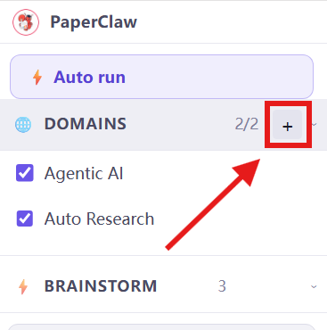
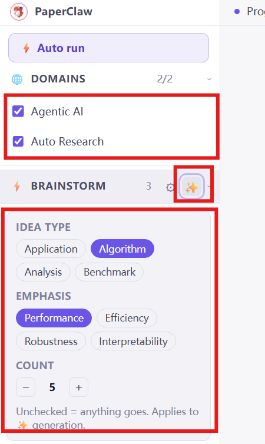
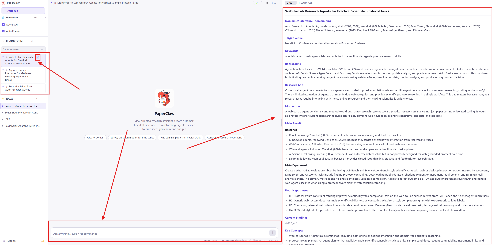
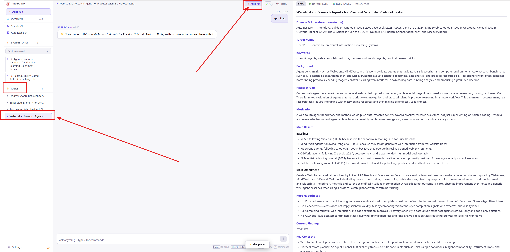

# PaperClaw — Web UI walkthrough

PaperClaw collapses the research lifecycle into one path — **🧭 Domain → 💡 Idea → 📄 Paper**.
This guide walks the **web UI** through that path in four steps, and gives the **CLI command**
for each one (the CLI mirrors every web feature — see the [main README](../README.md)).

> **Start the web UI:** `./dev.sh` from the repo root (backend `:8230` + frontend `:5173`),
> then open <http://localhost:5173>. Configure your provider/model/keys in **⚙️ Settings**
> or a [`settings.yaml`](../settings.example.yaml). For `provider: codex`, run
> `codex login` with ChatGPT on the backend machine first; OpenAlex still has its own key.

### At a glance

| # | Step | In the web UI | CLI |
|---|---|---|---|
| 1 | [Create a domain](#1-create-a-domain--the-ground-to-dig-in) | **+** next to **DOMAINS** → describe a field | `paperclaw domain auto "…"` |
| 2 | [Brainstorm ideas](#2-brainstorm-ideas--concrete-testable-directions) | check domains → **✨** on **BRAINSTORM** | `paperclaw domain select <id>` → `paperclaw brainstorm generate` |
| 3 | [Pin an idea](#3-pin-an-idea--promote-a-draft-to-a-living-idea) | open a draft → review Spec → **pin** | `paperclaw brainstorm pin <seed-id>` |
| 4 | [Auto run](#4-auto-run--topic--paper-on-autopilot) | **⚡ Auto run** in the top bar | `paperclaw run --idea <id>` |

---

## 1. Create a domain — *the ground to dig in*



In the left sidebar, click the **+** next to **DOMAINS**. Describe a field in one sentence;
auto mode surveys open scholarly indexes **live** and writes a `DOMAIN.md` spec — general
target, crucial papers (real authors/year), datasets, libraries, and submission venues.
Tick the checkbox on each domain you want brainstorming to draw from (here: *Agentic AI*,
*Auto Research* → `2/2` selected).

**CLI**
```bash
paperclaw domain auto "agentic AI for autonomous research"   # survey + write DOMAIN.md
paperclaw domain list                                        # [✓] = selected for brainstorming
paperclaw domain select <id>                                 # toggle selection
```

---

## 2. Brainstorm ideas — *concrete, testable directions*



With one or more domains checked, click the **✨** button on the **BRAINSTORM** bar to open
the generator. Steer it with **Idea type** (Application / Algorithm / Analysis / Benchmark),
**Emphasis** (Performance / Efficiency / Robustness / Interpretability), and **Count**, then
generate. PaperClaw digests the selected domains into that many full `IDEA.md` **drafts** —
background, research gap, motivation, and root hypotheses. *(Leave a facet unchecked for
"anything goes".)*

**CLI** — there's no domain argument: `generate` digests whatever domains are **selected**
(the checkboxes above), so select them first.
```bash
paperclaw domain select <id>           # tick the domain(s) to draw from (repeat per domain)
paperclaw brainstorm generate          # digest the SELECTED domains → IDEA.md drafts
paperclaw brainstorm generate --type algorithm --emphasis performance --count 5
paperclaw brainstorm list              # show the generated drafts
```

---

## 3. Pin an idea — *promote a draft to a living idea*



Open a draft from the **BRAINSTORM** list (left). Its full `IDEA.md` renders in the right-hand
**Spec** panel — Domain & Literature, Keywords, Background, Research Gap, Main Result, Root
Hypotheses, and more. Refine it in the chat box at the bottom (answer-first questions, spec
edits), then **pin** it: the draft and its conversation are promoted into a real **Idea** you
can run experiments on.

**Connect to domains.** At the top of the **Spec** panel, **🔗 Domains → Edit** connects the
idea to one or more domains (brainstormed ideas are auto-connected to the domain they came
from). Each connected domain is mounted read-only at `./domains/<name>/` in the idea's
workspace, so the chat/experiment agent can read its `DOMAIN.md`, reference codebase,
benchmarks, and any prior-run results.

**CLI**
```bash
paperclaw brainstorm pin <seed-id>           # promote a draft into a living idea
paperclaw idea list                          # list pinned ideas + their ids
paperclaw idea domains <idea-id>             # show connected domains
paperclaw idea domains <idea-id> --add <domain-id>     # connect another domain
paperclaw idea domains <idea-id> --set <id1>,<id2>     # set the connected set
```

---

## 4. Auto run — *topic → paper, on autopilot*



With the pinned idea open, click **⚡ Auto run** in the top bar (it reads **▶ Resume** once the
idea already has results). The run is **detached** — it survives closing the tab or restarting
the backend — and streams through *doctor → domain → idea → hypothesis loop → paper*. Watch the
live phase in the banner, browse rounds in the **🌳 Hypotheses** tab, and read the compiled
PDF in the **📄 Paper** tab.

**CLI**
```bash
paperclaw run --idea <id>              # autopilot on an existing idea
paperclaw status / stop / resume       # manage runs from any terminal
```

> [!NOTE]
> The **⚡ Auto run** at the **top-left** of the sidebar starts a run from a fresh **topic**
> (creating a new idea) — it mirrors `paperclaw run "your topic"`. It is still in **beta**:
> the in-app progress visualization for a topic launch is under development, so after you
> click it you can only follow the run from the CLI with **`paperclaw status`** (and
> `paperclaw stop` / `paperclaw resume`). The run itself is fine — it's detached like any
> auto run. The **top-bar** ⚡ Auto run (shown above, on an *existing* idea) does show the
> live banner.

Every step above has a CLI equivalent because shared logic lives in one service layer — see
the [CLI mode](../README.md#-2-cli-mode) section of the README for the full command set.
